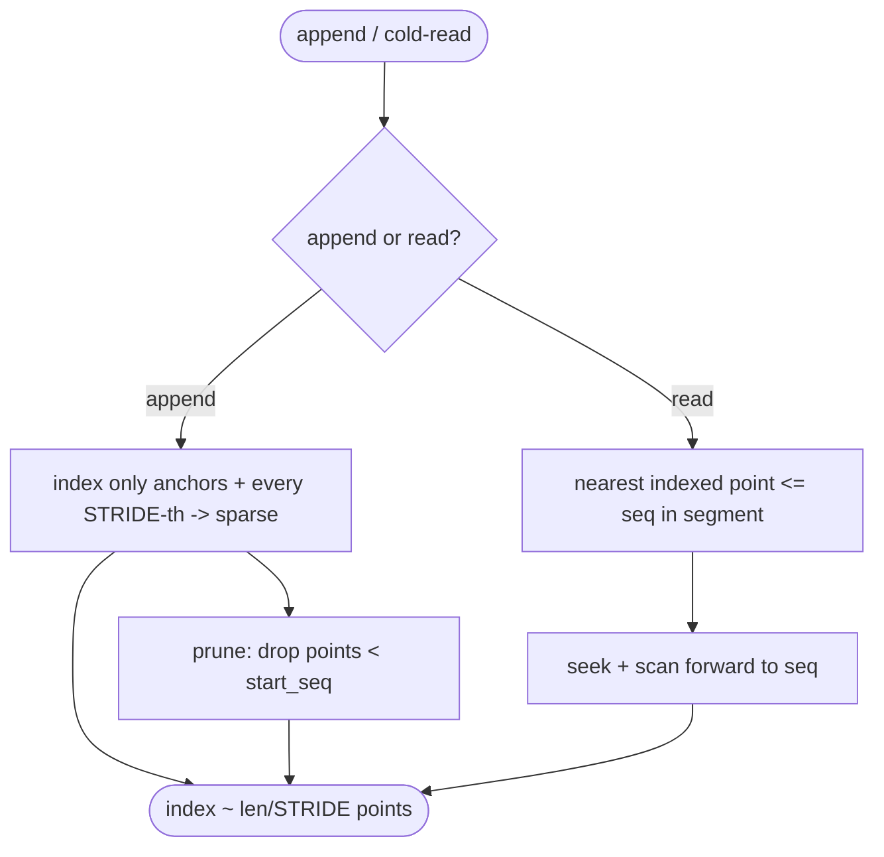
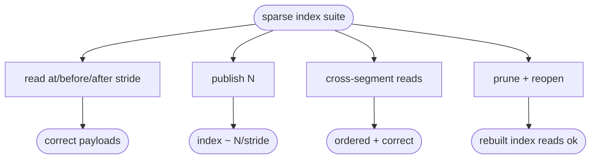

# relay sparse offset index (scale the log to billions of entries)

## Logic
<!-- type: logic lang: mermaid -->


## Unit Test
<!-- type: unit-test lang: mermaid -->



## Changes
<!-- type: changes lang: yaml -->

```yaml
changes:
  - path: projects/relay/src/log.rs
    action: modify
    section: logic
    impl_mode: hand-written
    reason: "Replace the dense offsets Vec with a sparse sorted index Vec<(Seq, u64)> (offset within segment), sampled every INDEX_STRIDE entries plus an anchor at each segment base_seq. read_disk_range locates the nearest indexed point <= the target in the same segment, seeks, and scans forward to reach it (then reads the run sequentially). Prune drops index points below start_seq; recovery rebuilds the sparse index. Add index_entries() for tests."
  - path: projects/relay/tests/sparse_index.rs
    action: create
    section: unit-test
    impl_mode: hand-written
    reason: "Tests: correct reads at/before/after stride boundaries, sparse index size ~ N/stride, cross-segment cold range, and correct reads after prune + reopen."
```
