<!-- HANDWRITE-BEGIN gap="missing-generator:logic:228fb179" tracker="1902" reason="Document the canonical local and Kubernetes structured stdout architecture and ownership boundaries." -->
# Structured stdout observability

This is the canonical ownership and verification contract for operational
service logs. Applications emit one versioned JSON object per stdout line.
Sift owns every collector adapter and the ingest/query plane. VAT and
Kubernetes expose or retain process output; neither parses application logs.

## Ownership

| Plane | Owner | Contract |
|---|---|---|
| HTTP request context | `service-http` plus the application router | Parse a valid W3C `traceparent`, preserve its trace id and parent span id, and create a new local span id. Invalid or missing input starts a new local root. |
| Structured service output | `service-observability` plus each service | Emit `axiom.service.log.v1` JSONL to stdout. No Sift client or collector dependency belongs in an application. |
| Local process lifecycle and capture | VAT | Capture stdout/stderr and expose trusted same-run paths such as `VAT_SERVICE_LUMEN_STDOUT_LOG`. VAT does not parse, forward, redact, or replay those bytes. |
| File/stdin collection | Sift | Validate, map, batch, retry, quarantine, checkpoint, and send through Sift's bounded ingest API. |
| Kubernetes collection | Sift | The Sift-owned CRI/GKE adapter reads container-runtime logs, tracks device/inode rotation, and feeds the same collector core. |
| Durable operational event and query | Sift | Fsync the raw event journal, project logs, and serve project/environment/correlation queries. |

Metrics remain on `/metrics`. OTLP traces may be exported independently, but
neither is a replacement for the stdout log contract described here.

## Local architecture

```mermaid
flowchart LR
    client["HTTP client with traceparent"] --> http["Lumen HTTP / service-http"]
    http --> app["Lumen request and audit spans"]
    app --> stdout["stdout: axiom.service.log.v1 JSONL"]

    subgraph vat["VAT run boundary"]
        stdout --> capture["VAT capture file"]
        capture -. "VAT_SERVICE_LUMEN_STDOUT_LOG" .-> runner["trusted VAT runner"]
    end

    runner --> collector["sift collect: file/stdin adapter"]
    collector --> core["Sift collector core: validate, map, batch, retry"]
    core --> ingest["POST /v1/events:write"]
    ingest --> journal["durable raw journal"]
    journal --> projection["logging projection"]
    projection --> query["POST /v1/logs:query"]
```



VAT is a test-environment orchestrator in this flow, not an observability
agent. Removing VAT changes only how the stdout file path is discovered; it
does not change the application or Sift contracts.

## Kubernetes architecture

```mermaid
flowchart LR
    client["HTTP client / ingress with traceparent"] --> pod["application pod"]
    pod --> stdout["container stdout JSONL"]
    stdout --> cri["container runtime CRI log files"]

    subgraph siftplane["Sift-owned collector plane"]
        adapter["CRI/GKE source adapter"] --> core["same collector core"]
        checkpoint["source identity + offset / rotation state"] --> adapter
        quarantine["bounded invalid-line quarantine"] <-- core
    end

    cri --> adapter
    core --> ingest["Sift bounded ingest API"]
    ingest --> journal["durable raw journal"]
    journal --> query["projections and query APIs"]
```

The application pod has no Sift sidecar, SDK, endpoint, token, or backpressure
loop. `sift k8s collector render` emits the node-level DaemonSet. It mounts
`/var/log/pods` read-only, keeps its device/inode checkpoint under a dedicated
writable host path, reads endpoint/project metadata from a ConfigMap and the
token from a Secret, and has no Kubernetes API permissions or token mount.

## `axiom.service.log.v1`

Every stdout record is one compact JSON object followed by one newline. The
shared schema is
`libs/service-observability/contracts/axiom.service.log.v1.schema.json`.

Required stable fields are `schema`, `timestamp`, `severity`, `service.name`,
`service.version`, `event`, `message`, and bounded primitive `attributes`.
Reserved correlation fields are `trace_id`, `span_id`, `parent_span_id`,
`trace_flags`, and `request_id`.

For an accepted W3C version `00` header:

- `trace_id` equals the inbound trace id;
- `parent_span_id` equals the inbound parent id;
- `span_id` is a newly generated nonzero local id;
- `trace_flags` preserves the inbound flags.

All ids are lowercase fixed-width hex. Zero ids, malformed headers, duplicate
headers, and unsupported versions are not trusted; the request proceeds with a
new local root so logging never depends on an exporter or collector being up.

## Collector guarantees

- File, stdin, and CRI sources implement one source/cursor interface and share
  the sole strict schema decoder, `OperationalEventV2` mapper, bounded batch,
  retry client, quarantine writer, and acknowledgment-before-commit runtime.
- Event ids derive from stable source identity, byte offset, and source bytes,
  so replay is idempotent at Sift ingest.
- Checkpoints advance only after the valid batch is acknowledged and invalid
  lines are fsynced to the bounded quarantine JSONL.
- Network errors, `429`, and `5xx` use bounded retry/backoff. Terminal rejects
  leave the checkpoint unchanged.
- CRI `P` fragments are assembled through `F`; incomplete groups remain
  uncommitted for restart/follow replay. Device/inode identity drains renamed
  files before same-path replacements start at offset zero.
- CRI discovery records last observed lengths. If retention removes a source
  with observed uncommitted bytes, the checkpoint and quarantine expose
  `lost_bytes`, `lost_sources`, and a durable `source_lost` record.
- Direct CRI and Cloud Logging input use the same recursively canonical
  workload+payload ID for `axiom.service.log.v1`, making dual delivery
  duplicate-safe even when Cloud Logging supplies its own preserved `insertId`.
- One-shot mode ends at current EOF. Follow mode supports regular files and
  CRI discovery without keeping more than one configured batch in memory.

## Reproduce locally

From the repository root:

```bash
cargo build -p vat -p lumen -p sift --bins
cargo test -p sift --test vat_lumen_observability_e2e vat_managed_lumen_stdout_reaches_real_sift_query -- --exact --nocapture
cargo test -p sift --test collector_cri -- --nocapture
cargo test -p sift --test deployment_cli
sift k8s collector render --namespace sift-system --image ghcr.io/chrischeng-c4/axiom/sift:0.1.1
```

The test starts real current-workspace VAT, Lumen, and Sift binaries. Its VAT
runner sends a fixed `traceparent`, reads only the advertised Lumen stdout path,
executes the real `sift collect` CLI, queries the real Sift logging API, and
retains `observability-proof.json`. The CRI suite uses real Sift processes and
node-log fixtures to verify partial framing, W3C trace correlation, workload
metadata, rename/replacement restart semantics, canonical Cloud Logging
coexistence, endpoint outage recovery, and explicit loss accounting. These are
complete local architecture proofs; they do not claim a live GKE rollout,
production load, HA, or independent EC approval.
<!-- HANDWRITE-END -->
