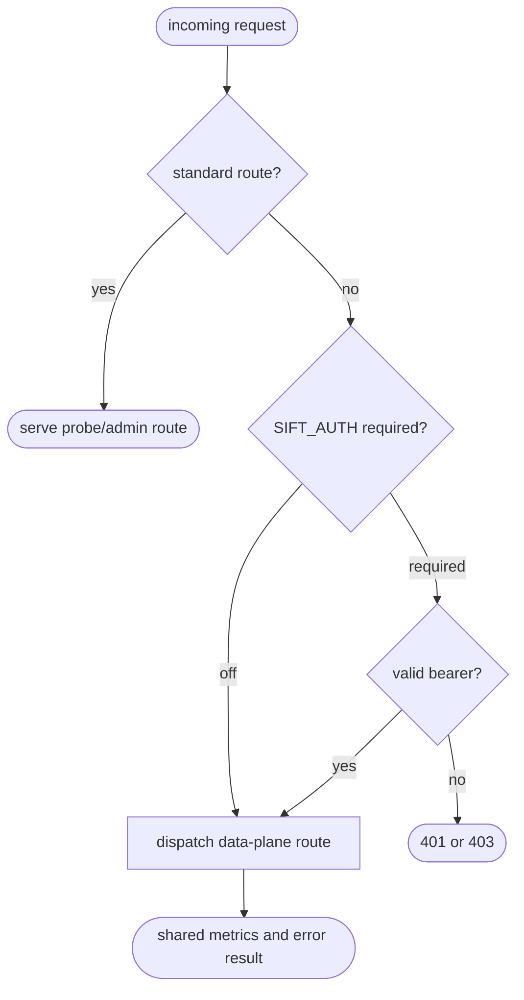

## Logic
<!-- type: logic lang: mermaid -->



## Changes
<!-- type: changes lang: yaml -->

```yaml
changes:
  - path: projects/sift/Cargo.toml
    action: modify
    section: logic
    impl_mode: hand-written
    gap: sift-shared-service-dependencies
    tracker: "1604"
    description: Compose service-auth, service-metrics, build-stamp, and typed OpenAPI code generation dependencies.
  - path: projects/sift/build.rs
    action: create
    section: logic
    impl_mode: hand-written
    gap: sift-build-provenance
    tracker: "1604"
    description: Stamp Sift source revision, build time, and target through the shared build-stamp crate.
  - path: projects/sift/src/auth.rs
    action: create
    section: logic
    impl_mode: hand-written
    gap: sift-shared-bearer-auth
    tracker: "1604"
    description: Adapt shared bearer-token verification to Sift environment configuration and data-plane middleware.
  - path: projects/sift/src/lib.rs
    action: modify
    section: logic
    impl_mode: hand-written
    gap: sift-runtime-security-routing
    tracker: "1604"
    description: Apply shared authorization, metrics, and structured error boundaries to Sift data-plane routes.
  - path: projects/sift/src/bin/sift.rs
    action: modify
    section: logic
    impl_mode: hand-written
    gap: sift-agent-cli-contract
    tracker: "1604"
    description: Add spec client generation, build metadata, and parseable JSON terminal output to the Sift CLI.
  - path: projects/sift/tests/runtime_security_e2e.rs
    action: create
    section: unit-test
    impl_mode: hand-written
    gap: sift-auth-route-contract-tests
    tracker: "1604"
    description: Verify required bearer auth protects data-plane routes while probes remain reachable.
  - path: projects/sift/tests/cli_contract.rs
    action: create
    section: unit-test
    impl_mode: hand-written
    gap: sift-agent-cli-contract-tests
    tracker: "1604"
    description: Verify JSON CLI output parses and spec generation emits a typed-client entrypoint.
```
