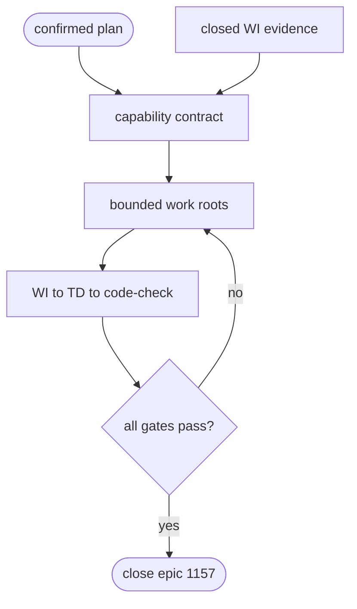

## Logic
<!-- type: logic lang: mermaid -->



## Changes
<!-- type: changes lang: yaml -->

```yaml
changes:
  - path: projects/sift/README.md
    action: modify
    section: logic
    impl_mode: hand-written
    gap: sift-domain-v1-capability-contract
    tracker: "1650"
    description: Add the six confirmed Domain v1 capability roots, correct evidence-backed baseline status, and attach bounded child work roots under epic 1157.
```
