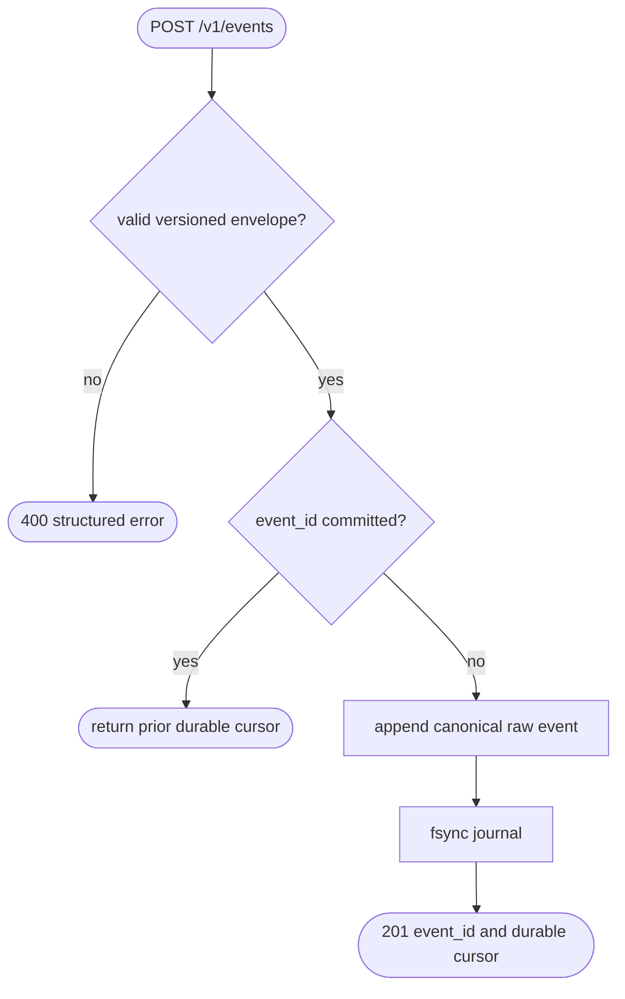

## Logic
<!-- type: logic lang: mermaid -->



## Changes
<!-- type: changes lang: yaml -->

```yaml
changes:
  - path: Cargo.toml
    action: modify
    section: changes
    impl_mode: hand-written
    gap: sift-workspace-registration
    tracker: "1576"
    description: Register the standalone Sift package in the root Cargo workspace.
  - path: projects/sift/Cargo.toml
    action: create
    section: changes
    impl_mode: hand-written
    gap: sift-service-manifest
    tracker: "1576"
    description: Define the standalone Sift Rust service package and its runtime dependencies.
  - path: projects/sift/src/lib.rs
    action: create
    section: logic
    impl_mode: hand-written
    gap: sift-service-core
    tracker: "1576"
    description: Implement the versioned operational-event envelope, durable raw journal, idempotency, query, and replay core.
  - path: projects/sift/src/bin/sift.rs
    action: create
    section: logic
    impl_mode: hand-written
    gap: sift-service-cli
    tracker: "1576"
    description: Implement serve, event, query, replay, spec, llm, upgrade, and issue CLI surfaces.
  - path: projects/sift/tests/ingest_api.rs
    action: create
    section: logic
    impl_mode: hand-written
    gap: sift-ingest-contract-tests
    tracker: "1576"
    description: Verify ingest acknowledgement, duplicate idempotency, direct metric preservation, query, and replay.
  - path: projects/sift/build.sh
    action: create
    section: changes
    impl_mode: hand-written
    gap: sift-build-entrypoint
    tracker: "1576"
    description: Build and locally install Sift with the required Rustup toolchain.
  - path: projects/sift/install.sh
    action: create
    section: changes
    impl_mode: hand-written
    gap: sift-install-entrypoint
    tracker: "1576"
    description: Install a target-specific Sift release archive with checksum verification.
  - path: projects/sift/llms.txt
    action: create
    section: changes
    impl_mode: hand-written
    gap: sift-agent-context
    tracker: "1576"
    description: Publish the TD-first agent context and operational command map.
```
