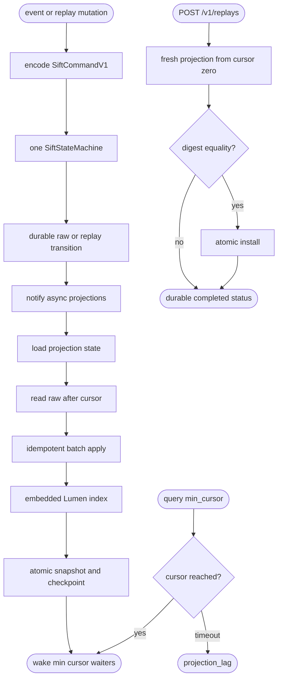
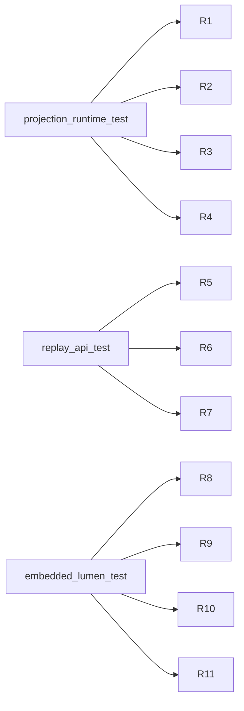

## Logic
<!-- type: logic lang: mermaid -->



## Schema
<!-- type: schema lang: yaml -->

```yaml
constants:
  projection_batch_size: 1000
  projection_wait_timeout_ms: 2000
  projection_retry_after_seconds: 1
  projection_state_format_version: 1
  command_format_version: 1
schemas:
  - name: SiftCommandV1
    kind: tagged_enum
    tag: kind
    variants:
      - name: append_event
        fields:
          - { name: event, type: OperationalEventV2, required: true }
      - name: upsert_replay_job
        fields:
          - { name: job, type: ReplayJob, required: true }
    compatibility: Bare OperationalEventV1/V2 Raft commands remain readable and upcast to append_event.
  - name: AppendResult
    fields:
      - { name: event_id, type: String, required: true }
      - { name: cursor, type: u64, required: true, description: Retained compatibility alias for raw_cursor. }
      - { name: raw_cursor, type: u64, required: true }
      - { name: commit_index, type: u64, required: true }
      - { name: duplicate, type: bool, required: true }
  - name: SiftControlState
    persistence: sift-control-state.json via service_durability atomic_write Always
    fields:
      - { name: format_version, type: u16, required: true }
      - { name: applied_index, type: u64, required: true }
      - { name: replay_jobs, type: "BTreeMap<String, ReplayJob>", required: true }
  - name: ProjectionDescriptor
    fields:
      - { name: name, type: String, required: true }
      - { name: schema_version, type: u32, required: true }
      - { name: retention, type: String, required: true }
  - name: ProjectionCheckpoint
    fields:
      - { name: projection, type: String, required: true }
      - { name: schema_version, type: u32, required: true }
      - { name: cursor, type: u64, required: true }
      - { name: event_id, type: String, required: false }
      - { name: state_sha256, type: String, required: true }
      - { name: updated_at, type: String, required: true, constraints: RFC3339 }
  - name: ProjectionStateEnvelope
    persistence: projections/<name>/state.json via one atomic fsync
    fields:
      - { name: format_version, type: u16, required: true }
      - { name: checkpoint, type: ProjectionCheckpoint, required: true }
      - { name: state_encoding, type: String, required: true, constraints: base64 }
      - { name: state_base64, type: String, required: true }
  - name: ReplayState
    kind: enum
    values: [pending, running, completed, failed]
  - name: ReplayJob
    fields:
      - { name: id, type: String, required: true }
      - { name: projection, type: String, required: true }
      - { name: state, type: ReplayState, required: true }
      - { name: requested_at, type: String, required: true }
      - { name: started_at, type: String, required: false }
      - { name: completed_at, type: String, required: false }
      - { name: source_cursor, type: u64, required: true }
      - { name: rebuilt_cursor, type: u64, required: false }
      - { name: live_digest, type: String, required: false }
      - { name: rebuilt_digest, type: String, required: false }
      - { name: equal, type: bool, required: false }
      - { name: error, type: String, required: false }
  - name: ProjectionLag
    fields:
      - { name: error, type: String, required: true, constraints: projection_lag }
      - { name: projection, type: String, required: true }
      - { name: required_cursor, type: u64, required: true }
      - { name: current_cursor, type: u64, required: true }
      - { name: retryable, type: bool, required: true, constraints: true }
      - { name: retry_after_seconds, type: u64, required: true }
projection_trait:
  required_methods: [descriptor, apply_idempotent, snapshot, restore]
  factory_requirement: Every registered projection provides a fresh factory for isolated rebuild.
embedded_lumen:
  crate: apps/lumen default-features=false
  collection: sift_operational_events_v1
  fields:
    body: { type: text, analyzer: whitespace_lower }
    project: { type: keyword }
    environment: { type: keyword }
    signal: { type: keyword }
    severity: { type: keyword }
    trace_id: { type: keyword }
    session_id: { type: keyword }
    occurred_at: { type: keyword }
    cursor: { type: number }
  deny: Arbitrary payload and attribute keys are never promoted to fields.
durability_order:
  append_event: governance -> Raft/local state-machine commit index -> blob/raw segment fsync -> control applied-index fsync -> acknowledgement
  replay_job: Raft/local state-machine commit index -> replay catalog transition fsync -> acknowledgement
  projection_batch: apply in memory -> serialize -> hash -> atomic state plus checkpoint fsync -> publish cursor -> notify waiters
```

## REST API
<!-- type: rest-api lang: yaml -->

```yaml
openapi: 3.1.0
info:
  title: Sift Projection Replay Slice
  version: 1.0.0
paths:
  /v1/replays:
    post:
      operationId: startReplay
      summary: Start an isolated raw-journal rebuild for one registered projection.
      requestBody:
        required: true
        content:
          application/json:
            schema:
              type: object
              required: [projection]
              properties:
                projection: { type: string }
      responses:
        "202":
          description: Replay mutation is durable and asynchronous rebuild is scheduled.
          content:
            application/json:
              schema: { $ref: "#/components/schemas/ReplayJob" }
        "400": { description: Unknown or invalid projection. }
        "503": { description: Mutation could not pass the shared state-machine durability boundary. }
  /v1/replays/{id}:
    get:
      operationId: getReplay
      summary: Read durable pending/running/completed/failed replay state.
      parameters:
        - { name: id, in: path, required: true, schema: { type: string } }
      responses:
        "200":
          description: Durable replay state.
          content:
            application/json:
              schema: { $ref: "#/components/schemas/ReplayJob" }
        "404": { description: Replay id not found. }
components:
  schemas:
    ReplayJob:
      type: object
      required: [id, projection, state, requested_at, source_cursor]
      properties:
        id: { type: string }
        projection: { type: string }
        state: { type: string, enum: [pending, running, completed, failed] }
        requested_at: { type: string, format: date-time }
        started_at: { type: [string, "null"], format: date-time }
        completed_at: { type: [string, "null"], format: date-time }
        source_cursor: { type: integer, format: uint64 }
        rebuilt_cursor: { type: [integer, "null"], format: uint64 }
        live_digest: { type: [string, "null"] }
        rebuilt_digest: { type: [string, "null"] }
        equal: { type: [boolean, "null"] }
        error: { type: [string, "null"] }
x-sift-shared-query-contract:
  min_cursor:
    behavior: Store query handlers call ProjectionRuntime.wait_for before reading a view.
    timeout_status: 503
    error: projection_lag
    headers: { Retry-After: "1" }
    body_fields: [projection, required_cursor, current_cursor, retryable, retry_after_seconds]
```

## Unit Test
<!-- type: unit-test lang: mermaid -->



## Changes
<!-- type: changes lang: yaml -->

```yaml
changes:
  - path: projects/sift/Cargo.toml
    action: modify
    section: logic
    impl_mode: hand-written
    gap: sift-embedded-lumen-dependency
    tracker: "1660"
    description: Link the lumen crate with default features disabled; do not link its server, operator, WAL, or Raft features.
  - path: projects/sift/src/projection/mod.rs
    action: create
    section: logic
    impl_mode: hand-written
    gap: sift-projection-module
    tracker: "1660"
    description: Export projection contracts, runtime, replay state, and the embedded Lumen adapter.
  - path: projects/sift/src/projection/model.rs
    action: create
    section: schema
    impl_mode: hand-written
    gap: sift-projection-model
    tracker: "1660"
    description: Define descriptors, checkpoints, state envelopes, replay jobs, and projection-lag errors.
  - path: projects/sift/src/projection/runtime.rs
    action: create
    section: logic
    impl_mode: hand-written
    gap: sift-projection-runtime
    tracker: "1660"
    description: Register factories, restore atomic states, catch up asynchronously, wait for cursors, and rebuild from raw.
  - path: projects/sift/src/projection/lumen.rs
    action: create
    section: logic
    impl_mode: hand-written
    gap: sift-embedded-lumen-adapter
    tracker: "1660"
    description: Wrap lumen Engine and RdbSnapshot for fixed-field indexing/search without a second service or durable log.
  - path: projects/sift/src/durability.rs
    action: modify
    section: schema
    impl_mode: hand-written
    gap: sift-framed-journal-state-machine
    tracker: "1605"
    description: Add backward-compatible SiftCommandV1, durable control state, replay transitions, and separate commit/raw cursor semantics.
  - path: projects/sift/src/lib.rs
    action: modify
    section: rest-api
    impl_mode: hand-written
    gap: sift-service-core
    tracker: "1576"
    description: Route all HTTP mutations through one state machine, start the projection worker, expose replay APIs, and map projection_lag.
  - path: projects/sift/src/bin/sift.rs
    action: modify
    section: logic
    impl_mode: hand-written
    gap: sift-domain-v1-projection-worker
    tracker: "1660"
    description: Start and gracefully stop the in-process projection worker with the Sift service.
  - path: projects/sift/tests/projection_runtime.rs
    action: create
    section: unit-test
    impl_mode: hand-written
    gap: sift-projection-runtime-tests
    tracker: "1660"
    description: Verify idempotency, atomic restart, lag waits, and fresh/live rebuild equality.
  - path: projects/sift/tests/replay_api.rs
    action: create
    section: unit-test
    impl_mode: hand-written
    gap: sift-replay-api-tests
    tracker: "1660"
    description: Verify one-state-machine event/replay ordering, durable job restart, and API lifecycle.
  - path: projects/sift/tests/embedded_lumen_projection.rs
    action: create
    section: unit-test
    impl_mode: hand-written
    gap: sift-embedded-lumen-tests
    tracker: "1660"
    description: Verify fixed-field text/keyword/range search, snapshot restore, and absence of a second service boundary.
```
