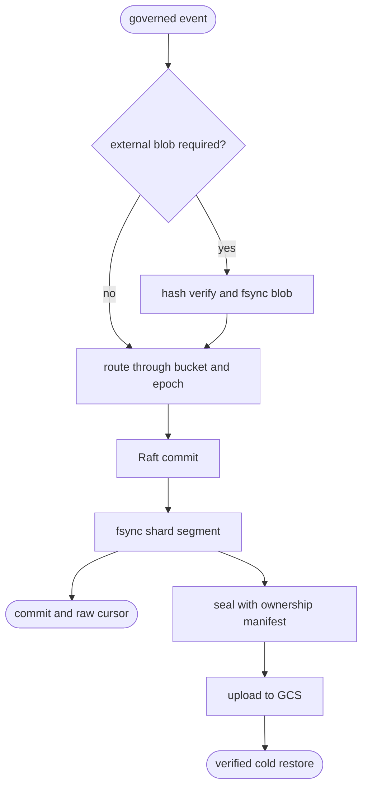

## Logic
<!-- type: logic lang: mermaid -->



## Schema
<!-- type: schema lang: yaml -->

```yaml
constants:
  virtual_buckets: 4096
  initial_logical_shards: 16
  default_segment_events: 1000
  blob_externalize_bytes: 65536
schemas:
  - name: BlobRef
    fields:
      - { name: hash, type: String, required: true, constraints: "sha256:<64 lowercase hex>" }
      - { name: size, type: u64, required: true }
      - { name: encoding, type: String, required: true }
  - name: EpochMap
    fields:
      - { name: epoch, type: u64, required: true }
      - { name: activated_at_cursor, type: u64, required: true }
      - { name: bucket_to_shard, type: "Vec<u16>", required: true, constraints: "exactly 4096" }
  - name: SegmentManifest
    fields:
      - { name: segment_id, type: String, required: true }
      - { name: epoch, type: u64, required: true }
      - { name: shard, type: u16, required: true }
      - { name: bucket_min, type: u16, required: true }
      - { name: bucket_max, type: u16, required: true }
      - { name: first_cursor, type: u64, required: true }
      - { name: last_cursor, type: u64, required: true }
      - { name: event_count, type: u64, required: true }
      - { name: bytes, type: u64, required: true }
      - { name: sha256, type: String, required: true }
      - { name: state, type: SegmentState, required: true }
      - { name: object_uri, type: String, required: false }
  - name: ArchiveManifest
    fields:
      - { name: format_version, type: u16, required: true }
      - { name: generated_at, type: RFC3339, required: true }
      - { name: epochs, type: "Vec<EpochMap>", required: true }
      - { name: segments, type: "Vec<SegmentManifest>", required: true }
      - { name: blobs, type: "Vec<BlobRef>", required: true }
ordering:
  append: "durable blob -> routed segment fsync -> compatibility journal fsync -> state visibility -> ack"
  archive: "segment/blob objects -> hash verification -> archive manifest last"
  restore: "manifest -> objects -> hashes -> local manifests -> replay"
compatibility:
  v1_raw_journal: imported into epoch 1 segments at open and kept readable
  epoch_change: only cursors at or after activated_at_cursor use the new map
  movement: sealed bytes are copied and manifest location changes; event bytes are never rewritten
```

## Unit Test
<!-- type: unit-test lang: mermaid -->

```mermaid
---
id: sift-sharded-journal-gcs-verification
requirements:
  routing:
    id: R1
    text: "4096 buckets route deterministically and new epochs affect only subsequent cursors"
    kind: functional
    risk: critical
    verify: test
  blob_order:
    id: R2
    text: "large binary content is hash verified and durable before the referencing raw frame"
    kind: reliability
    risk: critical
    verify: test
  segment_recovery:
    id: R3
    text: "torn active tails recover and sealed manifests preserve epoch ownership after movement"
    kind: compatibility
    risk: critical
    verify: test
  gcs_restore:
    id: R4
    text: "Vat GCS receives objects and manifest and exact cold restore verifies content hashes"
    kind: reliability
    risk: critical
    verify: test
elements:
  epoch_route_test: { kind: test, type: "rs/#[test]" }
  blob_segment_test: { kind: test, type: "rs/#[test]" }
  torn_tail_test: { kind: test, type: "rs/#[test]" }
  vat_gcs_test: { kind: test, type: "rs/#[tokio::test]" }
relations:
  - { from: epoch_route_test, verifies: routing }
  - { from: blob_segment_test, verifies: blob_order }
  - { from: torn_tail_test, verifies: segment_recovery }
  - { from: vat_gcs_test, verifies: gcs_restore }
---
requirementDiagram
    requirement R1 { id: R1 text: "bucket and epoch routing" risk: critical verifymethod: test }
    requirement R2 { id: R2 text: "blob before frame" risk: critical verifymethod: test }
    requirement R3 { id: R3 text: "segment recovery and movement" risk: critical verifymethod: test }
    requirement R4 { id: R4 text: "Vat GCS cold restore" risk: critical verifymethod: test }
    element vat_gcs_test { type: "rs/#[tokio::test]" }
    vat_gcs_test - verifies -> R4
```

## Changes
<!-- type: changes lang: yaml -->

```yaml
changes:
  - path: libs/service-backup/Cargo.toml
    action: modify
    section: logic
    impl_mode: hand-written
    gap: service-backup-gcs-dependencies
    tracker: "1659"
    description: Add blocking rustls HTTP, JSON, URL encoding, and timestamp dependencies for the synchronous BackupSink contract.
  - path: libs/service-backup/src/gcs.rs
    action: create
    section: logic
    impl_mode: hand-written
    gap: service-backup-gcs-adapter
    tracker: "1659"
    description: Implement GCS JSON API put/list/prune/get with Vat emulator endpoint support and ADC workload-identity bearer tokens.
  - path: libs/service-backup/src/lib.rs
    action: modify
    section: logic
    impl_mode: hand-written
    gap: service-backup-gcs-exports
    tracker: "1659"
    description: Export the real GCS sink and source contract and remove obsolete unsupported documentation.
  - path: libs/service-backup/src/sink.rs
    action: modify
    section: logic
    impl_mode: hand-written
    gap: service-backup-gcs-sink-routing
    tracker: "1659"
    description: Construct GcsSink for gs destinations and retain UnsupportedCloudSink only for optional unlinked S3.
  - path: libs/service-backup/src/source.rs
    action: modify
    section: logic
    impl_mode: hand-written
    gap: service-backup-gcs-source-routing
    tracker: "1659"
    description: Fetch exact gs object URIs through the shared GCS client.
  - path: projects/sift/src/event/model.rs
    action: modify
    section: schema
    impl_mode: hand-written
    gap: sift-content-blob-reference
    tracker: "1659"
    description: Add optional hash, size, and encoding blob references to OperationalEventV2 without breaking v1 upcast.
  - path: projects/sift/src/storage/mod.rs
    action: create
    section: logic
    impl_mode: hand-written
    gap: sift-sharded-storage-module
    tracker: "1659"
    description: Compose blob, routing, segment, and archive ownership as Sift's canonical raw storage plane.
  - path: projects/sift/src/storage/blob.rs
    action: create
    section: logic
    impl_mode: hand-written
    gap: sift-content-addressed-blob-store
    tracker: "1659"
    description: Atomically fsync SHA-256-addressed blobs and externalize large base64 payload fields before raw append.
  - path: projects/sift/src/storage/shard.rs
    action: create
    section: logic
    impl_mode: hand-written
    gap: sift-epoch-bucket-router
    tracker: "1659"
    description: Persist and validate 4096-bucket epoch maps and route future cursors without changing historical ownership.
  - path: projects/sift/src/storage/segment.rs
    action: create
    section: logic
    impl_mode: hand-written
    gap: sift-sealed-segment-store
    tracker: "1659"
    description: Append CRC frames per epoch/shard, recover torn tails, seal manifests, and move immutable segments without rewriting bytes.
  - path: projects/sift/src/storage/archive.rs
    action: create
    section: logic
    impl_mode: hand-written
    gap: sift-gcs-archive-manifest
    tracker: "1659"
    description: Upload sealed segments and blobs before the archive manifest and restore only hash-verified objects.
  - path: projects/sift/src/lib.rs
    action: modify
    section: logic
    impl_mode: hand-written
    gap: sift-sharded-journal-integration
    tracker: "1659"
    description: Externalize blobs and fsync routed segments before compatibility journal acknowledgement; reconcile legacy journal state on open.
  - path: projects/sift/tests/sharded_journal.rs
    action: create
    section: unit-test
    impl_mode: hand-written
    gap: sift-sharded-journal-tests
    tracker: "1659"
    description: Verify deterministic routing, future-only epochs, blob ordering, sealing/movement, torn tails, and compatibility recovery.
  - path: projects/sift/tests/gcs_archive.rs
    action: create
    section: unit-test
    impl_mode: hand-written
    gap: sift-vat-gcs-archive-tests
    tracker: "1659"
    description: Run Vat Cloud Storage emulator with real service-backup GCS requests and verify archive/restore hash equality.
```
