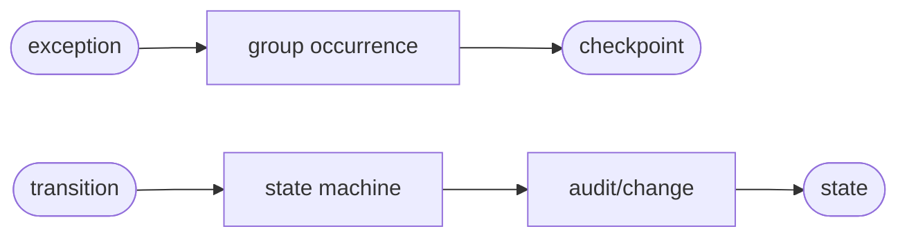
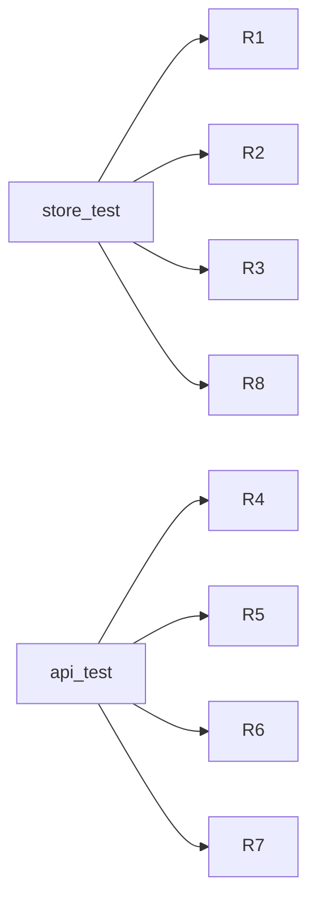

## Logic
<!-- type: logic lang: mermaid -->



## Schema
<!-- type: schema lang: yaml -->

```yaml
constants:
  projection: error-report-store
  schema_version: 1
  fingerprint_version: sift.error.fingerprint.v1
enums:
  ErrorLifecycleState: [open, acknowledged, resolved, muted]
schemas:
  - name: ErrorOccurrenceV1
    fields:
      - { name: cursor, type: u64, required: true }
      - { name: event_id, type: String, required: true }
      - { name: occurred_at, type: String, required: true }
      - { name: exception_type, type: String, required: true }
      - { name: message, type: String, required: true }
      - { name: stacktrace, type: String, required: false }
      - { name: trace_id, type: String, required: false }
      - { name: span_id, type: String, required: false }
      - { name: request_id, type: String, required: false }
      - { name: session_id, type: String, required: false }
  - name: ErrorLifecycleV1
    fields:
      - { name: project, type: String, required: true }
      - { name: fingerprint, type: String, required: true }
      - { name: state, type: ErrorLifecycleState, required: true }
      - { name: muted_until, type: String, required: false }
      - { name: actor, type: String, required: true }
      - { name: reason, type: String, required: false }
      - { name: occurrence_cursor, type: u64, required: true }
      - { name: updated_at, type: String, required: true }
      - { name: commit_index, type: u64, required: true }
  - name: ErrorGroupV1
    fields:
      - { name: project, type: String, required: true }
      - { name: fingerprint, type: String, required: true }
      - { name: fingerprint_version, type: String, required: true }
      - { name: state, type: ErrorLifecycleState, required: true }
      - { name: occurrences, type: "Vec<ErrorOccurrenceV1>", required: true }
      - { name: first_seen, type: String, required: true }
      - { name: last_seen, type: String, required: true }
      - { name: occurrence_count, type: u64, required: true }
      - { name: reopened, type: bool, required: true }
fingerprint_inputs:
  - normalized exception type
  - normalized message with volatile ids and numbers replaced
  - normalized top application stack frames
```

## REST API
<!-- type: rest-api lang: yaml -->

```yaml
openapi: 3.1.0
info: { title: Sift Error Store Slice, version: 1.0.0 }
paths:
  /v1/errors:query:
    post:
      operationId: queryErrors
      summary: Query deterministic error groups and ordered occurrences.
      responses:
        "200": { description: Stable error group page. }
        "403": { description: Project read denied. }
        "503": { description: Shared projection_lag. }
  /v1/errors/{fingerprint}:
    get:
      operationId: getErrorGroup
      responses:
        "200": { description: Error group detail. }
        "404": { description: Group absent. }
  /v1/errors/{fingerprint}/state:
    put:
      operationId: transitionErrorGroup
      summary: Durably acknowledge, resolve, mute, or reopen a group.
      responses:
        "200": { description: Committed lifecycle state and audit/change cursors. }
        "400": { description: Invalid state or mute expiry. }
        "403": { description: Project write denied. }
        "404": { description: Group absent. }
```

## Unit Test
<!-- type: unit-test lang: mermaid -->



## Changes
<!-- type: changes lang: yaml -->

```yaml
changes:
  - { path: projects/sift/src/projection/error_report.rs, action: create, section: schema, impl_mode: hand-written, gap: sift-error-report-projection, tracker: "1666", description: "Define exception normalization, fingerprints, groups, occurrences, query, snapshot, and rebuild semantics." }
  - { path: projects/sift/src/projection/model.rs, action: modify, section: schema, impl_mode: hand-written, gap: sift-projection-model, tracker: "1660", description: "Persist error lifecycle control state beside replay jobs." }
  - { path: projects/sift/src/projection/mod.rs, action: modify, section: logic, impl_mode: hand-written, gap: sift-projection-module, tracker: "1660", description: "Export error projection and lifecycle contracts." }
  - { path: projects/sift/src/projection/runtime.rs, action: modify, section: logic, impl_mode: hand-written, gap: sift-projection-runtime, tracker: "1660", description: "Register the independent error projection and typed reads." }
  - { path: projects/sift/src/durability.rs, action: modify, section: logic, impl_mode: hand-written, gap: sift-framed-journal-state-machine, tracker: "1605", description: "Commit lifecycle state and audit/change evidence in the one Sift state machine." }
  - { path: projects/sift/src/lib.rs, action: modify, section: rest-api, impl_mode: hand-written, gap: sift-service-core, tracker: "1576", description: "Add authorized error query, detail, and lifecycle routes." }
  - { path: projects/sift/tests/error_report_store.rs, action: create, section: unit-test, impl_mode: hand-written, gap: sift-error-report-store-tests, tracker: "1666", description: "Verify fingerprint boundaries, occurrences, correlations, and rebuild equality." }
  - { path: projects/sift/tests/error_report_api.rs, action: create, section: unit-test, impl_mode: hand-written, gap: sift-error-report-api-tests, tracker: "1666", description: "Verify durable authorized lifecycle, reopen, mute expiry, and audit/change evidence." }
```
