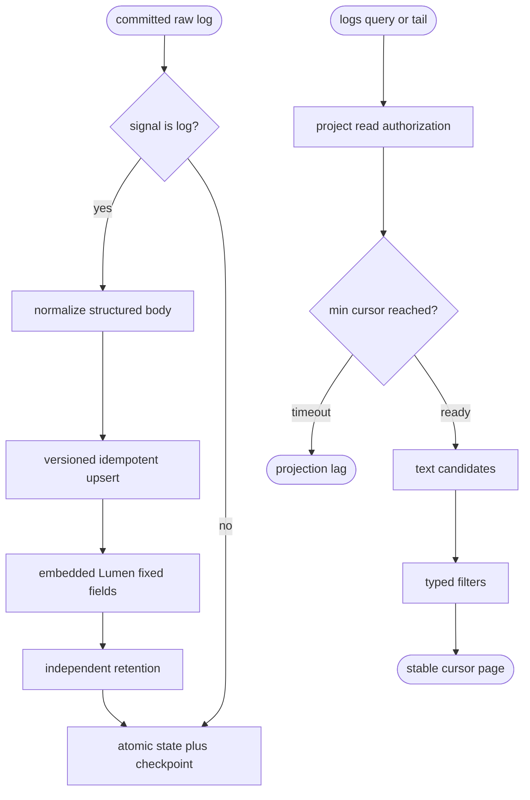
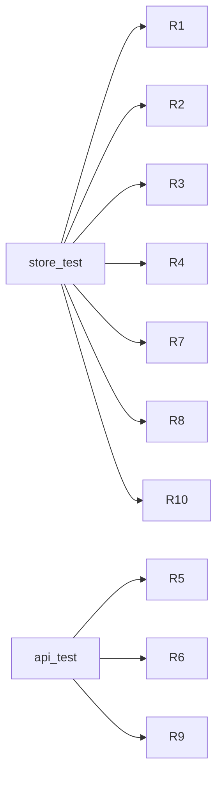

## Logic
<!-- type: logic lang: mermaid -->



## Schema
<!-- type: schema lang: yaml -->

```yaml
constants:
  logging_projection: logging-store
  logging_schema_version: 1
  default_retained_records: 1000000
  max_query_limit: 1000
schemas:
  - name: LogRecordV1
    fields:
      - { name: cursor, type: u64, required: true }
      - { name: event_id, type: String, required: true }
      - { name: project, type: String, required: true }
      - { name: environment, type: String, required: true }
      - { name: occurred_at, type: String, required: true, constraints: RFC3339 }
      - { name: observed_at, type: String, required: true, constraints: RFC3339 }
      - { name: severity, type: String, required: false }
      - { name: body_text, type: String, required: true }
      - { name: json_payload, type: JSON, required: true, constraints: object for GCP jsonPayload, structured value otherwise }
      - { name: resource, type: "BTreeMap<String,String>", required: true }
      - { name: attributes, type: "BTreeMap<String,AttributeValue>", required: true }
      - { name: trace_id, type: String, required: false }
      - { name: span_id, type: String, required: false }
      - { name: request_id, type: String, required: false }
      - { name: session_id, type: String, required: false }
      - { name: coexistence_key, type: String, required: true, description: Stable project plus event identity for later Cloud Logging collector dedupe. }
  - name: LogQuery
    fields:
      - { name: project, type: String, required: true }
      - { name: environment, type: String, required: false }
      - { name: start_time, type: String, required: false, constraints: RFC3339 inclusive }
      - { name: end_time, type: String, required: false, constraints: RFC3339 exclusive }
      - { name: severity, type: String, required: false }
      - { name: resource_type, type: String, required: false }
      - { name: service_name, type: String, required: false }
      - { name: trace_id, type: String, required: false }
      - { name: span_id, type: String, required: false }
      - { name: request_id, type: String, required: false }
      - { name: session_id, type: String, required: false }
      - { name: text, type: String, required: false }
      - { name: attribute_equals, type: "BTreeMap<String,AttributeValue>", required: false }
      - { name: after_cursor, type: u64, required: false, default: 0 }
      - { name: min_cursor, type: u64, required: false }
      - { name: limit, type: usize, required: false, default: 100, maximum: 1000 }
  - name: LogPage
    fields:
      - { name: records, type: "Vec<LogRecordV1>", required: true }
      - { name: next_cursor, type: u64, required: true }
      - { name: projection_cursor, type: u64, required: true }
      - { name: has_more, type: bool, required: true }
logging_lumen_fields:
  body: text
  project: keyword
  environment: keyword
  severity: keyword
  resource_type: keyword
  service_name: keyword
  trace_id: keyword
  span_id: keyword
  request_id: keyword
  session_id: keyword
  occurred_at: keyword
  coexistence_key: keyword
  cursor: number
retention:
  unit: records
  behavior: Remove the oldest record rows after the configured bound; raw events remain authoritative and rebuildable.
  independence: Logging snapshot and checkpoint are separate from every other projection.
```

## REST API
<!-- type: rest-api lang: yaml -->

```yaml
openapi: 3.1.0
info: { title: Sift Logging Store Slice, version: 1.0.0 }
paths:
  /v1/logs:query:
    post:
      operationId: queryLogs
      summary: Query the dedicated logging projection with typed filters and stable raw-cursor pagination.
      requestBody:
        required: true
        content:
          application/json:
            schema: { $ref: "#/components/schemas/LogQuery" }
      responses:
        "200": { description: Stable log page. }
        "400": { description: Invalid time, limit, or filter. }
        "403": { description: Project read denied. }
        "503": { description: projection_lag with Retry-After. }
  /v1/logs:tail:
    get:
      operationId: tailLogs
      summary: Return a bounded cursor-resumable log page for a caller-owned tail loop.
      parameters:
        - { name: project, in: query, required: true, schema: { type: string } }
        - { name: after_cursor, in: query, required: false, schema: { type: integer, format: uint64 } }
        - { name: min_cursor, in: query, required: false, schema: { type: integer, format: uint64 } }
        - { name: limit, in: query, required: false, schema: { type: integer, maximum: 1000 } }
      responses:
        "200": { description: Bounded page carrying next_cursor for resume. }
        "403": { description: Project read denied. }
        "503": { description: projection_lag with Retry-After. }
components:
  schemas:
    LogQuery: { type: object, required: [project] }
    LogPage: { type: object, required: [records, next_cursor, projection_cursor, has_more] }
```

## Unit Test
<!-- type: unit-test lang: mermaid -->



## Changes
<!-- type: changes lang: yaml -->

```yaml
changes:
  - path: projects/sift/src/projection/logging.rs
    action: create
    section: schema
    impl_mode: hand-written
    gap: sift-logging-projection
    tracker: "1664"
    description: Define the log record/query/page schema, fixed-field embedded Lumen index, retention, snapshot, restore, and typed query behavior.
  - path: projects/sift/src/projection/mod.rs
    action: modify
    section: logic
    impl_mode: hand-written
    gap: sift-projection-module
    tracker: "1660"
    description: Export logging projection contracts.
  - path: projects/sift/src/projection/runtime.rs
    action: modify
    section: logic
    impl_mode: hand-written
    gap: sift-projection-runtime
    tracker: "1660"
    description: Register the logging projection factory and expose typed read access without a second service boundary.
  - path: projects/sift/src/lib.rs
    action: modify
    section: rest-api
    impl_mode: hand-written
    gap: sift-service-core
    tracker: "1576"
    description: Add project-authorized logs query/tail routes, shared min-cursor lag mapping, and OpenAPI schemas.
  - path: projects/sift/tests/logging_store.rs
    action: create
    section: unit-test
    impl_mode: hand-written
    gap: sift-logging-store-tests
    tracker: "1664"
    description: Verify golden GCP/OTel records, filters, text, retention, coexistence identity, and rebuild equality.
  - path: projects/sift/tests/logging_api.rs
    action: create
    section: unit-test
    impl_mode: hand-written
    gap: sift-logging-api-tests
    tracker: "1664"
    description: Verify typed query, stable tail resume, min cursor lag, and project read authorization.
```
