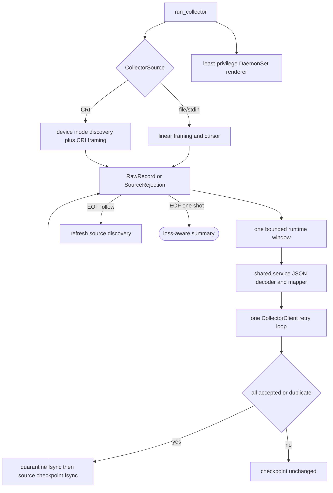

## Logic
<!-- type: logic lang: mermaid -->



Contract invariants:

- `CollectorSource` owns only framing, discovery, cursor identity, and typed checkpoint persistence. The sole runtime owns `batch_size`, `decode_service_log`, `OperationalEventV2` mapping, `CollectorClient`, retry classification, quarantine ordering, and acknowledgment-before-commit for all source kinds. CRI modules neither deserialize `ServiceLogEventV1` nor issue HTTP requests.
- `RawRecord` carries exact application bytes, stable source id, starting offset/physical line, an opaque next-cursor token, bounded resource/attribute enrichment, and an optional coexistence identity strategy. `SourceRejection` carries the same commit token so malformed CRI envelopes can be durably quarantined without blocking later records.
- CRI input is `<RFC3339Nano> <stdout|stderr> <P|F> <content>`. Contiguous same-stream `P` fragments concatenate until `F`; the application record starts at the first fragment offset. Incomplete EOF leaves the first-fragment cursor uncommitted. Assembled content and physical envelope lines obey `max_line_bytes`.
- CRI discovery canonicalizes the configured root, never follows symlinks, accepts regular files whose relative path matches `<namespace>_<pod>_<uid>/<container>/<restart>.log...`, bounds every identifier, and keys files by Unix `device:inode`. Previously checkpointed identities drain before new identities; rename preserves identity/offset and same-path inode replacement starts from zero.
- `collector.cri.checkpoint.v1` binds to canonical root and stores each identity's offset, line, last observed length, last relative path/workload fields, retirement flag, and cumulative counters. Missing identities with `offset < observed_len` generate exactly one `source_lost` quarantine item and increment `lost_bytes`/`lost_sources`; acknowledged EOF removal is loss-free.
- Source enrichment sets `gcp.resource.type=k8s_container`, `gcp.project_id`, optional `k8s.cluster.name`/`cloud.region`, namespace, pod, uid, container, optional node, `collector.stream`, source identity, and byte offset. The producer payload and trace/span/request fields remain unchanged.
- CRI calls the same `gcp::stable_id(project, resource_type, timestamp, monitored_resource_labels, jsonPayload)` used for Cloud Logging entries whose payload schema is `axiom.service.log.v1`. Resource labels include project, cluster, location, namespace, pod, and container so equivalent dual delivery has one journal event id while separate workloads cannot collide; Cloud `insertId` is preserved as `gcp.insert_id`, while it remains authoritative for non-Axiom GCP logs.
- Endpoint failure never calls `source.commit`. The runtime holds at most one batch; node log retention is the outage buffer, and disappearance before acknowledgment is surfaced by durable loss accounting on the next reconciliation.
- `sift k8s collector render` renders a Sift-owned ServiceAccount and DaemonSet with `/var/log/pods` read-only, `/var/lib/sift-collector` read-write, Secret/ConfigMap-sourced endpoint/token/project/cluster/location, Downward API node name, disabled token automount, seccomp RuntimeDefault, dropped capabilities, read-only root filesystem, and CPU/memory requests/limits. The collector container alone runs as UID 0 because GKE makes the root-owned CRI log tree unreadable to an arbitrary non-root UID; that UID is constrained to the read-only host mount, and it has no Kubernetes API token, privilege escalation, or Linux capabilities. It creates no Role or ClusterRole because it performs no Kubernetes API calls.
## Changes
<!-- type: changes lang: yaml -->

```yaml
changes:
  - path: projects/sift/src/collector/mod.rs
    action: modify
    anchor: SourceSpec
    section: logic
    impl_mode: hand-written
    description: Add typed CRI config/metadata, loss-aware summary, validation, and exports behind the existing run_collector API.
  - path: projects/sift/src/collector/source.rs
    action: create
    section: logic
    impl_mode: hand-written
    description: Own source-neutral records, enrichment, opaque commit cursors, outcomes, CollectorSource, and linear file/stdin framing.
  - path: projects/sift/src/collector/cri.rs
    action: create
    section: logic
    impl_mode: hand-written
    description: Own safe CRI discovery, envelope/partial framing, device-inode rotation, multi-source checkpoint, metadata, and loss accounting.
  - path: projects/sift/src/collector/runtime.rs
    action: modify
    anchor: run
    section: logic
    impl_mode: hand-written
    description: Drive every CollectorSource through one bounded decode/map/deliver/quarantine/ack/commit loop.
  - path: projects/sift/src/collector/model.rs
    action: modify
    anchor: decode_service_log
    section: logic
    impl_mode: hand-written
    description: Merge bounded source enrichment and optional CRI coexistence identity after the shared service log decode.
  - path: projects/sift/src/ingest/gcp.rs
    action: modify
    anchor: stable_id
    section: logic
    impl_mode: hand-written
    description: Share the canonical Axiom service-log Cloud Logging identity with the CRI mapper while preserving external insertId metadata.
  - path: projects/sift/src/bin/sift.rs
    action: modify
    anchor: collect
    section: logic
    impl_mode: hand-written
    description: Expose --cri-root with GKE metadata/state flags and the layered k8s collector renderer.
  - path: projects/sift/src/deploy.rs
    action: modify
    anchor: operator_yaml
    section: logic
    impl_mode: hand-written
    description: Render validated Sift collector DaemonSet assets.
  - path: projects/sift/k8s/collector/daemonset.yaml
    action: create
    section: logic
    impl_mode: hand-written
    description: Define the zero-API-permission ServiceAccount and hardened node collector DaemonSet; use a capability-free root collector only to traverse GKE's read-only root-owned CRI log tree.
  - path: projects/sift/tests/collector_cri.rs
    action: create
    section: unit-test
    impl_mode: hand-written
    description: Prove framing, correlation, metadata, rotation/restart, dedupe, outage recovery, and loss against real Sift.
  - path: projects/sift/tests/deployment_cli.rs
    action: modify
    anchor: layered_deployment_cli_renders_all_artifact_planes
    section: unit-test
    impl_mode: hand-written
    description: Prove the rendered collector least-privilege and resource contract.
```

The generated target list intentionally excludes Lumen, the shared stdout schema,
and explanatory Markdown: applications continue to emit only
`axiom.service.log.v1` JSONL, while the README capability evidence and
`observability/structured-stdout.md` runbook are updated through their existing
document ownership rather than Rust-item code generation.
## Unit Test
<!-- type: unit-test lang: mermaid -->

```mermaid
---
id: gke-cri-collector-adapter-verification
requirements:
  coexistence:
    id: R5
    text: "Equivalent CRI and Cloud Logging inputs, including a Cloud-generated insertId, converge on one canonical Axiom service-log event id and real-Sift dual delivery is duplicate-safe."
    kind: compatibility
    risk: high
    verify: cargo test -p sift --test collector_cri
  cri_framing:
    id: R2
    text: "CRI stdout/stderr F records, contiguous P-to-F assembly, incomplete partial replay, malformed envelopes, and assembled bounds are fixture-proven."
    kind: functional
    risk: high
    verify: cargo test -p sift --test collector_cri
  least_privilege_deployment:
    id: R7
    text: "Rendered assets use read-only pod logs, dedicated writable state, external config/credentials, no API token/permissions, hardening, and bounded resources."
    kind: security
    risk: high
    verify: cargo test -p sift --test deployment_cli
  outage_and_loss:
    id: R6
    text: "HTTP outage preserves offsets, recovery drains retained logs, and disappearance with observed unread bytes durably reports source_lost and loss counters."
    kind: resilience
    risk: high
    verify: cargo test -p sift --test collector_cri
  rotation_restart:
    id: R3
    text: "Device/inode checkpoints drain rename rotation, start replacement inodes at zero, and remain idempotent across process restart."
    kind: durability
    risk: high
    verify: cargo test -p sift --test collector_cri
  shared_core:
    id: R1
    text: "All source kinds feed one runtime-owned bounded decoder, mapper, delivery client, retry loop, quarantine order, and acknowledgment-before-commit contract."
    kind: architecture
    risk: high
    verify: cargo test -p sift collector::
  trace_metadata:
    id: R4
    text: "A Lumen Pod CRI event reaches real Sift query with unchanged W3C trace id and complete service/Kubernetes/GCP/node/stream identity."
    kind: integration
    risk: high
    verify: cargo test -p sift --test collector_cri
---
flowchart TD
    r1[R1 shared core] --> cargo_test_p_sift_collector[cargo test -p sift collector::]
    r2[R2 cri framing] --> cargo_test_p_sift_test_collector_cri[cargo test -p sift --test collector_cri]
    r3[R3 rotation restart] --> cargo_test_p_sift_test_collector_cri
    r4[R4 trace metadata] --> cargo_test_p_sift_test_collector_cri
    r5[R5 coexistence] --> cargo_test_p_sift_test_collector_cri
    r6[R6 outage and loss] --> cargo_test_p_sift_test_collector_cri
    r7[R7 least privilege deployment] --> cargo_test_p_sift_test_deployment_cli[cargo test -p sift --test deployment_cli]
```
