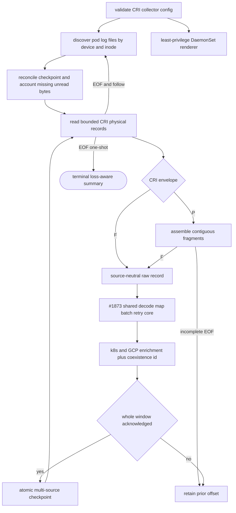

## Logic
<!-- type: logic lang: mermaid -->



Contract invariants:

- `SourceSpec::Cri` is a framing/discovery adapter. It yields source-neutral records to the same #1873 decoder, event mapper, bounded delivery client, retry classifier, quarantine writer, and acknowledgment-before-checkpoint loop used by file/stdin. CRI code never deserializes `ServiceLogEventV1` or calls the ingest API directly.
- A CRI physical record is `<RFC3339Nano timestamp> <stdout|stderr> <P|F> <content>`. `P` fragments must be contiguous and retain timestamp/stream identity until `F`; an incomplete group at EOF is not delivered, rejected, or checkpointed, so restart/follow rereads it. Envelope errors and over-limit assembled records use the shared bounded rejection sink.
- Discovery accepts only regular files below the configured canonical CRI root. Workload paths use `<namespace>_<pod>_<uid>/<container>/<restart>.log...`; symlinks and paths that do not produce bounded Kubernetes identifiers are ignored/rejected without escaping the root. File identity is `device:inode`, not path. Known identities drain before replacements; a same-path new inode starts at offset zero while a renamed known inode resumes its prior offset.
- `collector.cri.checkpoint.v1` is bound to the canonical CRI root and stores per-identity next offset, physical line, last observed length, last path/workload identity, and cumulative accepted/duplicate/rejected/lost counters. Only a fully acknowledged window advances offsets. Missing known files with uncommitted observed bytes increment `lost_bytes`/`lost_sources` and emit one durable bounded `source_lost` record; no data-loss condition is silent.
- Enrichment adds `gcp.resource.type=k8s_container`, `gcp.project_id`, optional cluster/location, `k8s.namespace.name`, `k8s.pod.name`, `k8s.pod.uid`, `k8s.container.name`, optional `k8s.node.name`, and `collector.stream`. Application JSON remains the shared payload and applications contain no Sift/GKE code.
- CRI events use the same content/resource/timestamp fallback identity as a Cloud Logging structured entry without `insertId`; the GCP normalizer and CRI adapter therefore converge on one `OperationalEventV2.event_id`, and the existing journal plus `project:event_id` coexistence key makes dual delivery duplicate-safe. Explicit Cloud Logging `insertId` remains authoritative on that ingest path.
- At most one configured batch is held while the HTTP client retries. On endpoint failure, the command exits or follow waits with all source offsets unchanged; CRI files are the bounded external buffer and loss accounting exposes retention/rotation overrun.
- `sift k8s collector render` emits a Sift-owned DaemonSet/ServiceAccount. It mounts only the configured pod-log root read-only and collector state read-write, disables service-account token automount, requires token/config from a Secret/ConfigMap, drops Linux capabilities, uses seccomp, read-only root filesystem, non-root IDs, and declares CPU/memory requests and limits. It grants no Kubernetes API RBAC because path-derived metadata plus Downward API node identity require none.

## Changes
<!-- type: changes lang: yaml -->

```yaml
changes:
  - path: projects/sift/src/collector/mod.rs
    action: modify
    anchor: SourceSpec
    section: logic
    impl_mode: hand-written
    description: Add the typed CRI source configuration, GKE metadata, loss-aware terminal summary, validation, and module exports while keeping one public run_collector entrypoint.
  - path: projects/sift/src/collector/source.rs
    action: create
    section: logic
    impl_mode: hand-written
    description: Define source-neutral RawRecord, enrichment, durable cursor, read outcome, and CollectorSource traits plus the file/stdin adapter over collector.checkpoint.v1.
  - path: projects/sift/src/collector/cri.rs
    action: create
    section: logic
    impl_mode: hand-written
    description: Discover node CRI files safely, parse envelopes and partial records, track device/inode rotation with collector.cri.checkpoint.v1, enrich workload metadata, and account source loss.
  - path: projects/sift/src/collector/runtime.rs
    action: modify
    anchor: run
    section: logic
    impl_mode: hand-written
    description: Make the existing bounded decode/map/deliver/quarantine/ack loop consume CollectorSource so file, stdin, and CRI share one batching and checkpoint progression core.
  - path: projects/sift/src/collector/model.rs
    action: modify
    anchor: decode_service_log
    section: logic
    impl_mode: hand-written
    description: Apply source-provided resource and primitive attribute enrichment after the shared schema decoder and permit a CRI coexistence identity override without changing application payloads.
  - path: projects/sift/src/ingest/gcp.rs
    action: modify
    anchor: stable_id
    section: logic
    impl_mode: hand-written
    description: Expose the existing Cloud Logging fallback identity inside Sift so CRI and GCP normalization share exactly one dedupe algorithm.
  - path: projects/sift/src/bin/sift.rs
    action: modify
    anchor: CollectArgs
    section: logic
    impl_mode: hand-written
    description: Add mutually exclusive --source/--cri-root collection, GKE metadata flags, durable state defaults, and sift k8s collector render while retaining machine-readable summaries.
  - path: projects/sift/src/deploy.rs
    action: modify
    anchor: operator_yaml
    section: logic
    impl_mode: hand-written
    description: Render the Sift-owned collector DaemonSet artifact with validated namespace and image substitutions.
  - path: projects/sift/k8s/collector/daemonset.yaml
    action: create
    section: logic
    impl_mode: hand-written
    description: Define ServiceAccount, zero-API-RBAC DaemonSet, read-only pod-log and dedicated state mounts, external token/config, non-root hardening, and bounded resources.
  - path: projects/sift/tests/collector_cri.rs
    action: create
    section: unit-test
    impl_mode: hand-written
    description: Start real Sift processes and use CRI fixtures to prove partial stdout/stderr assembly, trace query, metadata, rotation/restart/inode replacement, coexistence dedupe, outage checkpoint retention, and explicit loss accounting.
  - path: projects/sift/tests/deployment_cli.rs
    action: modify
    anchor: layered_deployment_cli_renders_all_artifact_planes
    section: unit-test
    impl_mode: hand-written
    description: Verify collector renderer output, node-log/state mount permissions, external credential/config wiring, no API token, security context, and resource bounds.
  - path: projects/sift/README.md
    action: modify
    section: logic
    impl_mode: hand-written
    description: Mark the GKE collection work roots and fixture inventory with implemented evidence.
  - path: projects/sift/observability/structured-stdout.md
    action: modify
    section: logic
    impl_mode: hand-written
    description: Replace the future CRI adapter note with the delivered local fixture and Kubernetes collector commands, ownership, coexistence, and loss semantics.
```

No application service or shared log schema target changes: Lumen and every other producer continue to write only `axiom.service.log.v1` JSONL to stdout.
