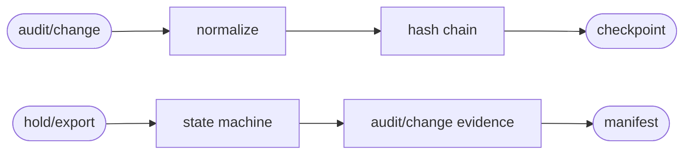
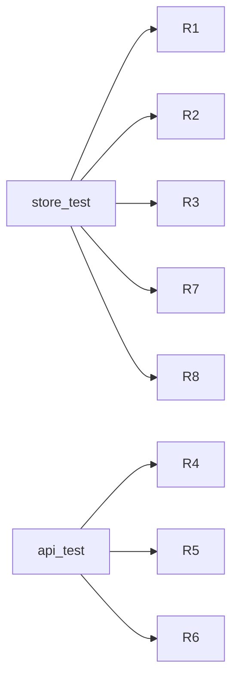

## Logic
<!-- type: logic lang: mermaid -->



## Schema
<!-- type: schema lang: yaml -->

```yaml
constants:
  projection: audit-change-store
  schema_version: 1
  record_schema: sift.audit.v1
  default_retention_days: 365
schemas:
  - name: AuditChangeRecordV1
    fields:
      - { name: cursor, type: u64, required: true }
      - { name: event_id, type: String, required: true }
      - { name: project, type: String, required: true }
      - { name: signal, type: SignalKind, required: true }
      - { name: actor, type: String, required: true }
      - { name: subject, type: String, required: false }
      - { name: action, type: String, required: true }
      - { name: target, type: String, required: false }
      - { name: payload, type: json, required: true }
      - { name: previous_hash, type: String, required: true }
      - { name: record_hash, type: String, required: true }
  - name: AuditLegalHoldV1
    fields:
      - { name: id, type: String, required: true }
      - { name: project, type: String, required: true }
      - { name: start_time, type: String, required: true }
      - { name: end_time, type: String, required: true }
      - { name: reason, type: String, required: true }
      - { name: actor, type: String, required: true }
      - { name: active, type: bool, required: true }
      - { name: commit_index, type: u64, required: true }
  - name: AuditExportManifestV1
    fields:
      - { name: id, type: String, required: true }
      - { name: project, type: String, required: true }
      - { name: record_count, type: u64, required: true }
      - { name: content_sha256, type: String, required: true }
      - { name: actor, type: String, required: true }
      - { name: commit_index, type: u64, required: true }
immutability:
  record_identity: event_id
  chain_scope: project
  retention: expired records remain in raw journal and are hidden from the hot view unless an active legal hold covers occurred_at
```

## REST API
<!-- type: rest-api lang: yaml -->

```yaml
openapi: 3.1.0
info: { title: Sift Audit And Change Store Slice, version: 1.0.0 }
paths:
  /v1/audit:query:
    post:
      operationId: queryAuditTimeline
      responses:
        "200": { description: Authorized immutable timeline page. }
        "403": { description: Project read denied. }
        "503": { description: Shared projection_lag. }
  /v1/audit/holds/{id}:
    put:
      operationId: upsertAuditLegalHold
      responses:
        "200": { description: Durable admin-only hold and audit/change evidence. }
    delete:
      operationId: releaseAuditLegalHold
      responses:
        "200": { description: Durable hold release and audit/change evidence. }
  /v1/audit:export:
    post:
      operationId: exportAuditTimeline
      responses:
        "200": { description: Bounded records plus committed content-hash manifest. }
        "403": { description: Project admin denied. }
```

## Unit Test
<!-- type: unit-test lang: mermaid -->



## Changes
<!-- type: changes lang: yaml -->

```yaml
changes:
  - { path: projects/sift/src/projection/audit_change.rs, action: create, section: schema, impl_mode: hand-written, gap: sift-audit-change-projection, tracker: "1668", description: "Define normalized hash-chained records, retention/hold query, export records, snapshot, integrity verification, and rebuild." }
  - { path: projects/sift/src/projection/model.rs, action: modify, section: schema, impl_mode: hand-written, gap: sift-projection-model, tracker: "1660", description: "Persist legal holds and export manifests in the durable control state." }
  - { path: projects/sift/src/projection/mod.rs, action: modify, section: logic, impl_mode: hand-written, gap: sift-projection-module, tracker: "1660", description: "Export audit/change projection and control contracts." }
  - { path: projects/sift/src/projection/runtime.rs, action: modify, section: logic, impl_mode: hand-written, gap: sift-projection-runtime, tracker: "1660", description: "Register the independent audit/change projection and typed reads." }
  - { path: projects/sift/src/durability.rs, action: modify, section: logic, impl_mode: hand-written, gap: sift-framed-journal-state-machine, tracker: "1605", description: "Commit legal holds and export manifests and append control evidence through the one state machine." }
  - { path: projects/sift/src/lib.rs, action: modify, section: rest-api, impl_mode: hand-written, gap: sift-service-core, tracker: "1576", description: "Add scoped audit query and admin-only hold/export routes." }
  - { path: projects/sift/tests/audit_change_store.rs, action: create, section: unit-test, impl_mode: hand-written, gap: sift-audit-change-store-tests, tracker: "1668", description: "Verify normalization, immutability, chain integrity, correlation, and rebuild equality." }
  - { path: projects/sift/tests/audit_change_api.rs, action: create, section: unit-test, impl_mode: hand-written, gap: sift-audit-change-api-tests, tracker: "1668", description: "Verify retention/hold precedence, scoped authorization, controlled export, and mutation evidence." }
```
