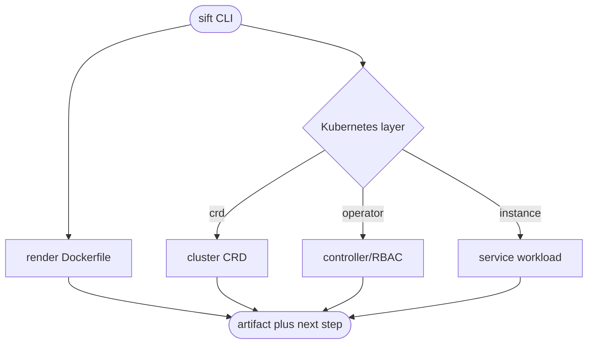

## Logic
<!-- type: logic lang: mermaid -->



## Changes
<!-- type: changes lang: yaml -->

```yaml
changes:
  - path: projects/sift/src/deploy.rs
    action: create
    section: logic
    impl_mode: hand-written
    gap: sift-layered-deployment-renderer
    tracker: "1606"
    description: Render Sift Dockerfile, CRD, operator, and instance artifacts from checked-in templates.
  - path: projects/sift/src/operator.rs
    action: create
    section: logic
    impl_mode: hand-written
    gap: sift-shared-operator-controller
    tracker: "1606"
    description: Define the Sift custom-resource type and compose the shared leader-elected operator reconcile loop.
  - path: projects/sift/src/bin/sift.rs
    action: modify
    section: logic
    impl_mode: hand-written
    gap: sift-deployment-cli-surface
    tracker: "1606"
    description: Expose dockerfile and layered k8s render/operator commands with executable continuations.
  - path: projects/sift/Dockerfile
    action: create
    section: changes
    impl_mode: hand-written
    gap: sift-source-image-artifact
    tracker: "1606"
    description: Provide the source-build Sift image contract.
  - path: projects/sift/Dockerfile.release
    action: create
    section: changes
    impl_mode: hand-written
    gap: sift-release-image-artifact
    tracker: "1606"
    description: Provide the verified release-binary Sift image contract.
  - path: projects/sift/k8s/crd/sift.yaml
    action: create
    section: changes
    impl_mode: hand-written
    gap: sift-crd-artifact
    tracker: "1606"
    description: Define the cluster-scoped Sift custom resource API with YAML-quoted string enum values so `off` remains an auth-mode string at Kubernetes validation time.
  - path: projects/sift/k8s/operator/operator.yaml
    action: create
    section: changes
    impl_mode: hand-written
    gap: sift-operator-artifact
    tracker: "1606"
    description: Define Sift operator service account, RBAC, and controller deployment.
  - path: projects/sift/k8s/instances/dev.yaml
    action: create
    section: changes
    impl_mode: hand-written
    gap: sift-instance-artifact
    tracker: "1606"
    description: Define the development Sift custom resource with standard probes, single-node topology, and a YAML-quoted `auth: "off"` string.
  - path: projects/sift/HA.md
    action: create
    section: changes
    impl_mode: hand-written
    gap: sift-ha-operations-document
    tracker: "1606"
    description: Document Sift single-node and Raft replica deployment, backup, restore, and failure recovery.
  - path: projects/sift/tests/deployment_cli.rs
    action: create
    section: unit-test
    impl_mode: hand-written
    gap: sift-deployment-cli-tests
    tracker: "1606"
    description: Verify all Dockerfile and layered Kubernetes artifact commands render expected contracts, including the Sift auth enum as a string rather than YAML boolean coercion.
```
