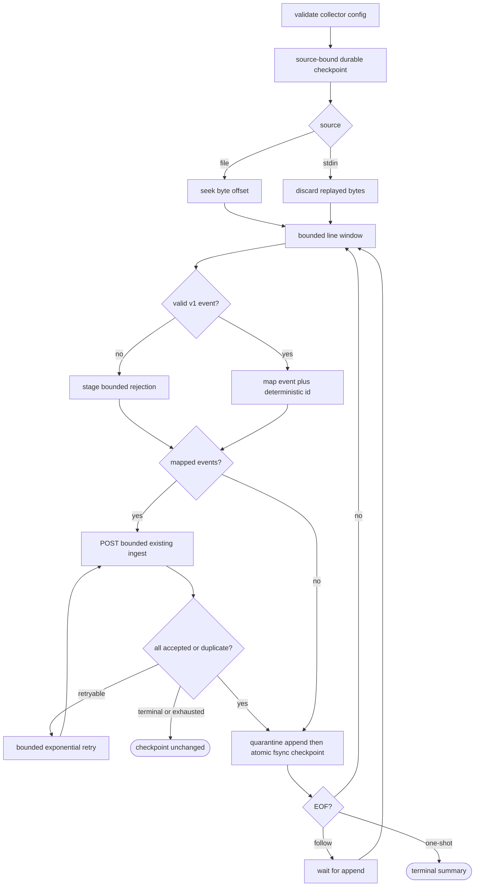

## Logic
<!-- type: logic lang: mermaid -->



Contract invariants:

- The decoder accepts only `axiom.service.log.v1`, RFC3339 timestamps, known uppercase severities, nonempty bounded service/event fields, at most 64 bounded primitive attributes, lowercase nonzero 32/16-character trace/span ids, optional valid parent/flags/request fields, and a line no larger than the configured cap.
- `OperationalEventV2.event_id` is `stdout-` plus SHA-256 over stable source id, starting byte offset, and exact line bytes. Resource includes `service.name`, `service.version`, and `collector.source_id`; payload preserves the complete decoded service event; signal is `log`.
- A checkpoint is scoped to one source id and stores next byte offset, next line number, and cumulative accepted/duplicate/rejected counters. File size below its offset is a terminal rotation/truncation error delegated to #1675.
- The client sends the canonical `EventWriteRequest` to the existing bounded ingest route. Only network errors, HTTP 429, and HTTP 5xx retry. Other 4xx responses and item-level rejections stop without checkpoint advancement.
- Rejections never contain more than 1024 bytes of original input or 512 bytes of error text. They are written before the window checkpoint; valid later lines remain processable.
- Follow mode is valid only for regular files. It waits at EOF and re-enters the same window loop; it introduces no alternate parser or delivery semantics.
## Changes
<!-- type: changes lang: yaml -->

```yaml
changes:
  - path: projects/sift/src/collector/mod.rs
    action: create
    section: logic
    impl_mode: hand-written
    description: Own CollectorConfig, SourceSpec, CollectorSummary, validation defaults, module exports, and run_collector.
  - path: projects/sift/src/collector/model.rs
    action: create
    section: logic
    impl_mode: hand-written
    description: Decode and strictly validate ServiceLogEventV1, convert bounded primitive attributes, preserve payload, validate correlation, and derive stable ids.
  - path: projects/sift/src/collector/checkpoint.rs
    action: create
    section: logic
    impl_mode: hand-written
    description: Persist collector.checkpoint.v1 by atomic fsynced replace and collector.rejection.v1 by bounded append diagnostics.
  - path: projects/sift/src/collector/client.rs
    action: create
    section: logic
    impl_mode: hand-written
    description: POST canonical batches with x-sift-project and optional bearer, classify retryable failures, reject partial terminal outcomes, and count accepted versus duplicate.
  - path: projects/sift/src/collector/runtime.rs
    action: create
    section: logic
    impl_mode: hand-written
    description: Open/seek/discard file or stdin sources and run the bounded window, quarantine, delivery, checkpoint, one-shot, and follow loop.
  - path: projects/sift/src/bin/sift.rs
    action: modify
    anchor: append_event
    section: logic
    impl_mode: hand-written
    description: Expose sift collect flags and machine-readable one-shot terminal summary while follow stays attached.
  - path: projects/sift/tests/structured_stdout_collector_e2e.rs
    action: create
    section: unit-test
    impl_mode: hand-written
    description: Start real Sift, collect a Lumen JSONL file containing an invalid line and valid correlated events, query logs, and prove checkpoint replay idempotency.
```

The existing standardized crate root exports `pub mod collector`. The manifest adds direct `reqwest.workspace = true` and `service-observability = { path = "../../libs/service-observability" }`; these declarative seams let the collector own HTTP delivery and consume the producer-neutral schema without importing Lumen.
## Unit Test
<!-- type: unit-test lang: mermaid -->

```mermaid
---
id: structured-stdout-collector-core-verification
requirements:
  adapter_boundary:
    id: R5
    text: "Collector validation, mapping, delivery, and checkpoint logic contain no Lumen or CRI-specific parsing, leaving #1675 only a source adapter."
    kind: contract
    risk: medium
    verify: cargo test -p sift collector::
  bounded_delivery:
    id: R4
    text: "Batches use existing /v1/events:write with bounded size, memory, timeout, retry, optional bearer token, and terminal non-advancing failure."
    kind: stability
    risk: high
    verify: cargo test -p sift collector::client
  checkpoint_idempotency:
    id: R3
    text: "Source identity plus byte and line checkpoint state is atomically persisted only after accepted or duplicate acknowledgment; replay produces no duplicate event."
    kind: durability
    risk: high
    verify: cargo test -p sift --test structured_stdout_collector_e2e real_file_collector_ingests_queries_and_resumes -- --exact
  finite_follow:
    id: R6
    text: "One-shot terminates with a machine-readable summary while follow waits at EOF and reuses identical offset/window behavior."
    kind: regression
    risk: medium
    verify: cargo test -p sift collector::runtime
  source_pipeline:
    id: R1
    text: "The Sift-owned collector reads unchanged axiom.service.log.v1 records from a finite file through the same core used for stdin and follow mode."
    kind: integration
    risk: high
    verify: cargo test -p sift --test structured_stdout_collector_e2e real_file_collector_ingests_queries_and_resumes -- --exact
  validation_mapping:
    id: R2
    text: "Schema, bounds, timestamps, and correlation are validated before deterministic source-offset mapping into OperationalEventV2; invalid lines become bounded quarantine entries."
    kind: functional
    risk: high
    verify: cargo test -p sift collector::model
---
flowchart TD
    r1[R1 source pipeline] --> cargo_test_p_sift_test_structured_stdout_collector_e2e_real_file_collector_ingests_queries_and_resumes_exact[cargo test -p sift --test structured_stdout_collector_e2e real_file_collector_ingests_queries_and_resumes -- --exact]
    r3[R3 checkpoint idempotency] --> cargo_test_p_sift_test_structured_stdout_collector_e2e_real_file_collector_ingests_queries_and_resumes_exact
    r2[R2 validation mapping] --> cargo_test_p_sift_collector_model[cargo test -p sift collector::model]
    r4[R4 bounded delivery] --> cargo_test_p_sift_collector_client[cargo test -p sift collector::client]
    r5[R5 adapter boundary] --> cargo_test_p_sift_collector[cargo test -p sift collector::]
    r6[R6 finite follow] --> cargo_test_p_sift_collector_runtime[cargo test -p sift collector::runtime]
```
