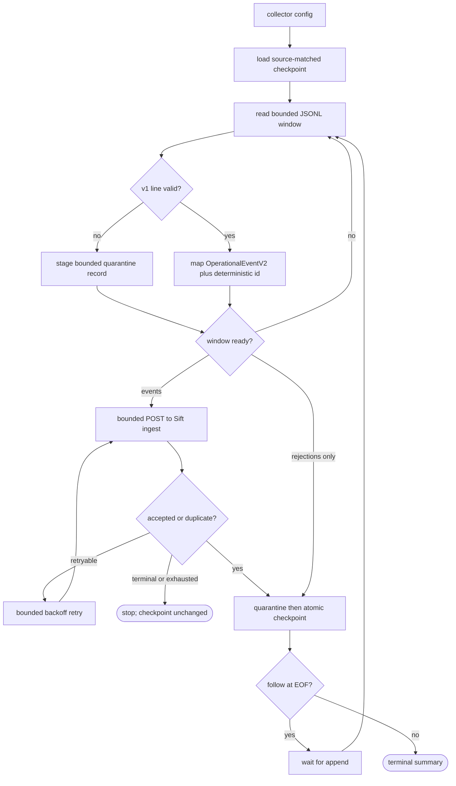

## Logic
<!-- type: logic lang: mermaid -->



The checkpoint is an acknowledgment boundary, not merely a read cursor: it never advances past a valid line until Sift durably accepts or identifies that event as a duplicate. Invalid structured lines use the explicit quarantine policy and may advance only after their bounded diagnostic is recorded. File one-shot, file follow, and stdin all call the same line/window pipeline; #1675 later supplies CRI records to that core without changing validation, mapping, delivery, or checkpoint semantics.

## Changes
<!-- type: changes lang: yaml -->

```yaml
changes:
  - path: projects/sift/src/collector/mod.rs
    action: create
    section: logic
    impl_mode: hand-written
    description: Define public collector configuration, source mode, summary, defaults, and the reusable run entrypoint.
  - path: projects/sift/src/collector/model.rs
    action: create
    section: logic
    impl_mode: hand-written
    description: Validate axiom.service.log.v1, derive deterministic source-offset ids, and map the shared wire event into OperationalEventV2.
  - path: projects/sift/src/collector/checkpoint.rs
    action: create
    section: logic
    impl_mode: hand-written
    description: Load and atomically fsync source-bound byte/line checkpoints and append bounded structured quarantine diagnostics.
  - path: projects/sift/src/collector/client.rs
    action: create
    section: logic
    impl_mode: hand-written
    description: Deliver bounded EventWriteRequest batches through the existing authenticated HTTP ingest endpoint with accepted/duplicate accounting and bounded retries.
  - path: projects/sift/src/collector/runtime.rs
    action: create
    section: logic
    impl_mode: hand-written
    description: Share one byte-offset window pipeline across seekable files, appended-file follow mode, and stdin resume/discard mode.
  - path: projects/sift/src/bin/sift.rs
    action: modify
    anchor: append_event
    section: logic
    impl_mode: hand-written
    description: Register sift collect with file/stdin, source identity, endpoint/token, project/environment, checkpoint/quarantine, batch/retry, and follow flags.
  - path: projects/sift/tests/structured_stdout_collector_e2e.rs
    action: create
    section: unit-test
    impl_mode: hand-written
    description: Run real Sift serve and collect processes over Lumen JSONL, query the logging projection, replay the checkpoint, and prove quarantine continuation.
```

The implementation also exports the collector module from the already-standardized Sift crate root and adds direct workspace `reqwest` plus shared `service-observability` dependencies in `projects/sift/Cargo.toml`. Neither declarative file needs a new nested ownership region.

## Unit Test
<!-- type: unit-test lang: mermaid -->

```mermaid
---
id: structured-stdout-collector-core-verification
requirements:
  adapter_boundary:
    id: R5
    text: "Collector validation, mapping, delivery, and checkpoint logic contain no Lumen or CRI-specific parsing, leaving #1675 only a source adapter."
    kind: contract
    risk: medium
    verify: cargo test -p sift collector::
  bounded_delivery:
    id: R4
    text: "Batches use existing /v1/events:write with bounded size, memory, timeout, retry, optional bearer token, and terminal non-advancing failure."
    kind: stability
    risk: high
    verify: cargo test -p sift collector::client
  checkpoint_idempotency:
    id: R3
    text: "Source identity plus byte and line checkpoint state is atomically persisted only after accepted or duplicate acknowledgment; replay produces no duplicate event."
    kind: durability
    risk: high
    verify: cargo test -p sift --test structured_stdout_collector_e2e real_file_collector_ingests_queries_and_resumes -- --exact
  finite_follow:
    id: R6
    text: "One-shot terminates with a machine-readable summary while follow waits at EOF and reuses identical offset/window behavior."
    kind: regression
    risk: medium
    verify: cargo test -p sift collector::runtime
  source_pipeline:
    id: R1
    text: "The Sift-owned collector reads unchanged axiom.service.log.v1 records from a finite file through the same core used for stdin and follow mode."
    kind: integration
    risk: high
    verify: cargo test -p sift --test structured_stdout_collector_e2e real_file_collector_ingests_queries_and_resumes -- --exact
  validation_mapping:
    id: R2
    text: "Schema, bounds, timestamps, and correlation are validated before deterministic source-offset mapping into OperationalEventV2; invalid lines become bounded quarantine entries."
    kind: functional
    risk: high
    verify: cargo test -p sift collector::model
---
flowchart TD
    r1[R1 source pipeline] --> cargo_test_p_sift_test_structured_stdout_collector_e2e_real_file_collector_ingests_queries_and_resumes_exact[cargo test -p sift --test structured_stdout_collector_e2e real_file_collector_ingests_queries_and_resumes -- --exact]
    r3[R3 checkpoint idempotency] --> cargo_test_p_sift_test_structured_stdout_collector_e2e_real_file_collector_ingests_queries_and_resumes_exact
    r2[R2 validation mapping] --> cargo_test_p_sift_collector_model[cargo test -p sift collector::model]
    r4[R4 bounded delivery] --> cargo_test_p_sift_collector_client[cargo test -p sift collector::client]
    r5[R5 adapter boundary] --> cargo_test_p_sift_collector[cargo test -p sift collector::]
    r6[R6 finite follow] --> cargo_test_p_sift_collector_runtime[cargo test -p sift collector::runtime]
```
