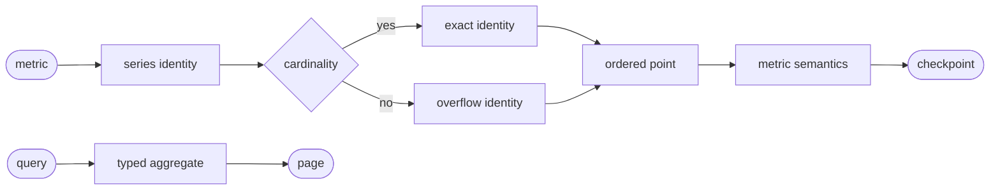
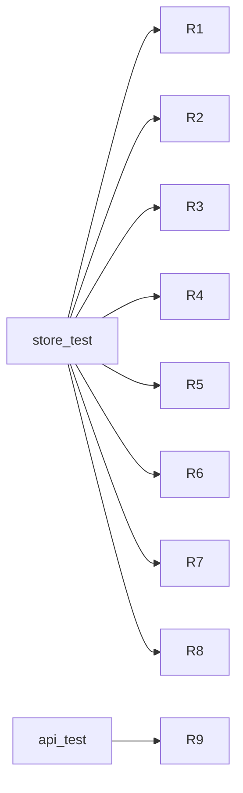

## Logic
<!-- type: logic lang: mermaid -->



## Schema
<!-- type: schema lang: yaml -->

```yaml
constants:
  projection: metric-store
  schema_version: 1
  chunk_points: 256
  rollup_windows_seconds: [60, 3600]
enums:
  MetricAggregation: [raw, sum, avg, min, max, count, rate]
  HistogramKind: [explicit, exponential]
schemas:
  - name: MetricHistogramV1
    fields:
      - { name: kind, type: HistogramKind, required: true }
      - { name: count, type: u64, required: true }
      - { name: sum, type: f64, required: true }
      - { name: explicit_bounds, type: "Vec<f64>", required: false }
      - { name: bucket_counts, type: "Vec<u64>", required: true }
      - { name: scale, type: i32, required: false }
      - { name: zero_count, type: u64, required: false }
      - { name: positive_offset, type: i32, required: false }
      - { name: negative_offset, type: i32, required: false }
  - name: MetricPointV1
    fields:
      - { name: cursor, type: u64, required: true }
      - { name: occurred_at, type: String, required: true }
      - { name: value, type: f64, required: true }
      - { name: histogram, type: MetricHistogramV1, required: false }
      - { name: exemplars, type: "Vec<MetricExemplar>", required: true }
  - name: MetricSeriesResultV1
    fields:
      - { name: series_id, type: String, required: true }
      - { name: project, type: String, required: true }
      - { name: name, type: String, required: true }
      - { name: temporality, type: MetricTemporality, required: true }
      - { name: resource, type: map, required: true }
      - { name: attributes, type: map, required: true }
      - { name: overflow, type: bool, required: true }
      - { name: points, type: "Vec<MetricPointV1>", required: true }
      - { name: aggregate, type: f64, required: false }
      - { name: histogram, type: MetricHistogramV1, required: false }
      - { name: reset_count, type: u64, required: true }
      - { name: rollups, type: "Vec<MetricRollupV1>", required: true }
cardinality:
  identity: canonical SHA256 of project, metric name, unit, temporality, resource, and attributes
  overflow: one deterministic project and metric scoped series; raw event remains unchanged
```

## REST API
<!-- type: rest-api lang: yaml -->

```yaml
openapi: 3.1.0
info: { title: Sift Metric Store Slice, version: 1.0.0 }
paths:
  /v1/metrics:query:
    post:
      operationId: queryMetrics
      summary: Query bounded metric series, points, rollups, and typed aggregates.
      responses:
        "200": { description: Stable metric series page. }
        "400": { description: Invalid filter, aggregation, or time range. }
        "403": { description: Project read denied. }
        "503": { description: Shared projection_lag. }
```

## Unit Test
<!-- type: unit-test lang: mermaid -->



## Changes
<!-- type: changes lang: yaml -->

```yaml
changes:
  - { path: projects/sift/src/projection/metric.rs, action: create, section: schema, impl_mode: hand-written, gap: sift-metric-projection, tracker: "1667", description: "Define series identity, chunks, temporality, histograms, exemplars, overflow, rollups, typed query, snapshot, and rebuild." }
  - { path: projects/sift/src/projection/mod.rs, action: modify, section: logic, impl_mode: hand-written, gap: sift-projection-module, tracker: "1660", description: "Export the metric projection and query contracts." }
  - { path: projects/sift/src/projection/runtime.rs, action: modify, section: logic, impl_mode: hand-written, gap: sift-projection-runtime, tracker: "1660", description: "Register the independent metric projection and typed query." }
  - { path: projects/sift/src/lib.rs, action: modify, section: rest-api, impl_mode: hand-written, gap: sift-service-core, tracker: "1576", description: "Add the authorized typed metric query route." }
  - { path: projects/sift/tests/metric_store.rs, action: create, section: unit-test, impl_mode: hand-written, gap: sift-metric-store-tests, tracker: "1667", description: "Verify temporality, resets, histograms, exemplars, overflow, late points, rollups, and rebuild equality." }
  - { path: projects/sift/tests/metric_api.rs, action: create, section: unit-test, impl_mode: hand-written, gap: sift-metric-api-tests, tracker: "1667", description: "Verify authorized typed query, pagination, and projection lag." }
```
