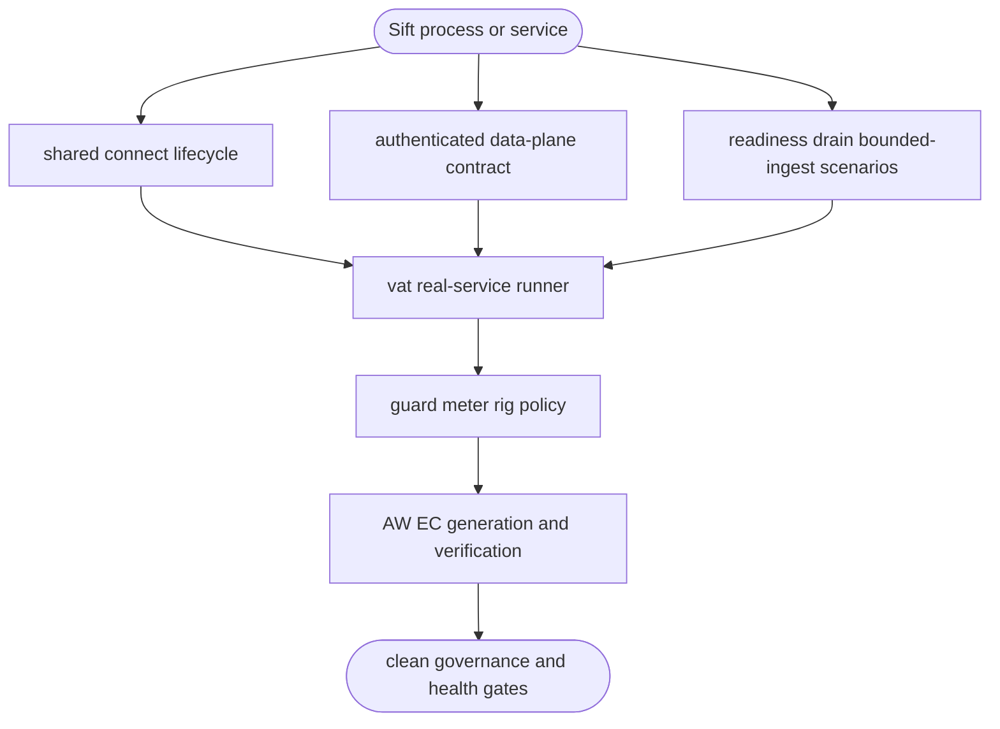

## Logic
<!-- type: logic lang: mermaid -->



## Changes
<!-- type: changes lang: yaml -->

```yaml
changes:
  - path: projects/sift/Cargo.toml
    action: modify
    section: logic
    impl_mode: hand-written
    gap: sift-shared-connect-dependency
    tracker: "1607"
    description: Enable cli-std Kubernetes connection lifecycle support for the Sift CLI.
  - path: projects/sift/src/bin/sift.rs
    action: modify
    section: logic
    impl_mode: hand-written
    gap: sift-connect-command
    tracker: "1607"
    description: Expose the supported Sift cluster connect command using the shared port-forward and token-resolution lifecycle.
  - path: projects/sift/tests/operational_cli.rs
    action: create
    section: unit-test
    impl_mode: hand-written
    gap: sift-cli-operational-contract
    tracker: "1607"
    description: Verify CLI standard surfaces, connect help, and parseable terminal output contracts.
  - path: projects/sift/tests/stability_e2e.rs
    action: create
    section: unit-test
    impl_mode: hand-written
    gap: sift-stability-evidence
    tracker: "1607"
    description: Exercise readiness, drain, bounded ingestion, and journal recovery through the Sift service router.
  - path: projects/sift/vat.toml
    action: create
    section: changes
    impl_mode: hand-written
    gap: sift-vat-real-service-runner
    tracker: "1607"
    description: Define the COW workspace and real Sift service runner used by operational evidence.
  - path: projects/sift/guard.toml
    action: create
    section: changes
    impl_mode: hand-written
    gap: sift-guard-security-contract
    tracker: "1607"
    description: Bind Sift bearer-auth and probe-exemption evidence to the security guard surface.
  - path: projects/sift/meter-stability.toml
    action: create
    section: changes
    impl_mode: hand-written
    gap: sift-meter-stability-contract
    tracker: "1607"
    description: Bind repeatable Sift stability tests to the meter gate surface.
  - path: projects/sift/external-contracts/security-hardening/sift-auth.md
    action: create
    section: changes
    impl_mode: hand-written
    gap: sift-auth-external-contract
    tracker: "1607"
    description: Declare the bearer-auth and operational-probe external contract.
  - path: projects/sift/external-contracts/long-running-stability/sift-resilience.md
    action: create
    section: changes
    impl_mode: hand-written
    gap: sift-resilience-external-contract
    tracker: "1607"
    description: Declare bounded-ingest, drain, and recovery evidence for the stability gate.
```
