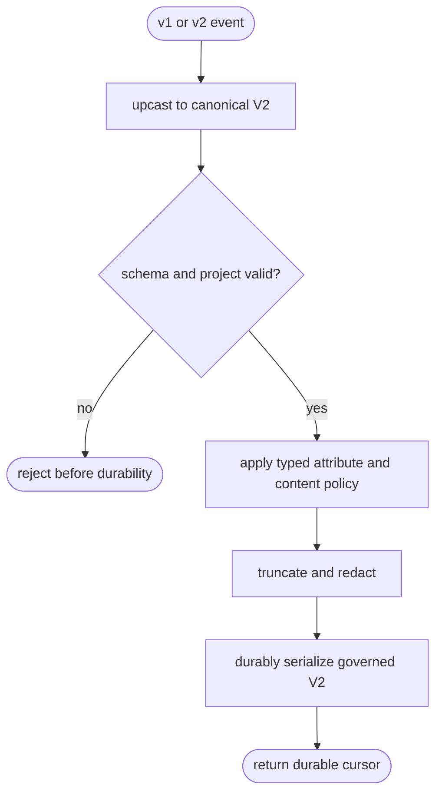

## Logic
<!-- type: logic lang: mermaid -->



## Schema
<!-- type: schema lang: yaml -->

```yaml
schemas:
  - name: OperationalEventV2
    description: Canonical raw-journal event; schema_version is exactly 2.
    fields:
      - { name: schema_version, type: u16, required: true }
      - { name: schema_url, type: String, required: true }
      - { name: event_id, type: String, required: true }
      - { name: project, type: String, required: true }
      - { name: environment, type: String, required: true }
      - { name: occurred_at, type: RFC3339, required: true }
      - { name: observed_at, type: RFC3339, required: true }
      - { name: signal, type: SignalKind, required: true }
      - { name: resource, type: Map<String,String>, required: true }
      - { name: instrumentation_scope, type: InstrumentationScope, required: false }
      - { name: attributes, type: Map<String,AttributeValue>, required: false }
      - { name: trace_id, type: String, required: false }
      - { name: span_id, type: String, required: false }
      - { name: request_id, type: String, required: false }
      - { name: session_id, type: String, required: false }
      - { name: severity, type: String, required: false }
      - { name: metric, type: MetricPoint, required: false }
      - { name: payload, type: JSON, required: true }
  - name: SignalKind
    variants: [log, span, metric, exception, audit_event, change_event, profile, evaluation]
  - name: AttributeValue
    variants: [string, bool, int, double, bytes, array, map]
  - name: GovernancePolicy
    fields:
      - { name: capture_genai_content, type: bool, default: false }
      - { name: max_string_bytes, type: usize, default: 4096 }
      - { name: denied_attribute_keys, type: Set<String>, default: [] }
      - { name: redaction_text, type: String, default: "[REDACTED]" }
  - name: GovernancePolicySet
    fields:
      - { name: default, type: GovernancePolicy, required: true }
      - { name: projects, type: Map<String,GovernancePolicy>, required: false }
compatibility:
  v1_reader: inspect event.schema_version inside every journal/snapshot/raft envelope
  v1_upcast: preserve ids, signal, resource, attributes, metric, severity, payload, and correlation; derive deterministic legacy project/environment and observed_at
  journal_writer: serialize only governed OperationalEventV2 values
```

## Unit Test
<!-- type: unit-test lang: mermaid -->

```mermaid
---
id: sift-operational-event-v2-verification
requirements:
  v2_round_trip:
    id: R1
    text: "all eight signals and every typed attribute kind round-trip as schema version 2"
    kind: functional
    risk: high
    verify: test
  v1_upcast:
    id: R2
    text: "existing v1 journal, snapshot, and raft event JSON upcasts deterministically without losing fields"
    kind: compatibility
    risk: high
    verify: test
  governance_before_durability:
    id: R3
    text: "default-off GenAI content, denied attributes, and oversized strings are governed before Raft and raw journal bytes"
    kind: security
    risk: critical
    verify: test
  project_policy:
    id: R4
    text: "project-specific content policy overrides the default without affecting other projects"
    kind: functional
    risk: high
    verify: test
elements:
  event_v2_golden: { kind: test, type: "rs/#[test]" }
  v1_upcast_golden: { kind: test, type: "rs/#[test]" }
  journal_privacy_bytes: { kind: test, type: "rs/#[test]" }
  project_policy_isolation: { kind: test, type: "rs/#[test]" }
relations:
  - { from: event_v2_golden, verifies: v2_round_trip }
  - { from: v1_upcast_golden, verifies: v1_upcast }
  - { from: journal_privacy_bytes, verifies: governance_before_durability }
  - { from: project_policy_isolation, verifies: project_policy }
---
requirementDiagram
    requirement R1 { id: R1 text: "V2 typed round trip" risk: high verifymethod: test }
    requirement R2 { id: R2 text: "v1 deterministic upcast" risk: high verifymethod: test }
    requirement R3 { id: R3 text: "govern before durability" risk: critical verifymethod: test }
    requirement R4 { id: R4 text: "project policy isolation" risk: high verifymethod: test }
    element event_v2_golden { type: "rs/#[test]" }
    event_v2_golden - verifies -> R1
```

## Changes
<!-- type: changes lang: yaml -->

```yaml
changes:
  - path: projects/sift/src/event/mod.rs
    action: create
    section: schema
    impl_mode: hand-written
    gap: sift-event-module
    tracker: "1657"
    description: Export the versioned event model and governance policy as one semantic event boundary.
  - path: projects/sift/src/event/model.rs
    action: create
    section: schema
    impl_mode: hand-written
    gap: sift-operational-event-v2-model
    tracker: "1657"
    description: Define OperationalEventV2, typed attributes, eight signals, v1 wire shape, incoming compatibility decode, and deterministic upcast.
  - path: projects/sift/src/event/governance.rs
    action: create
    section: logic
    impl_mode: hand-written
    gap: sift-pre-journal-governance
    tracker: "1657"
    description: Load default/project policies and apply denied-key, truncation, and default-off GenAI content redaction idempotently.
  - path: projects/sift/src/lib.rs
    action: modify
    section: logic
    impl_mode: hand-written
    gap: sift-v2-journal-integration
    tracker: "1657"
    description: Store and expose canonical V2 values, decode legacy StoredEvent frames, and govern before Raft proposal and raw append.
  - path: projects/sift/src/durability.rs
    action: modify
    section: logic
    impl_mode: hand-written
    gap: sift-v1-raft-command-upcast
    tracker: "1657"
    description: Decode both v1 and v2 replicated commands into canonical governed V2 events.
  - path: projects/sift/tests/event_v2_governance.rs
    action: create
    section: unit-test
    impl_mode: hand-written
    gap: sift-v2-governance-tests
    tracker: "1657"
    description: Golden-test eight-signal typed round trips, v1 journal/snapshot upcast, project policy isolation, and absence of sensitive raw bytes.
  - path: projects/sift/tests/ingest_api.rs
    action: modify
    section: unit-test
    impl_mode: hand-written
    gap: sift-eight-signal-contract
    tracker: "1657"
    description: Expand the bootstrap signal and OpenAPI assertions to OperationalEventV2.
  - path: projects/sift/README.md
    action: modify
    section: changes
    impl_mode: hand-written
    gap: sift-v2-capability-evidence
    tracker: "1657"
    description: Mark the OperationalEventV2/upcast/governance work roots with their passing test evidence.
```
