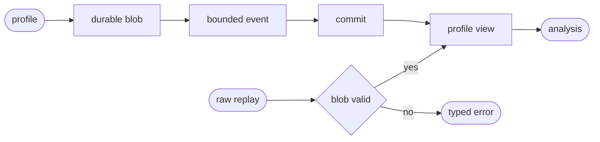
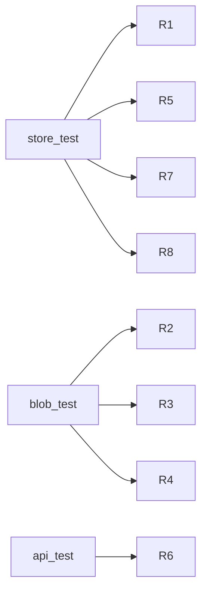

## Logic
<!-- type: logic lang: mermaid -->



## Schema
<!-- type: schema lang: yaml -->

```yaml
constants:
  projection: profile-store
  schema_version: 1
  record_schema: sift.profile.v1
  default_retention_days: 30
schemas:
  - name: ProfileStackSampleV1
    fields:
      - { name: frames, type: Vec<String>, required: true }
      - { name: value, type: f64, required: true }
      - { name: labels, type: Map<String,String>, required: true }
  - name: ProfileRecordV1
    fields:
      - { name: cursor, type: u64, required: true }
      - { name: profile_id, type: String, required: true }
      - { name: project, type: String, required: true }
      - { name: start_time, type: String, required: true }
      - { name: end_time, type: String, required: true }
      - { name: sample_type, type: String, required: true }
      - { name: unit, type: String, required: true }
      - { name: samples, type: Vec<ProfileStackSampleV1>, required: true }
      - { name: blob, type: ContentBlobRef, required: false }
      - { name: trace_id, type: String, required: false }
      - { name: span_id, type: String, required: false }
      - { name: retention_expires_at, type: String, required: true }
  - name: ProfileFunctionValueV1
    fields:
      - { name: function, type: String, required: true }
      - { name: inclusive, type: f64, required: true }
      - { name: self_value, type: f64, required: true }
      - { name: delta, type: f64, required: false }
  - name: ProfileQuery
    fields:
      - { name: project, type: String, required: true }
      - { name: view, type: 'list|flamegraph|top_functions|diff', required: true }
      - { name: profile_id, type: String, required: false }
      - { name: baseline_profile_id, type: String, required: false }
      - { name: comparison_profile_id, type: String, required: false }
      - { name: trace_id, type: String, required: false }
      - { name: span_id, type: String, required: false }
      - { name: min_cursor, type: u64, required: false }
durability:
  order: blob fsync -> bounded metadata event validation -> Raft/raw commit -> acknowledgement
  raw_rule: profile payloads at or above the configured threshold are replaced by one hash/size/encoding reference before raw append
  rebuild_rule: every referenced blob must exist and pass SHA-256 verification before its record is projected
```

## REST API
<!-- type: rest-api lang: yaml -->

```yaml
openapi: 3.1.0
info: { title: Sift Profile Observability Slice, version: 1.0.0 }
paths:
  /v1/profiles:
    post:
      operationId: ingestOtlpProfiles
      responses:
        "200": { description: OTLP partial-success after blob and raw durability. }
        "400": { description: Invalid profile or missing/corrupt blob reference. }
        "413": { description: Bounded request limit exceeded. }
  /v1/profiles:query:
    post:
      operationId: queryProfiles
      responses:
        "200": { description: Authorized list, flamegraph, top-functions, or diff response. }
        "403": { description: Project read denied. }
        "503": { description: Shared projection_lag with current cursor and Retry-After. }
```

## Unit Test
<!-- type: unit-test lang: mermaid -->



## Changes
<!-- type: changes lang: yaml -->

```yaml
changes:
  - { path: projects/sift/src/projection/profile.rs, action: create, section: schema, impl_mode: hand-written, gap: sift-profile-projection, tracker: "1669", description: "Define blob-backed profile records, OTel normalization, retention, typed analysis, snapshot, and rebuild semantics." }
  - { path: projects/sift/src/projection/mod.rs, action: modify, section: logic, impl_mode: hand-written, gap: sift-projection-module, tracker: "1660", description: "Export profile projection and query contracts." }
  - { path: projects/sift/src/projection/runtime.rs, action: modify, section: logic, impl_mode: hand-written, gap: sift-projection-runtime, tracker: "1660", description: "Register the independent profile projection with journal blob access and typed reads." }
  - { path: projects/sift/src/storage/blob.rs, action: modify, section: logic, impl_mode: hand-written, gap: sift-content-addressed-blob-store, tracker: "1659", description: "Externalize large complete profile payloads and validate referenced bytes before raw acknowledgement/rebuild." }
  - { path: projects/sift/src/storage/mod.rs, action: modify, section: logic, impl_mode: hand-written, gap: sift-sharded-storage-module, tracker: "1659", description: "Expose profile-safe content-addressed blob operations to the journal and projection." }
  - { path: projects/sift/src/lib.rs, action: modify, section: rest-api, impl_mode: hand-written, gap: sift-service-core, tracker: "1576", description: "Add project-scoped profile list/flamegraph/top/diff route with shared projection-lag contract." }
  - { path: projects/sift/tests/profile_store.rs, action: create, section: unit-test, impl_mode: hand-written, gap: sift-profile-store-tests, tracker: "1669", description: "Verify normalization, analysis, correlations, retention, snapshot, and raw rebuild equality." }
  - { path: projects/sift/tests/profile_blob_durability.rs, action: create, section: unit-test, impl_mode: hand-written, gap: sift-profile-blob-tests, tracker: "1669", description: "Verify blob-before-ack, bounded raw bytes, missing/corrupt rejection, and OTLP API authorization." }
```
