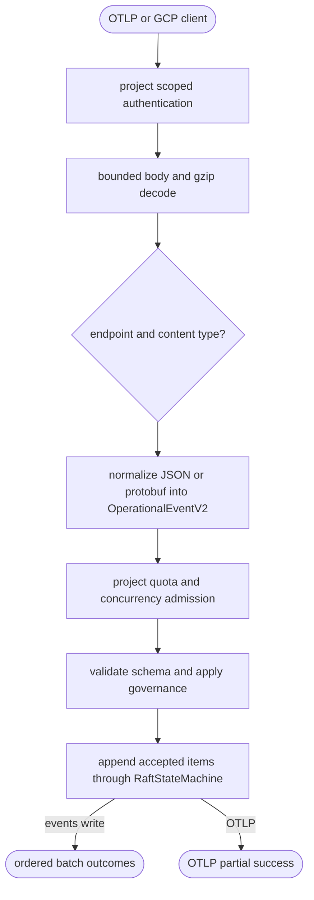

## Logic
<!-- type: logic lang: mermaid -->

The transport boundary is bounded and synchronous: authentication, decompression, decoding, normalization, admission, validation, governance, and durable append complete before an item is accepted. Invalid siblings do not block valid items. Every accepted signal becomes `OperationalEventV2` before the shared append path, so transport cannot bypass Raft, privacy policy, idempotency, or raw-journal durability.
