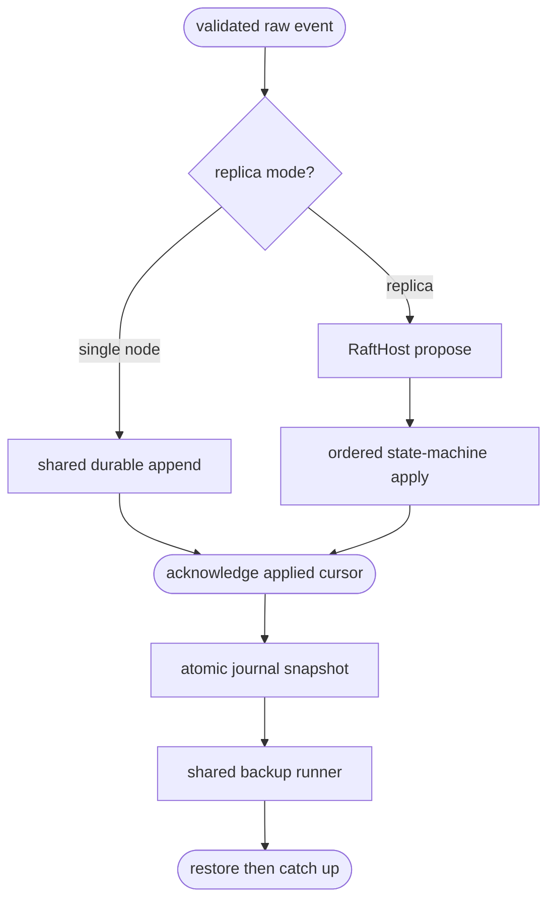

## Logic
<!-- type: logic lang: mermaid -->



## Changes
<!-- type: changes lang: yaml -->

```yaml
changes:
  - path: projects/sift/Cargo.toml
    action: modify
    section: logic
    impl_mode: hand-written
    gap: sift-ha-shared-dependencies
    tracker: "1605"
    description: Compose raft-core, raft-host, service-durability, and service-backup dependencies for the Sift runtime.
  - path: projects/sift/src/durability.rs
    action: create
    section: logic
    impl_mode: hand-written
    gap: sift-framed-journal-state-machine
    tracker: "1605"
    description: Implement CRC-framed event journal snapshot/restore and the RaftStateMachine adapter.
  - path: projects/sift/src/backup.rs
    action: create
    section: logic
    impl_mode: hand-written
    gap: sift-shared-backup-runner
    tracker: "1605"
    description: Implement Sift snapshot backup/restore composition through service-backup destinations and retention.
  - path: projects/sift/src/lib.rs
    action: modify
    section: logic
    impl_mode: hand-written
    gap: sift-ha-runtime-routing
    tracker: "1605"
    description: Route single-node writes through the framed journal and replica writes through RaftHost while exposing snapshot operations.
  - path: projects/sift/src/bin/sift.rs
    action: modify
    section: logic
    impl_mode: hand-written
    gap: sift-ha-cli-lifecycle
    tracker: "1605"
    description: Add snapshot, restore, and backup commands with shared backup destination and retention arguments.
  - path: projects/sift/tests/ha_backup_e2e.rs
    action: create
    section: unit-test
    impl_mode: hand-written
    gap: sift-ha-backup-contract-tests
    tracker: "1605"
    description: Verify durable recovery, Raft single-node state-machine ordering, snapshot restore, and shared backup output.
```
