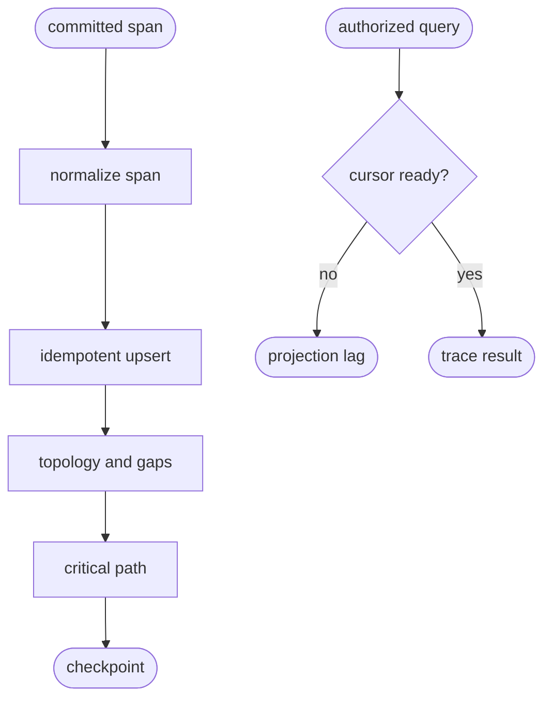
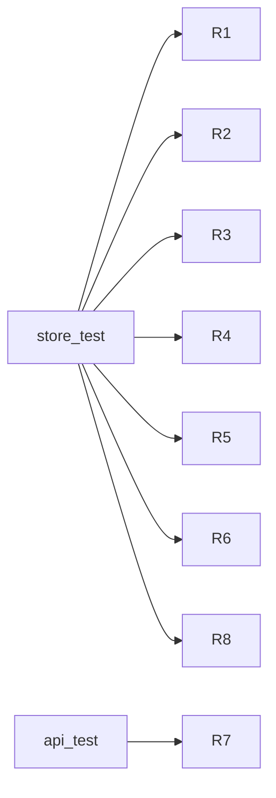

## Logic
<!-- type: logic lang: mermaid -->



## Schema
<!-- type: schema lang: yaml -->

```yaml
constants:
  projection: trace-store
  schema_version: 1
schemas:
  - name: SpanLinkV1
    fields:
      - { name: trace_id, type: String, required: true }
      - { name: span_id, type: String, required: true }
      - { name: attributes, type: "BTreeMap<String,AttributeValue>", required: true }
  - name: SpanEventV1
    fields:
      - { name: name, type: String, required: true }
      - { name: time_unix_nano, type: u64, required: true }
      - { name: attributes, type: "BTreeMap<String,AttributeValue>", required: true }
  - name: SpanRecordV1
    fields:
      - { name: cursor, type: u64, required: true }
      - { name: project, type: String, required: true }
      - { name: environment, type: String, required: true }
      - { name: trace_id, type: String, required: true }
      - { name: span_id, type: String, required: true }
      - { name: parent_span_id, type: String, required: false }
      - { name: name, type: String, required: true }
      - { name: kind, type: String, required: false }
      - { name: start_time_unix_nano, type: u64, required: true }
      - { name: end_time_unix_nano, type: u64, required: true }
      - { name: status_code, type: String, required: false }
      - { name: status_message, type: String, required: false }
      - { name: links, type: "Vec<SpanLinkV1>", required: true }
      - { name: events, type: "Vec<SpanEventV1>", required: true }
      - { name: resource, type: "BTreeMap<String,String>", required: true }
      - { name: attributes, type: "BTreeMap<String,AttributeValue>", required: true }
      - { name: request_id, type: String, required: false }
      - { name: session_id, type: String, required: false }
  - name: TraceResultV1
    fields:
      - { name: project, type: String, required: true }
      - { name: trace_id, type: String, required: true }
      - { name: spans, type: "Vec<SpanRecordV1>", required: true }
      - { name: root_span_ids, type: "Vec<String>", required: true }
      - { name: partial, type: bool, required: true }
      - { name: gaps, type: "Vec<String>", required: true }
      - { name: cycles, type: "Vec<Vec<String>>", required: true }
      - { name: critical_path_span_ids, type: "Vec<String>", required: true }
      - { name: duration_unix_nano, type: u64, required: true }
      - { name: correlation_ids, type: "BTreeMap<String,Vec<String>>", required: true }
      - { name: projection_cursor, type: u64, required: true }
ordering: start_time_unix_nano_then_span_id_then_cursor
partial_rules:
  - missing parent
  - duplicate conflicting span id
  - parent cycle
  - no root
```

## REST API
<!-- type: rest-api lang: yaml -->

```yaml
openapi: 3.1.0
info: { title: Sift Trace Store Slice, version: 1.0.0 }
paths:
  /v1/traces/{id}:
    get:
      operationId: getTrace
      summary: Return a stable complete or explicitly partial trace topology.
      parameters:
        - { name: id, in: path, required: true, schema: { type: string } }
        - { name: project, in: query, required: true, schema: { type: string } }
        - { name: min_cursor, in: query, required: false, schema: { type: integer, format: uint64 } }
      responses:
        "200": { description: Trace topology and critical path. }
        "400": { description: Invalid project or trace id. }
        "403": { description: Project read denied. }
        "404": { description: Trace absent from the authorized project. }
        "503": { description: Shared projection_lag with Retry-After. }
```

## Unit Test
<!-- type: unit-test lang: mermaid -->



## Changes
<!-- type: changes lang: yaml -->

```yaml
changes:
  - path: projects/sift/src/projection/trace.rs
    action: create
    section: schema
    impl_mode: hand-written
    gap: sift-trace-projection
    tracker: "1665"
    description: Define span/link/event schemas, trace topology, partial diagnostics, critical path, correlations, snapshot, and rebuild semantics.
  - path: projects/sift/src/projection/mod.rs
    action: modify
    section: logic
    impl_mode: hand-written
    gap: sift-projection-module
    tracker: "1660"
    description: Export trace projection contracts.
  - path: projects/sift/src/projection/runtime.rs
    action: modify
    section: logic
    impl_mode: hand-written
    gap: sift-projection-runtime
    tracker: "1660"
    description: Register the independent trace projection and typed read access.
  - path: projects/sift/src/lib.rs
    action: modify
    section: rest-api
    impl_mode: hand-written
    gap: sift-service-core
    tracker: "1576"
    description: Add project-authorized trace retrieval with shared min-cursor lag behavior and OpenAPI schemas.
  - path: projects/sift/tests/trace_store.rs
    action: create
    section: unit-test
    impl_mode: hand-written
    gap: sift-trace-store-tests
    tracker: "1665"
    description: Verify topology, missing parents, cycles, links/events, critical path, correlations, ordering, and rebuild equality.
  - path: projects/sift/tests/trace_api.rs
    action: create
    section: unit-test
    impl_mode: hand-written
    gap: sift-trace-api-tests
    tracker: "1665"
    description: Verify authorized trace retrieval, not found, and projection lag.
```
