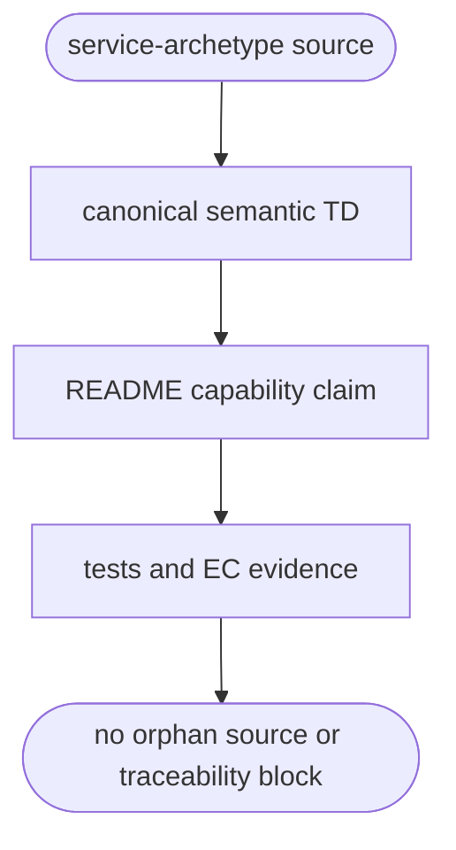

## Logic
<!-- type: logic lang: mermaid -->


## Changes
<!-- type: changes lang: yaml -->

```yaml
changes:
  - path: projects/sift/tech-design/semantic/sift-projects-sift.md
    action: modify
    section: logic
    impl_mode: hand-written
    gap: sift-service-archetype-semantic-ownership
    tracker: "1619"
    description: Add semantic source and evidence edges for every implemented Sift service-archetype runtime, deployment, and operational test artifact.
```
