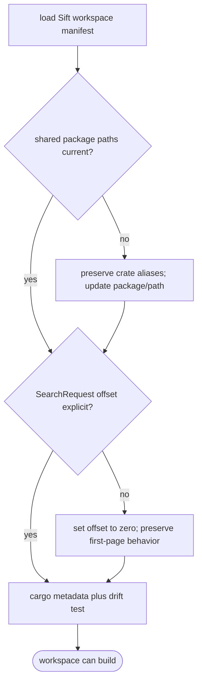
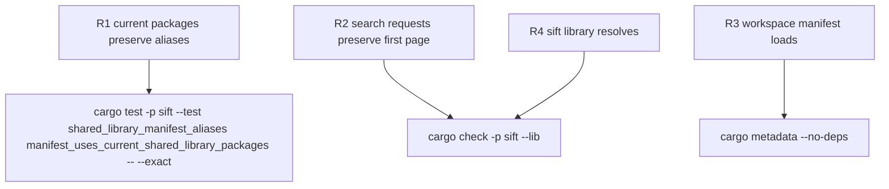

## Logic
<!-- type: logic lang: mermaid -->


## Changes
<!-- type: changes lang: yaml -->

```yaml
changes:
  - path: projects/sift/tests/shared_library_manifest_aliases.rs
    action: create
    section: unit-test
    impl_mode: hand-written
    description: Lock the four current package names and paths while proving the legacy Rust dependency aliases remain stable.
  - path: projects/sift/src/projection/logging.rs
    action: modify
    section: logic
    impl_mode: hand-written
    description: Supply the current Lumen SearchRequest offset with zero to preserve first-page logging queries.
  - path: projects/sift/src/projection/lumen.rs
    action: modify
    section: logic
    impl_mode: hand-written
    description: Supply the current Lumen SearchRequest offset with zero to preserve first-page embedded searches.
```

The bounded implementation also corrects the four corresponding dependency entries in `projects/sift/Cargo.toml`. Cargo manifests are declarative build inputs rather than Rust codegen targets; the generated regression test is the executable drift gate for that hand-authored manifest change. The two projection changes are already owned by their established HANDWRITE regions and only make the current Lumen first-page default explicit.
## Unit Test
<!-- type: unit-test lang: mermaid -->


