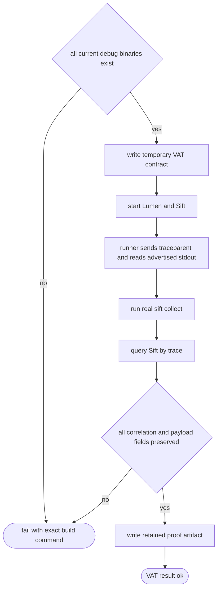

## Logic
<!-- type: logic lang: mermaid -->


## Changes
<!-- type: changes lang: yaml -->

```yaml
changes:
  - path: projects/sift/tests/vat_lumen_observability_e2e.rs
    action: create
    section: unit-test
    impl_mode: hand-written
  - path: projects/sift/observability/structured-stdout.md
    action: create
    section: logic
    impl_mode: hand-written
```

## Unit Test

```mermaid
---
id: sift-vat-lumen-observability-journey-verification
requirements:
  collector_cli:
    id: R3
    text: "The real Sift collector consumes only the advertised Lumen stdout path and public Sift endpoint."
    kind: integration
    risk: high
    verify: vat_managed_lumen_stdout_reaches_real_sift_query
  query_preserves:
    id: R4
    text: "Sift query preserves service identity structured payload message trace span and parent correlation."
    kind: integration
    risk: high
    verify: vat_managed_lumen_stdout_reaches_real_sift_query
  real_services:
    id: R1
    text: "VAT starts the current real Lumen and Sift binaries and a real runner probe."
    kind: functional
    risk: high
    verify: vat_managed_lumen_stdout_reaches_real_sift_query
  runbook:
    id: R5
    text: "A canonical runbook documents local and Kubernetes ownership flows plus the reproducible command."
    kind: documentation
    risk: medium
    verify: architecture_runbook_names_owned_boundaries_and_repro_command
  traceparent_stdout:
    id: R2
    text: "A fixed valid inbound traceparent appears in the VAT-advertised Lumen stdout path."
    kind: functional
    risk: high
    verify: vat_managed_lumen_stdout_reaches_real_sift_query
---
flowchart TD
    r1[R1 real services] --> vat_managed_lumen_stdout_reaches_real_sift_query[vat_managed_lumen_stdout_reaches_real_sift_query]
    r2[R2 traceparent stdout] --> vat_managed_lumen_stdout_reaches_real_sift_query
    r3[R3 collector cli] --> vat_managed_lumen_stdout_reaches_real_sift_query
    r4[R4 query preserves] --> vat_managed_lumen_stdout_reaches_real_sift_query
    r5[R5 runbook] --> architecture_runbook_names_owned_boundaries_and_repro_command[architecture_runbook_names_owned_boundaries_and_repro_command]
```

<!-- type: unit-test lang: mermaid -->


