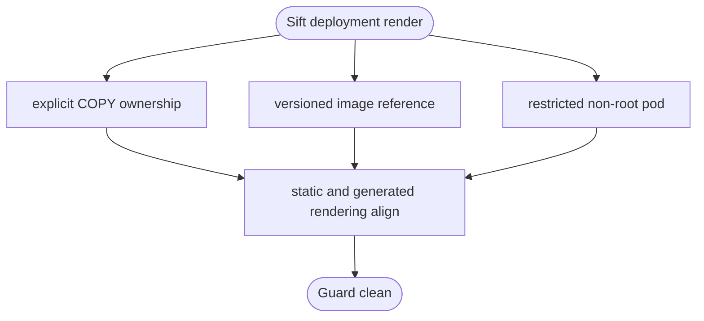

## Logic
<!-- type: logic lang: mermaid -->


## Changes
<!-- type: changes lang: yaml -->

```yaml
changes:
  - path: projects/sift/Dockerfile
    action: modify
    section: changes
    impl_mode: hand-written
    gap: sift-dockerfile-copy-ownership
    tracker: "1616"
    description: Apply explicit non-root ownership to build and runtime COPY operations.
  - path: projects/sift/k8s/operator/operator.yaml
    action: modify
    section: changes
    impl_mode: hand-written
    gap: sift-static-operator-security-context
    tracker: "1616"
    description: Pin the operator image and declare restricted non-root pod and container security context.
  - path: projects/sift/k8s/instances/dev.yaml
    action: modify
    section: changes
    impl_mode: hand-written
    gap: sift-dev-image-pin
    tracker: "1616"
    description: Use a versioned development image reference.
  - path: projects/sift/src/deploy.rs
    action: modify
    section: logic
    impl_mode: hand-written
    gap: sift-rendered-image-pin
    tracker: "1616"
    description: Keep staging and production instance rendering pinned to a versioned Sift image.
  - path: projects/sift/src/operator.rs
    action: modify
    section: logic
    impl_mode: hand-written
    gap: sift-operator-workload-security-context
    tracker: "1616"
    description: Render restricted non-root security context for Sift workload and backup containers.
  - path: projects/sift/tests/deployment_cli.rs
    action: modify
    section: unit-test
    impl_mode: hand-written
    gap: sift-deployment-security-render-tests
    tracker: "1616"
    description: Verify deployment rendering keeps versioned images and non-root security controls.
```
