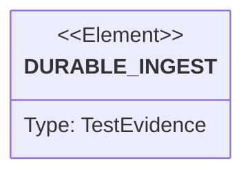

# Semantic TD: sift/projects/sift

## Schema
<!-- type: schema lang: yaml -->

```yaml
semantic_domain:
  key: "sift/projects/sift"
  source_group: "projects/sift"
  coverage_kind: semantic
  evidence:
    source_units:
      - path: "projects/sift/src/lib.rs"
        language: "rust"
        ownership_state: "handwrite"
        generator_primitives: ["source_unit"]
        source_evidence_node:
          layer: "source"
          ecosystem: "rust"
          role: "source"
          section_type: "schema"
          domain: "projects/sift"
      - path: "projects/sift/src/bin/sift.rs"
        language: "rust"
        ownership_state: "handwrite"
        generator_primitives: ["source_unit"]
        source_evidence_node:
          layer: "source"
          ecosystem: "rust"
          role: "source"
          section_type: "schema"
          domain: "projects/sift"
      - path: "projects/sift/tests/ingest_api.rs"
        language: "rust"
        ownership_state: "handwrite"
        generator_primitives: ["source_unit"]
        source_evidence_node:
          layer: "source"
          ecosystem: "rust"
          role: "source"
          section_type: "schema"
          domain: "projects/sift"
      - path: "projects/sift/build.sh"
        language: "shell"
        ownership_state: "handwrite"
        generator_primitives: ["source_unit"]
        source_evidence_node:
          layer: "source"
          ecosystem: "shell"
          role: "source"
          section_type: "schema"
          domain: "projects/sift"
      - path: "projects/sift/install.sh"
        language: "shell"
        ownership_state: "handwrite"
        generator_primitives: ["source_unit"]
        source_evidence_node:
          layer: "source"
          ecosystem: "shell"
          role: "source"
          section_type: "schema"
          domain: "projects/sift"
      - path: "projects/sift/llms.txt"
        language: "llms"
        ownership_state: "codegen"
        generator_primitives: ["project_root_llms"]
        source_evidence_node:
          layer: "source"
          ecosystem: "llms"
          role: "source"
          section_type: "schema"
          domain: "projects/sift"
```

## Unit Test
<!-- type: unit-test lang: mermaid -->



## Changes
<!-- type: changes lang: yaml -->

```yaml
coverage_kind: semantic
changes:
  - path: "projects/sift/src/lib.rs"
    action: modify
    section: schema
    impl_mode: hand-written
    description: "Versioned envelope, durable raw journal, query, and replay ownership."
  - path: "projects/sift/src/bin/sift.rs"
    action: modify
    section: schema
    impl_mode: hand-written
    description: "Unified service and agent-facing CLI ownership."
  - path: "projects/sift/tests/ingest_api.rs"
    action: modify
    section: schema
    impl_mode: hand-written
    description: "Durable ingest and standard-endpoint contract evidence."
  - path: "projects/sift/build.sh"
    action: modify
    section: schema
    impl_mode: hand-written
    description: "Rustup-based local build and install entrypoint."
  - path: "projects/sift/install.sh"
    action: modify
    section: schema
    impl_mode: hand-written
    description: "Verified release archive install entrypoint."
  - path: "projects/sift/llms.txt"
    action: modify
    section: schema
    impl_mode: codegen
    description: "TD-first project agent context generated from the configured service contract."
  - action: annotate
    section: unit-test
    impl_mode: hand-written
    description: "Semantic evidence edge for the bootstrap contract suite."
```
