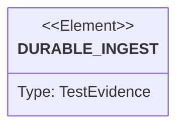

# Semantic TD: sift/projects/sift

## Schema
<!-- type: schema lang: yaml -->

```yaml
semantic_domain:
  key: "sift/projects/sift"
  source_group: "projects/sift"
  coverage_kind: semantic
  evidence:
    source_units:
      - path: "projects/sift/src/lib.rs"
        language: "rust"
        ownership_state: "handwrite"
        generator_primitives: ["source_unit"]
        source_evidence_node:
          layer: "source"
          ecosystem: "rust"
          role: "source"
          section_type: "schema"
          domain: "projects/sift"
      - path: "projects/sift/src/bin/sift.rs"
        language: "rust"
        ownership_state: "handwrite"
        generator_primitives: ["source_unit"]
        source_evidence_node:
          layer: "source"
          ecosystem: "rust"
          role: "source"
          section_type: "schema"
          domain: "projects/sift"
      - path: "projects/sift/tests/ingest_api.rs"
        language: "rust"
        ownership_state: "handwrite"
        generator_primitives: ["source_unit"]
        source_evidence_node:
          layer: "source"
          ecosystem: "rust"
          role: "source"
          section_type: "schema"
          domain: "projects/sift"
      - path: "projects/sift/build.sh"
        language: "shell"
        ownership_state: "handwrite"
        generator_primitives: ["source_unit"]
        source_evidence_node:
          layer: "source"
          ecosystem: "shell"
          role: "source"
          section_type: "schema"
          domain: "projects/sift"
      - path: "projects/sift/install.sh"
        language: "shell"
        ownership_state: "handwrite"
        generator_primitives: ["source_unit"]
        source_evidence_node:
          layer: "source"
          ecosystem: "shell"
          role: "source"
          section_type: "schema"
          domain: "projects/sift"
      - path: "projects/sift/llms.txt"
        language: "llms"
        ownership_state: "codegen"
        generator_primitives: ["project_root_llms"]
        source_evidence_node:
          layer: "source"
          ecosystem: "llms"
          role: "source"
          section_type: "schema"
          domain: "projects/sift"
      - path: "projects/sift/Dockerfile"
        language: "dockerfile"
        ownership_state: "handwrite"
        generator_primitives: ["runtime_image"]
        source_evidence_node: { layer: "operations", ecosystem: "dockerfile", role: "source-image", section_type: "schema", domain: "projects/sift" }
      - path: "projects/sift/Dockerfile.release"
        language: "dockerfile"
        ownership_state: "handwrite"
        generator_primitives: ["runtime_image"]
        source_evidence_node: { layer: "operations", ecosystem: "dockerfile", role: "release-image", section_type: "schema", domain: "projects/sift" }
      - path: "projects/sift/build.rs"
        language: "rust"
        ownership_state: "handwrite"
        generator_primitives: ["build_stamp"]
        source_evidence_node: { layer: "build", ecosystem: "rust", role: "build-script", section_type: "schema", domain: "projects/sift" }
      - path: "projects/sift/k8s/base/kustomization.yaml"
        language: "kustomize"
        ownership_state: "handwrite"
        generator_primitives: ["kustomize_manifest"]
        source_evidence_node: { layer: "operations", ecosystem: "kustomize", role: "base", section_type: "schema", domain: "projects/sift" }
      - path: "projects/sift/k8s/overlays/dev/kustomization.yaml"
        language: "kustomize"
        ownership_state: "handwrite"
        generator_primitives: ["kustomize_manifest"]
        source_evidence_node: { layer: "operations", ecosystem: "kustomize", role: "dev-overlay", section_type: "schema", domain: "projects/sift" }
      - path: "projects/sift/k8s/overlays/staging/kustomization.yaml"
        language: "kustomize"
        ownership_state: "handwrite"
        generator_primitives: ["kustomize_manifest"]
        source_evidence_node: { layer: "operations", ecosystem: "kustomize", role: "staging-overlay", section_type: "schema", domain: "projects/sift" }
      - path: "projects/sift/k8s/overlays/prod/kustomization.yaml"
        language: "kustomize"
        ownership_state: "handwrite"
        generator_primitives: ["kustomize_manifest"]
        source_evidence_node: { layer: "operations", ecosystem: "kustomize", role: "production-overlay", section_type: "schema", domain: "projects/sift" }
      - path: "projects/sift/k8s/overlays/template/kustomization.yaml"
        language: "kustomize"
        ownership_state: "handwrite"
        generator_primitives: ["kustomize_manifest"]
        source_evidence_node: { layer: "operations", ecosystem: "kustomize", role: "template-overlay", section_type: "schema", domain: "projects/sift" }
      - path: "projects/sift/src/auth.rs"
        language: "rust"
        ownership_state: "handwrite"
        generator_primitives: ["service_auth_adapter"]
        source_evidence_node: { layer: "runtime", ecosystem: "rust", role: "auth", section_type: "schema", domain: "projects/sift" }
      - path: "projects/sift/src/backup.rs"
        language: "rust"
        ownership_state: "handwrite"
        generator_primitives: ["service_backup_adapter"]
        source_evidence_node: { layer: "runtime", ecosystem: "rust", role: "backup", section_type: "schema", domain: "projects/sift" }
      - path: "projects/sift/src/deploy.rs"
        language: "rust"
        ownership_state: "handwrite"
        generator_primitives: ["deployment_renderer"]
        source_evidence_node: { layer: "operations", ecosystem: "rust", role: "deployment-renderer", section_type: "schema", domain: "projects/sift" }
      - path: "projects/sift/src/durability.rs"
        language: "rust"
        ownership_state: "handwrite"
        generator_primitives: ["raft_state_machine"]
        source_evidence_node: { layer: "runtime", ecosystem: "rust", role: "durability", section_type: "schema", domain: "projects/sift" }
      - path: "projects/sift/src/operator.rs"
        language: "rust"
        ownership_state: "handwrite"
        generator_primitives: ["operator_reconciler"]
        source_evidence_node: { layer: "operations", ecosystem: "rust", role: "operator", section_type: "schema", domain: "projects/sift" }
      - path: "projects/sift/tests/cli_contract.rs"
        language: "rust"
        ownership_state: "handwrite"
        generator_primitives: ["contract_test"]
        source_evidence_node: { layer: "verification", ecosystem: "rust", role: "cli-contract", section_type: "schema", domain: "projects/sift" }
      - path: "projects/sift/tests/deployment_cli.rs"
        language: "rust"
        ownership_state: "handwrite"
        generator_primitives: ["contract_test"]
        source_evidence_node: { layer: "verification", ecosystem: "rust", role: "deployment-contract", section_type: "schema", domain: "projects/sift" }
      - path: "projects/sift/tests/ha_backup_e2e.rs"
        language: "rust"
        ownership_state: "handwrite"
        generator_primitives: ["e2e_test"]
        source_evidence_node: { layer: "verification", ecosystem: "rust", role: "ha-backup", section_type: "schema", domain: "projects/sift" }
      - path: "projects/sift/tests/operational_cli.rs"
        language: "rust"
        ownership_state: "handwrite"
        generator_primitives: ["contract_test"]
        source_evidence_node: { layer: "verification", ecosystem: "rust", role: "operational-cli", section_type: "schema", domain: "projects/sift" }
      - path: "projects/sift/tests/runtime_security_e2e.rs"
        language: "rust"
        ownership_state: "handwrite"
        generator_primitives: ["e2e_test"]
        source_evidence_node: { layer: "verification", ecosystem: "rust", role: "security", section_type: "schema", domain: "projects/sift" }
      - path: "projects/sift/tests/stability_e2e.rs"
        language: "rust"
        ownership_state: "handwrite"
        generator_primitives: ["e2e_test"]
        source_evidence_node: { layer: "verification", ecosystem: "rust", role: "stability", section_type: "schema", domain: "projects/sift" }
```

## Unit Test
<!-- type: unit-test lang: mermaid -->



## Changes
<!-- type: changes lang: yaml -->

```yaml
coverage_kind: semantic
changes:
  - path: "projects/sift/src/lib.rs"
    action: modify
    section: schema
    impl_mode: hand-written
    description: "Versioned envelope, durable raw journal, query, and replay ownership."
  - path: "projects/sift/src/bin/sift.rs"
    action: modify
    section: schema
    impl_mode: hand-written
    description: "Unified service and agent-facing CLI ownership, including shared Rustls crypto-provider installation before online Kubernetes and TLS paths initialize."
  - path: "projects/sift/tests/ingest_api.rs"
    action: modify
    section: schema
    impl_mode: hand-written
    description: "Durable ingest and standard-endpoint contract evidence."
  - path: "projects/sift/build.sh"
    action: modify
    section: schema
    impl_mode: hand-written
    description: "Rustup-based local build and install entrypoint."
  - path: "projects/sift/install.sh"
    action: modify
    section: schema
    impl_mode: hand-written
    description: "Verified release archive install entrypoint."
  - path: "projects/sift/llms.txt"
    action: modify
    section: schema
    impl_mode: codegen
    description: "TD-first project agent context generated from the configured service contract."
  - path: "projects/sift/Dockerfile"
    action: modify
    section: schema
    impl_mode: hand-written
    description: "Source-build service image with explicit non-root ownership."
  - path: "projects/sift/Dockerfile.release"
    action: modify
    section: schema
    impl_mode: hand-written
    description: "Release-binary service image contract."
  - path: "projects/sift/build.rs"
    action: modify
    section: schema
    impl_mode: hand-written
    description: "Build stamp ownership for CLI metadata."
  - path: "projects/sift/k8s/base/kustomization.yaml"
    action: modify
    section: schema
    impl_mode: hand-written
    description: "Shared Kustomize base ownership."
  - path: "projects/sift/k8s/overlays/dev/kustomization.yaml"
    action: modify
    section: schema
    impl_mode: hand-written
    description: "Development Kustomize overlay ownership."
  - path: "projects/sift/k8s/overlays/staging/kustomization.yaml"
    action: modify
    section: schema
    impl_mode: hand-written
    description: "Staging Kustomize overlay ownership."
  - path: "projects/sift/k8s/overlays/prod/kustomization.yaml"
    action: modify
    section: schema
    impl_mode: hand-written
    description: "Production Kustomize overlay ownership."
  - path: "projects/sift/k8s/overlays/template/kustomization.yaml"
    action: modify
    section: schema
    impl_mode: hand-written
    description: "Template Kustomize overlay ownership."
  - path: "projects/sift/src/auth.rs"
    action: modify
    section: schema
    impl_mode: hand-written
    description: "Shared bearer-auth adapter ownership."
  - path: "projects/sift/src/backup.rs"
    action: modify
    section: schema
    impl_mode: hand-written
    description: "Shared backup lifecycle adapter ownership."
  - path: "projects/sift/src/deploy.rs"
    action: modify
    section: schema
    impl_mode: hand-written
    description: "Offline deployment artifact rendering ownership."
  - path: "projects/sift/src/durability.rs"
    action: modify
    section: schema
    impl_mode: hand-written
    description: "Framed journal and Raft state-machine ownership."
  - path: "projects/sift/src/operator.rs"
    action: modify
    section: schema
    impl_mode: hand-written
    description: "Shared Kubernetes operator adapter ownership."
  - path: "projects/sift/tests/cli_contract.rs"
    action: modify
    section: schema
    impl_mode: hand-written
    description: "CLI conformance evidence ownership."
  - path: "projects/sift/tests/deployment_cli.rs"
    action: modify
    section: schema
    impl_mode: hand-written
    description: "Deployment render and hardening evidence ownership."
  - path: "projects/sift/tests/ha_backup_e2e.rs"
    action: modify
    section: schema
    impl_mode: hand-written
    description: "HA backup and restore evidence ownership."
  - path: "projects/sift/tests/operational_cli.rs"
    action: modify
    section: schema
    impl_mode: hand-written
    description: "Operational connect and terminal-output evidence ownership."
  - path: "projects/sift/tests/runtime_security_e2e.rs"
    action: modify
    section: schema
    impl_mode: hand-written
    description: "Bearer auth and probe-exemption evidence ownership."
  - path: "projects/sift/tests/stability_e2e.rs"
    action: modify
    section: schema
    impl_mode: hand-written
    description: "Bounded ingest, drain, and recovery evidence ownership."
  - action: annotate
    section: unit-test
    impl_mode: hand-written
    description: "Semantic evidence edge for the bootstrap contract suite."
```
