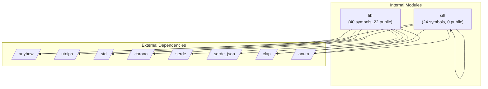

# Dependency Graph: Analyzed Project

## Overview

- **Internal Modules**: 2
- **External Dependencies**: 8
- **Total Relationships**: 13

## Module Graph

## Internal Modules

| Module | Path | Symbols | Public |
|--------|------|---------|--------|
| sift | projects/sift/src/bin/sift.rs | 24 | 0 |
| lib | projects/sift/src/lib.rs | 40 | 22 |

## External Dependencies

| Dependency |
|------------|
| anyhow |
| utoipa |
| std |
| chrono |
| serde |
| serde_json |
| clap |
| axum |

## Dependency Details

| From | To | Type |
|------|-----|------|
| sift | std | import |
| sift | anyhow | import |
| sift | axum | import |
| sift | clap | import |
| sift | sift | import |
| lib | std | import |
| lib | anyhow | import |
| lib | axum | import |
| lib | chrono | import |
| lib | clap | import |
| lib | serde | import |
| lib | serde_json | import |
| lib | utoipa | import |
