# Dependency Graph: Analyzed Project

## Overview

- **Internal Modules**: 20
- **External Dependencies**: 16
- **Total Relationships**: 54

## Module Graph

```mermaid
flowchart TD
    subgraph Internal["Internal Modules"]
        ha_backup_e2e["ha_backup_e2e\n(2 symbols, 0 public)"]
        ingest_api["ingest_api\n(4 symbols, 0 public)"]
        cli_contract["cli_contract\n(2 symbols, 0 public)"]
        behavior_one_port_health_readiness_metrics_contract["behavior_one_port_health_readiness_metrics_contract\n(3 symbols, 0 public)"]
        behavior_durable_ingest_http_contract["behavior_durable_ingest_http_contract\n(3 symbols, 0 public)"]
        stability_e2e["stability_e2e\n(2 symbols, 0 public)"]
        runtime_security_e2e["runtime_security_e2e\n(3 symbols, 0 public)"]
        stability_sift_long_running_stability_resilience["stability_sift_long_running_stability_resilience\n(3 symbols, 0 public)"]
        operational_cli["operational_cli\n(3 symbols, 0 public)"]
        security_sift_security_hardening_bearer_auth["security_sift_security_hardening_bearer_auth\n(3 symbols, 0 public)"]
        deployment_cli["deployment_cli\n(2 symbols, 0 public)"]
        behavior_served_openapi_and_docs_contract["behavior_served_openapi_and_docs_contract\n(3 symbols, 0 public)"]
        build["build\n(1 symbols, 0 public)"]
        operator["operator\n(10 symbols, 5 public)"]
        sift["sift\n(60 symbols, 0 public)"]
        deploy["deploy\n(7 symbols, 6 public)"]
        lib["lib\n(59 symbols, 35 public)"]
        auth["auth\n(12 symbols, 7 public)"]
        backup["backup\n(2 symbols, 2 public)"]
        durability["durability\n(8 symbols, 4 public)"]
    end
    subgraph External["External Dependencies"]
        service_backup[/"service_backup"/]
        anyhow[/"anyhow"/]
        axiom_operator[/"axiom_operator"/]
        std[/"std"/]
        serde[/"serde"/]
        schemars[/"schemars"/]
        chrono[/"chrono"/]
        service_metrics[/"service_metrics"/]
        raft_host[/"raft_host"/]
        utoipa[/"utoipa"/]
        tower[/"tower"/]
        serde_json[/"serde_json"/]
        kube[/"kube"/]
        clap[/"clap"/]
        axum[/"axum"/]
        service_auth[/"service_auth"/]
    end
    ha_backup_e2e --> std
    ha_backup_e2e --> raft_host
    ha_backup_e2e --> sift
    ingest_api --> std
    ingest_api --> axum
    ingest_api --> sift
    ingest_api --> tower
    cli_contract --> std
    stability_e2e --> std
    stability_e2e --> axum
    stability_e2e --> sift
    stability_e2e --> tower
    runtime_security_e2e --> std
    runtime_security_e2e --> axum
    runtime_security_e2e --> service_auth
    runtime_security_e2e --> sift
    runtime_security_e2e --> tower
    operational_cli --> std
    deployment_cli --> std
    operator --> axiom_operator
    operator --> kube
    operator --> schemars
    operator --> serde
    operator --> serde_json
    sift --> std
    sift --> anyhow
    sift --> axum
    sift --> clap
    sift --> serde
    sift --> serde_json
    sift --> sift
    deploy --> anyhow
    lib --> std
    lib --> anyhow
    lib --> axum
    lib --> chrono
    lib --> clap
    lib --> serde
    lib --> serde_json
    lib --> service_metrics
    lib --> utoipa
    auth --> std
    auth --> anyhow
    auth --> axum
    auth --> service_auth
    backup --> std
    backup --> anyhow
    backup --> service_backup
    backup --> DurableJournal
    durability --> std
    durability --> anyhow
    durability --> raft_host
    durability --> serde
    durability --> crate
```

## Internal Modules

| Module | Path | Symbols | Public |
|--------|------|---------|--------|
| ha_backup_e2e | projects/sift/tests/ha_backup_e2e.rs | 2 | 0 |
| ingest_api | projects/sift/tests/ingest_api.rs | 4 | 0 |
| cli_contract | projects/sift/tests/cli_contract.rs | 2 | 0 |
| behavior_one_port_health_readiness_metrics_contract | projects/sift/tests/behavior_one_port_health_readiness_metrics_contract.rs | 3 | 0 |
| behavior_durable_ingest_http_contract | projects/sift/tests/behavior_durable_ingest_http_contract.rs | 3 | 0 |
| stability_e2e | projects/sift/tests/stability_e2e.rs | 2 | 0 |
| runtime_security_e2e | projects/sift/tests/runtime_security_e2e.rs | 3 | 0 |
| stability_sift_long_running_stability_resilience | projects/sift/tests/stability_sift_long_running_stability_resilience.rs | 3 | 0 |
| operational_cli | projects/sift/tests/operational_cli.rs | 3 | 0 |
| security_sift_security_hardening_bearer_auth | projects/sift/tests/security_sift_security_hardening_bearer_auth.rs | 3 | 0 |
| deployment_cli | projects/sift/tests/deployment_cli.rs | 2 | 0 |
| behavior_served_openapi_and_docs_contract | projects/sift/tests/behavior_served_openapi_and_docs_contract.rs | 3 | 0 |
| build | projects/sift/build.rs | 1 | 0 |
| operator | projects/sift/src/operator.rs | 10 | 5 |
| sift | projects/sift/src/bin/sift.rs | 60 | 0 |
| deploy | projects/sift/src/deploy.rs | 7 | 6 |
| lib | projects/sift/src/lib.rs | 59 | 35 |
| auth | projects/sift/src/auth.rs | 12 | 7 |
| backup | projects/sift/src/backup.rs | 2 | 2 |
| durability | projects/sift/src/durability.rs | 8 | 4 |

## External Dependencies

| Dependency |
|------------|
| service_backup |
| anyhow |
| axiom_operator |
| std |
| serde |
| schemars |
| chrono |
| service_metrics |
| raft_host |
| utoipa |
| tower |
| serde_json |
| kube |
| clap |
| axum |
| service_auth |

## Dependency Details

| From | To | Type |
|------|-----|------|
| ha_backup_e2e | std | import |
| ha_backup_e2e | raft_host | import |
| ha_backup_e2e | sift | import |
| ingest_api | std | import |
| ingest_api | axum | import |
| ingest_api | sift | import |
| ingest_api | tower | import |
| cli_contract | std | import |
| stability_e2e | std | import |
| stability_e2e | axum | import |
| stability_e2e | sift | import |
| stability_e2e | tower | import |
| runtime_security_e2e | std | import |
| runtime_security_e2e | axum | import |
| runtime_security_e2e | service_auth | import |
| runtime_security_e2e | sift | import |
| runtime_security_e2e | tower | import |
| operational_cli | std | import |
| deployment_cli | std | import |
| operator | axiom_operator | import |
| operator | kube | import |
| operator | schemars | import |
| operator | serde | import |
| operator | serde_json | import |
| sift | std | import |
| sift | anyhow | import |
| sift | axum | import |
| sift | clap | import |
| sift | serde | import |
| sift | serde_json | import |
| sift | sift | import |
| deploy | anyhow | import |
| lib | std | import |
| lib | anyhow | import |
| lib | axum | import |
| lib | chrono | import |
| lib | clap | import |
| lib | serde | import |
| lib | serde_json | import |
| lib | service_metrics | import |
| lib | utoipa | import |
| auth | std | import |
| auth | anyhow | import |
| auth | axum | import |
| auth | service_auth | import |
| backup | std | import |
| backup | anyhow | import |
| backup | service_backup | import |
| backup | DurableJournal | import |
| durability | std | import |
| durability | anyhow | import |
| durability | raft_host | import |
| durability | serde | import |
| durability | crate | import |
