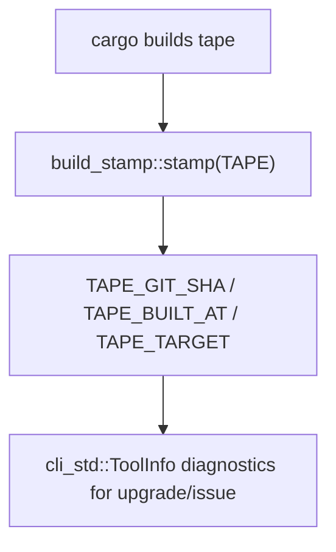

# Tape Build Stamp

## Overview
<!-- type: overview lang: markdown -->

`projects/tape/build.rs` delegates to `libs/build-stamp` with the `TAPE` prefix,
emitting `TAPE_GIT_SHA`, `TAPE_BUILT_AT`, and `TAPE_TARGET`.

## Logic
<!-- type: logic lang: mermaid -->



## Changes
<!-- type: changes lang: yaml -->

```yaml
changes:
  - path: projects/tape/build.rs
    action: modify
    section: logic
    impl_mode: hand-written
    description: "Tape build-stamp wiring for cli-std ToolInfo provenance."
```
