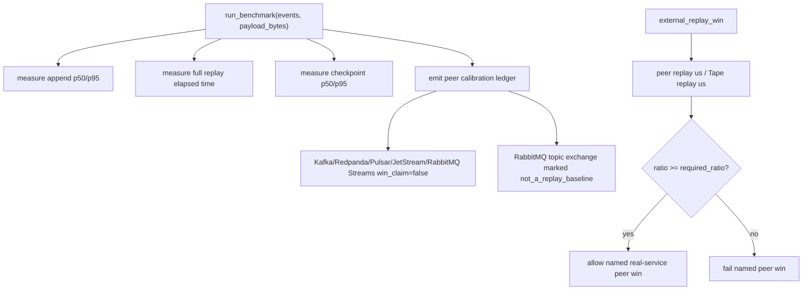
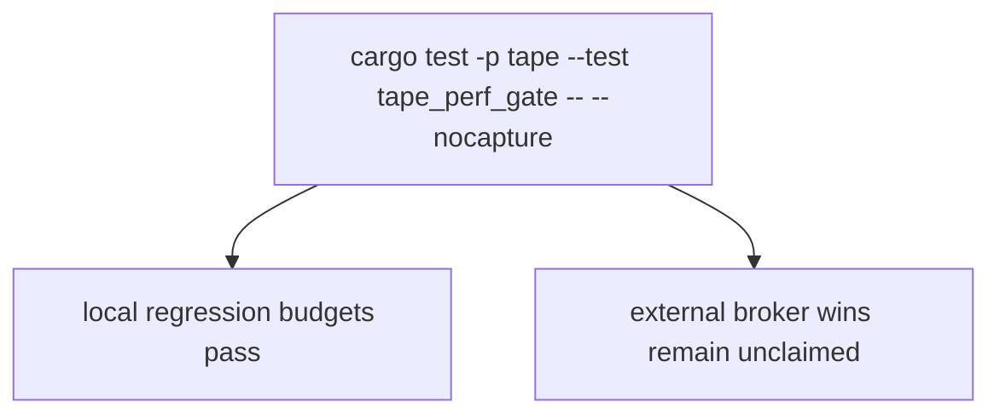

# Tape Benchmark Core

## Overview
<!-- type: overview lang: markdown -->

`projects/tape/src/bench.rs` defines the first competitive-performance evidence
surface. It measures local append, replay, and checkpoint operations and also
models named real-service replay wins such as the NATS JetStream local backlog
gate. Other replay-log peer wins stay unclaimed until their own real-service
peer runs are added.

## Logic
<!-- type: logic lang: mermaid -->



## Unit Test
<!-- type: unit-test lang: mermaid -->



## Changes
<!-- type: changes lang: yaml -->

```yaml
changes:
  - path: projects/tape/src/bench.rs
    action: create
    section: logic
    impl_mode: hand-written
    description: "Local performance regression benchmark and external peer calibration ledger."
  - path: projects/tape/src/bench.rs
    action: modify
    section: logic
    impl_mode: hand-written
    description: "Named real-service replay win reporting for NATS JetStream and future calibrated peers."
  - path: projects/tape/src/bench.rs
    action: create
    section: unit-test
    impl_mode: hand-written
    description: "Benchmark verification is exercised through the tape_perf_gate integration test."
```
