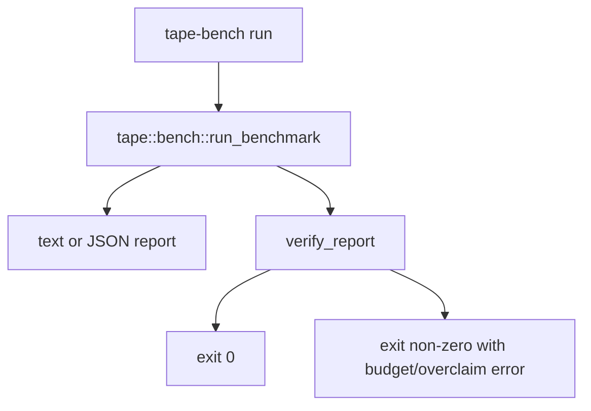

# Tape Benchmark CLI

## Overview
<!-- type: overview lang: markdown -->

`projects/tape/src/bin/tape-bench.rs` provides a small local benchmark CLI for
the first Tape replay slice. It prints either text or JSON and exits non-zero if
local regression budgets fail or if Tape overclaims external broker wins.

## Logic
<!-- type: logic lang: mermaid -->



## Changes
<!-- type: changes lang: yaml -->

```yaml
changes:
  - path: projects/tape/src/bin/tape-bench.rs
    action: create
    section: logic
    impl_mode: hand-written
    description: "CLI wrapper for Tape local benchmark and calibration-status reporting."
```
