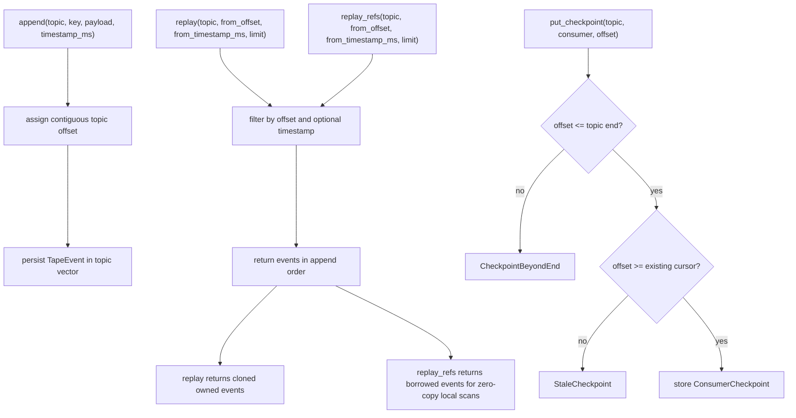
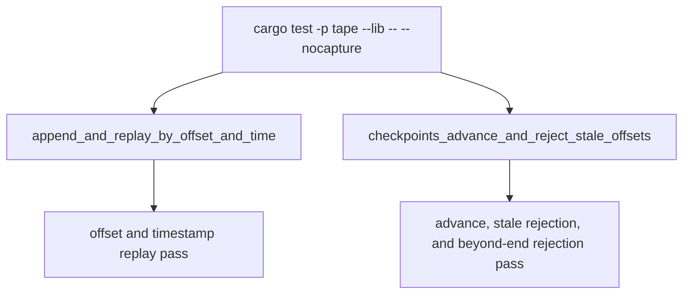

# Tape Local Journal Core

## Overview
<!-- type: overview lang: markdown -->

`projects/tape/src/lib.rs` defines the first Tape replay journal core:
`TapeJournal`, `TapeEvent`, `ConsumerCheckpoint`, and `TapeError`. It is local
and file-serializable, deliberately below the future h2c/raft/operator layers.
The core exposes owned replay for CLI/API callers and zero-copy `replay_refs`
for local backlog scan performance gates.

## Logic
<!-- type: logic lang: mermaid -->



## Unit Test
<!-- type: unit-test lang: mermaid -->



## Changes
<!-- type: changes lang: yaml -->

```yaml
changes:
  - path: projects/tape/src/lib.rs
    action: modify
    section: logic
    impl_mode: hand-written
    description: "Initial local Tape journal and checkpoint core."
  - path: projects/tape/src/lib.rs
    action: modify
    section: logic
    impl_mode: hand-written
    description: "Add zero-copy replay_refs for local backlog scan performance gates."
  - path: projects/tape/src/lib.rs
    action: modify
    section: unit-test
    impl_mode: hand-written
    description: "Inline unit tests for local replay and checkpoint behavior."
```
