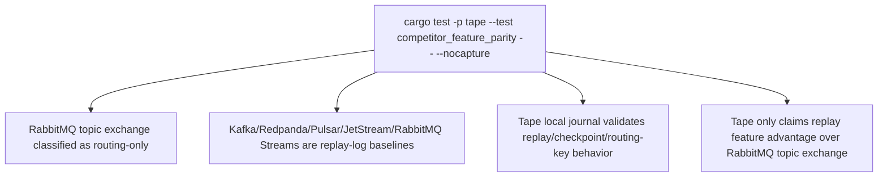

# Tape Competitor Feature Parity Test

## Overview
<!-- type: overview lang: markdown -->

`projects/tape/tests/competitor_feature_parity.rs` is the functional EC backing
for Tape's first competitor feature matrix. It validates replay-log features and
keeps RabbitMQ topic exchange scoped to topic routing/fanout semantics.

## Unit Test
<!-- type: unit-test lang: mermaid -->



## Changes
<!-- type: changes lang: yaml -->

```yaml
changes:
  - path: projects/tape/tests/competitor_feature_parity.rs
    action: modify
    section: unit-test
    impl_mode: hand-written
    description: "Functional competitor feature parity test for Tape replay-log semantics."
```
