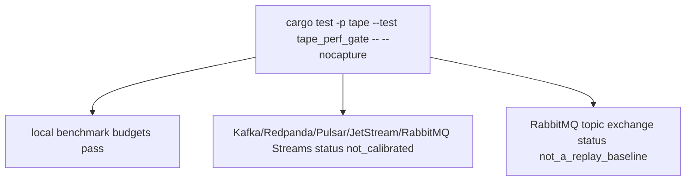

# Tape Performance Gate Test

## Overview
<!-- type: overview lang: markdown -->

`projects/tape/tests/tape_perf_gate.rs` verifies Tape's local benchmark and
calibration ledger. It proves local append/replay/checkpoint budget compliance
while refusing external broker win claims without real peer evidence.

## Unit Test
<!-- type: unit-test lang: mermaid -->



## Changes
<!-- type: changes lang: yaml -->

```yaml
changes:
  - path: projects/tape/tests/tape_perf_gate.rs
    action: create
    section: unit-test
    impl_mode: hand-written
    description: "Performance regression and calibration-status gate for Tape competitor performance."
```
