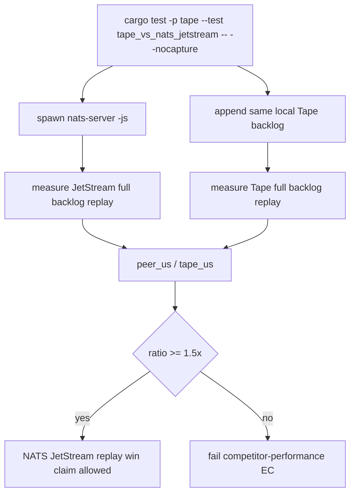

# Tape Versus NATS JetStream Replay Test

## Overview
<!-- type: overview lang: markdown -->

`projects/tape/tests/tape_vs_nats_jetstream.rs` starts a real local
`nats-server -js`, publishes a 20,000-event, 128-byte-payload JetStream backlog,
and compares full replay of that backlog against Tape's zero-copy local journal
replay. The gate permits a performance win claim only when Tape is at least 1.5x
faster for this named workload.

## Unit Test
<!-- type: unit-test lang: mermaid -->



## Changes
<!-- type: changes lang: yaml -->

```yaml
changes:
  - path: projects/tape/tests/tape_vs_nats_jetstream.rs
    action: create
    section: unit-test
    impl_mode: hand-written
    description: "Real NATS JetStream competitor benchmark for Tape local backlog replay performance."
```
