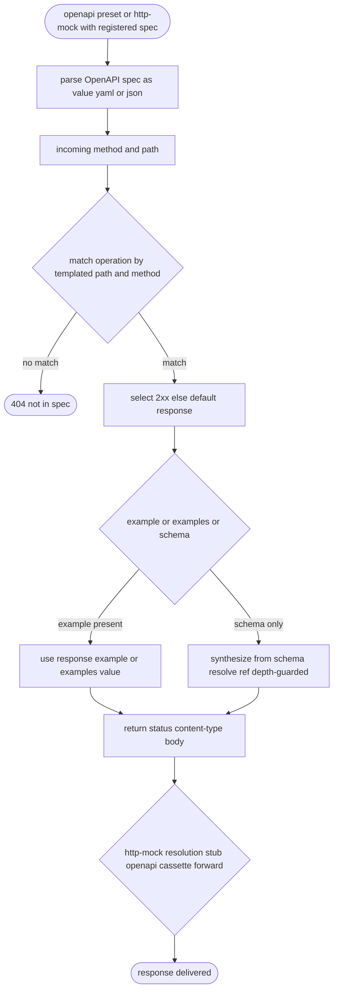

# Vat OpenAPI-Driven Mock HTTP Service

## Logic
<!-- type: logic lang: mermaid -->


## Schema
<!-- type: schema lang: yaml -->

```yaml
$schema: "https://json-schema.org/draft/2020-12/schema"
$id: "vat-openapi-mock-evidence.schema.json"
title: "Vat OpenAPI mock evidence"
type: object
description: "Service-evidence shape and the generated mock response for vat's OpenAPI mock engine."
properties:
  preset:
    type: string
    enum: [openapi]
  prepare_mode:
    type: string
    enum: [builtin_emulator]
  spec:
    type: string
    description: "Path to the OpenAPI document (relative to vat.toml), resolved to an absolute path for the emulator process."
  exported_env:
    type: array
    items: { type: string }
    description: "OPENAPI_MOCK_HOST (and any export targets) point at http://127.0.0.1:<port>."
  mock_response:
    type: object
    description: "A response generated from the spec for a matched operation."
    properties:
      status: { type: integer }
      content_type: { type: string }
      source: { type: string, enum: [example, examples, schema] }
    additionalProperties: true
additionalProperties: true
```
## Config
<!-- type: config lang: yaml -->

```yaml
$schema: "https://json-schema.org/draft/2020-12/schema"
$id: "vat-config-openapi.schema.json"
title: "vat.toml (OpenAPI preset addition)"
type: object
properties:
  services:
    type: array
    items:
      type: object
      required: [id]
      properties:
        preset:
          type: string
          enum: [postgres, redis, nats, rabbitmq, mysql, mongo, firestore, pubsub, datastore, bigtable, spanner, firebase, firebase-auth, cloud-tasks, cloud-scheduler, cloud-workflows, cloud-storage, http-mock, openapi]
          description: >
            openapi runs vat's built-in OpenAPI mock server under runtime=auto
            (built-in only). It requires a spec (path to an OpenAPI document
            relative to vat.toml) and serves spec-derived responses; the runner
            points its base URL at the exported OPENAPI_MOCK_HOST. The same engine
            also backs the http-mock proxy's /__admin/openapi source.
        spec:
          type: string
          description: "Path (relative to vat.toml) to the OpenAPI 3.x (or Swagger 2.0) document. Required for the openapi preset; rejected for others."
        runtime:
          type: string
          enum: [auto, native, docker]
          default: auto
        export:
          type: object
          additionalProperties: { type: string }
      additionalProperties: true
additionalProperties: true
```
## CLI
<!-- type: cli lang: yaml -->

```yaml
commands:
  - name: vat emulator
    usage: "vat emulator openapi --host-port 127.0.0.1:<PORT> --spec <path>"
    behavior:
      - "Hidden verb: vat spawns itself as the service process for the openapi preset; --spec is the resolved OpenAPI document path used only by this kind."
      - "Serves a mock HTTP server: each request is matched against the spec's operations (path templating like /users/{id}); a 2xx (else default) response is generated from its example, examples, or a schema-synthesized body."
      - "An unmatched path returns 404; a malformed spec degrades gracefully and never panics."
      - "The same engine backs the http-mock proxy's /__admin/openapi source (resolution order stub > openapi > cassette > forward). Built without the emulator feature, the verb errors cleanly."
```
## Unit Test
<!-- type: unit-test lang: mermaid -->

```mermaid
---
id: vat-openapi-driven-mock-http-service-unit-tests
---
requirementDiagram
    requirement preset_parses_builtin {
      id: UT1
      text: "ServicePreset round-trips openapi, classifies as built-in and built-in-only, and validate requires a spec (rejects openapi without spec and rejects an explicit runtime)."
      risk: high
      verifymethod: test
    }
    requirement respond_example {
      id: UT2
      text: "respond(method,path) returns a 2xx response built from the operation's response example when present."
      risk: high
      verifymethod: test
    }
    requirement respond_schema {
      id: UT3
      text: "When no example exists, the response body is synthesized from the schema (object/array/scalar) respecting example/default/enum."
      risk: high
      verifymethod: test
    }
    requirement path_templating {
      id: UT4
      text: "Templated paths (/users/{id}) match a concrete path; an undocumented path returns None."
      risk: medium
      verifymethod: test
    }
    requirement ref_and_depth {
      id: UT5
      text: "$ref resolves within the document and a self-referential schema is depth-guarded (no infinite recursion / panic)."
      risk: high
      verifymethod: test
    }
    requirement http_mock_source {
      id: UT6
      text: "A spec registered on the http-mock proxy answers a proxied request to its host from the spec (stub > openapi > cassette order)."
      risk: high
      verifymethod: test
    }
    test config_openapi_tests {
      type: functional
      verifies: preset_parses_builtin
    }
    test respond_example_tests {
      type: functional
      verifies: respond_example
    }
    test respond_schema_tests {
      type: functional
      verifies: respond_schema
    }
    test path_template_tests {
      type: functional
      verifies: path_templating
    }
    test ref_depth_tests {
      type: functional
      verifies: ref_and_depth
    }
    test http_mock_openapi_tests {
      type: functional
      verifies: http_mock_source
    }
```
## E2E Test
<!-- type: e2e-test lang: yaml -->

```yaml
e2e_tests:
  - id: vat-openapi-standalone-and-proxy-smoke
    name: "OpenAPI mock serves spec responses standalone and via the http-mock proxy"
    capability_id: agent-native-gpu-native-dev-containers
    contract_id: local-agent-test-runner-protocol
    category: behavior
    command: "cargo test -p vat --test vat_emulator_openapi -- --nocapture"
    assertions:
      - "spawning vat emulator openapi --spec <tmp spec> and GETting a documented path returns the spec's example; an undocumented path returns 404."
      - "registering a spec for a host on the http-mock proxy answers a proxied HTTPS-MITM GET to that host from the spec (no stub, no upstream)."
  - id: vat-openapi-preset-run-smoke
    name: "openapi preset serves a spec-derived response to the runner"
    capability_id: agent-native-gpu-native-dev-containers
    contract_id: local-agent-test-runner-protocol
    category: behavior
    command: "cargo test -p vat openapi_preset_serves_spec -- --nocapture --ignored"
    assertions:
      - "a preset = openapi vat.toml run exports OPENAPI_MOCK_HOST and the runner curls a documented operation, getting the spec-derived response with no app code change."
  - id: vat-openapi-lean-build
    name: "lean build still compiles"
    capability_id: agent-native-gpu-native-dev-containers
    contract_id: local-agent-test-runner-protocol
    category: behavior
    command: "cargo build -p vat --no-default-features"
    assertions:
      - "vat compiles without the emulator feature; the openapi emulator verb then errors cleanly, never a panic."
```
## Changes
<!-- type: changes lang: yaml -->

```yaml
changes:
  - path: projects/vat/tech-design/interfaces/rest/openapi-driven-mock-http-service.md
    action: create
    section: changes
    impl_mode: hand-written
    reason: "Define the OpenAPI mock TD."
  - path: projects/vat/src/emulator/openapi.rs
    action: add
    section: logic
    impl_mode: hand-written
    refs:
      - "projects/vat/tech-design/interfaces/rest/openapi-driven-mock-http-service.md#logic"
    summary: "OpenAPI mock engine: OpenApiSpec value-walk, respond(method,path) with path templating + response/body selection + example_from_schema ($ref + depth guard); standalone axum server."
  - path: projects/vat/src/emulator/mod.rs
    action: modify
    section: logic
    impl_mode: hand-written
    refs:
      - "projects/vat/tech-design/interfaces/rest/openapi-driven-mock-http-service.md#logic"
    summary: "Register the openapi module and the Openapi serve arm (carrying the spec path)."
  - path: projects/vat/src/emulator/httpmock/mod.rs
    action: modify
    section: logic
    impl_mode: hand-written
    refs:
      - "projects/vat/tech-design/interfaces/rest/openapi-driven-mock-http-service.md#logic"
    summary: "Add the OpenAPI source + /__admin/openapi route; resolution order stub > openapi > cassette > forward."
  - path: projects/vat/src/cli.rs
    action: modify
    section: cli
    impl_mode: hand-written
    refs:
      - "projects/vat/tech-design/interfaces/rest/openapi-driven-mock-http-service.md#cli"
    summary: "Add the Openapi EmulatorKind and the optional --spec arg on the hidden Emulator verb."
  - path: projects/vat/src/commands/emulator.rs
    action: modify
    section: cli
    impl_mode: hand-written
    refs:
      - "projects/vat/tech-design/interfaces/rest/openapi-driven-mock-http-service.md#cli"
    summary: "Pass --spec through and map Openapi to the emulator serve dispatch."
  - path: projects/vat/src/config.rs
    action: modify
    section: config
    impl_mode: hand-written
    refs:
      - "projects/vat/tech-design/interfaces/rest/openapi-driven-mock-http-service.md#config"
    summary: "Add the Openapi ServicePreset, the spec ServiceConfig field, classification, and validate_openapi_service (requires spec)."
  - path: projects/vat/src/commands/run.rs
    action: modify
    section: logic
    impl_mode: hand-written
    refs:
      - "projects/vat/tech-design/interfaces/rest/openapi-driven-mock-http-service.md#logic"
    summary: "Extend builtin_emulator_info/service_preset_name + dead arms; give prepare_builtin_service the workspace root so the openapi branch resolves the spec to an absolute --spec."
  - path: projects/vat/src/commands/llm.rs
    action: modify
    section: config
    impl_mode: hand-written
    refs:
      - "projects/vat/tech-design/interfaces/rest/openapi-driven-mock-http-service.md#config"
    summary: "Document the openapi preset and the http-mock OpenAPI source."
  - path: projects/vat/README.md
    action: modify
    section: config
    impl_mode: hand-written
    refs:
      - "projects/vat/tech-design/interfaces/rest/openapi-driven-mock-http-service.md#config"
    summary: "Document the openapi preset (spec -> mock) and the http-mock OpenAPI source."
  - path: projects/vat/tests/vat_emulator_openapi.rs
    action: add
    section: unit-test
    impl_mode: hand-written
    refs:
      - "projects/vat/tech-design/interfaces/rest/openapi-driven-mock-http-service.md#unit-test"
      - "projects/vat/tech-design/interfaces/rest/openapi-driven-mock-http-service.md#e2e-test"
    summary: "Add tests/vat_emulator_openapi.rs (standalone + http-mock OpenAPI source)."
```
# Reviews

### Review 1
**Verdict:** approved

- [logic] Engine lifecycle parse -> match -> select response -> example/schema body -> http-mock source order is coherent and matches the approved plan.
- [schema] Mock response evidence (status/content_type/source) and exported env captured.
- [config] openapi built-in-only preset and the spec field are correct; runtime stays auto.
- [cli] emulator openapi verb plus the --spec arg are correct.
- [unit-test] preset/respond-example/respond-schema/templating/ref-depth/http-mock-source coverage is complete.
- [e2e-test] standalone, proxy, preset-run, and lean-build are covered.
- [changes] hand-written change set is complete; no scenarios needed.

# Reviews

### Review 1
**Verdict:** approved

- [logic] Spec parse -> operation match (path templating) -> response select -> example/schema body -> http-mock source order is fully specified and matches the impl plan.
- [schema] Mock response evidence and exported env are correct.
- [config] openapi built-in-only preset + spec field are correct; runtime stays auto.
- [cli] emulator openapi verb + --spec arg are correct.
- [unit-test] preset/respond-example/respond-schema/templating/ref-depth/http-mock-source coverage is complete.
- [e2e-test] standalone, proxy, preset-run, and lean-build are covered.
- [changes] hand-written change set is complete and consistent with the sections.
