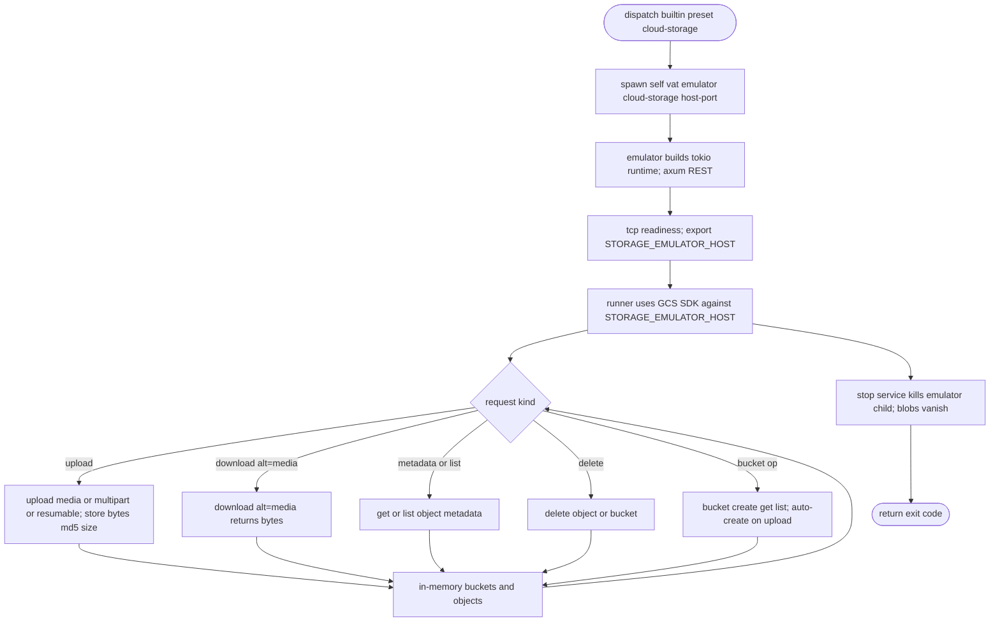

# Vat Built-in Cloud Storage (GCS) Emulator

## Logic
<!-- type: logic lang: mermaid -->



## Schema
<!-- type: schema lang: yaml -->

```yaml
$schema: "https://json-schema.org/draft/2020-12/schema"
$id: "vat-cloud-storage-evidence.schema.json"
title: "Vat Cloud Storage emulator evidence"
type: object
description: "Service-evidence shape and the GCS object resource for vat's built-in Cloud Storage emulator."
properties:
  preset:
    type: string
    enum: [cloud-storage]
  prepare_mode:
    type: string
    enum: [builtin_emulator]
  exported_env:
    type: array
    items: { type: string }
    description: "Host env var exported to the runner: STORAGE_EMULATOR_HOST (the var the GCS SDKs read)."
  object:
    type: object
    description: "A GCS object resource as returned by the JSON API."
    properties:
      kind: { type: string }
      bucket: { type: string }
      name: { type: string }
      size: { type: string }
      contentType: { type: string }
      generation: { type: string }
      md5Hash: { type: string }
      updated: { type: string }
    additionalProperties: true
additionalProperties: true
```

## Config
<!-- type: config lang: yaml -->

```yaml
$schema: "https://json-schema.org/draft/2020-12/schema"
$id: "vat-config-cloud-storage.schema.json"
title: "vat.toml (Cloud Storage preset addition)"
type: object
properties:
  services:
    type: array
    items:
      type: object
      required: [id]
      properties:
        preset:
          type: string
          enum: [postgres, redis, nats, rabbitmq, mysql, mongo, firestore, pubsub, datastore, bigtable, spanner, firebase, firebase-auth, cloud-tasks, cloud-scheduler, cloud-workflows, cloud-storage]
          description: >
            cloud-storage runs vat's built-in GCS emulator under runtime=auto
            (no gcloud/Java/Docker — Google ships no standalone GCS emulator). It
            exports STORAGE_EMULATOR_HOST, which the GCS client SDKs read, so the
            runner needs no code change. Blob state is in-memory and per-run.
            Built-in only: runtime must stay auto.
        runtime:
          type: string
          enum: [auto, native, docker]
          default: auto
        export:
          type: object
          additionalProperties: { type: string }
      additionalProperties: true
additionalProperties: true
```

## CLI
<!-- type: cli lang: yaml -->

```yaml
commands:
  - name: vat emulator
    usage: "vat emulator cloud-storage --host-port 127.0.0.1:<PORT>"
    behavior:
      - "Hidden verb: vat spawns itself as the service process for the cloud-storage preset."
      - "Serves the GCS JSON API v1 subset over an in-memory store: bucket create/get/list/delete (auto-create on upload), object upload (media/multipart/minimal resumable), download (alt=media), metadata, list (prefix), delete."
      - "Object names with slashes are percent-decoded; size and md5Hash are reported so SDK integrity checks pass. The runner reaches it through STORAGE_EMULATOR_HOST."
      - "Built without the emulator feature, the verb errors cleanly (no panic); an unknown object returns a structured 404."
```

## Unit Test
<!-- type: unit-test lang: mermaid -->

```mermaid
---
id: vat-built-in-cloud-storage-gcs-emulator-unit-tests
---
requirementDiagram
    requirement preset_parses_builtin {
      id: UT1
      text: "ServicePreset round-trips cloud-storage, and it classifies as built-in and built-in-only (validate rejects an explicit runtime)."
      risk: medium
      verifymethod: test
    }
    requirement exports_storage_host {
      id: UT2
      text: "prepare_builtin_service exports STORAGE_EMULATOR_HOST and builds the self-exec emulator command."
      risk: medium
      verifymethod: test
    }
    requirement media_upload_download {
      id: UT3
      text: "A media upload then download (alt=media) returns the same bytes; metadata reports the right size and md5Hash."
      risk: high
      verifymethod: test
    }
    requirement multipart_and_list_delete {
      id: UT4
      text: "A multipart upload round-trips; list with a prefix returns the object; delete removes it (404 afterward)."
      risk: high
      verifymethod: test
    }
    requirement slashed_names {
      id: UT5
      text: "Object names containing '/' (percent-encoded in the path) upload and download correctly."
      risk: medium
      verifymethod: test
    }
    test config_cloud_storage_tests {
      type: functional
      verifies: preset_parses_builtin
    }
    test prepare_storage_builtin_tests {
      type: functional
      verifies: exports_storage_host
    }
    test storage_media_roundtrip_tests {
      type: functional
      verifies: media_upload_download
    }
    test storage_multipart_list_delete_tests {
      type: functional
      verifies: multipart_and_list_delete
    }
    test storage_slashed_name_tests {
      type: functional
      verifies: slashed_names
    }
```
