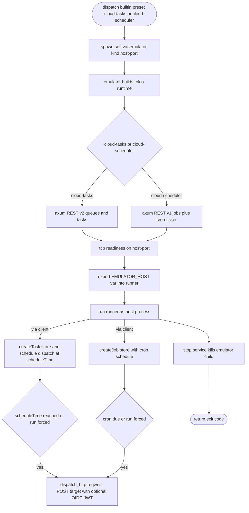

# Vat Built-in Cloud Tasks and Cloud Scheduler Emulators

## Logic
<!-- type: logic lang: mermaid -->


## Schema
<!-- type: schema lang: yaml -->

```yaml
$schema: "https://json-schema.org/draft/2020-12/schema"
$id: "vat-cloud-tasks-scheduler-evidence.schema.json"
title: "Vat Cloud Tasks / Scheduler emulator evidence"
type: object
description: "Service-evidence shape for vat's built-in Cloud Tasks / Scheduler emulators."
properties:
  preset:
    type: string
    enum: [cloud-tasks, cloud-scheduler]
  prepare_mode:
    type: string
    enum: [builtin_emulator]
  exported_env:
    type: array
    items: { type: string }
    description: "Host env var exported to the runner: CLOUD_TASKS_EMULATOR_HOST or CLOUD_SCHEDULER_EMULATOR_HOST."
  dispatch:
    type: object
    description: "How the emulator delivers a task/job: an outbound HTTP request to the target."
    properties:
      uri: { type: string }
      http_method: { type: string }
      oidc: { type: [boolean] }
    additionalProperties: true
additionalProperties: true
```
## Config
<!-- type: config lang: yaml -->

```yaml
$schema: "https://json-schema.org/draft/2020-12/schema"
$id: "vat-config-cloud-tasks-scheduler.schema.json"
title: "vat.toml (Cloud Tasks / Scheduler preset additions)"
type: object
properties:
  services:
    type: array
    items:
      type: object
      required: [id]
      properties:
        preset:
          type: string
          enum: [postgres, redis, nats, rabbitmq, mysql, mongo, firestore, pubsub, datastore, bigtable, spanner, firebase, firebase-auth, cloud-tasks, cloud-scheduler]
          description: >
            cloud-tasks and cloud-scheduler run vat's built-in Rust emulator under
            runtime=auto (no gcloud/Java/Docker — these services have no official
            emulator). They export CLOUD_TASKS_EMULATOR_HOST /
            CLOUD_SCHEDULER_EMULATOR_HOST; point your client's base URL at
            http://$HOST. Built-in only: runtime must stay auto.
        runtime:
          type: string
          enum: [auto, native, docker]
          default: auto
        export:
          type: object
          additionalProperties: { type: string }
      additionalProperties: true
additionalProperties: true
```
## CLI
<!-- type: cli lang: yaml -->

```yaml
commands:
  - name: vat emulator
    usage: "vat emulator <cloud-tasks|cloud-scheduler> --host-port 127.0.0.1:<PORT>"
    behavior:
      - "Hidden verb: vat spawns itself as the service process for a cloud-tasks / cloud-scheduler preset."
      - "cloud-tasks serves the Cloud Tasks v2 REST API and dispatches each task's httpRequest at its scheduleTime (or on tasks/{t}:run)."
      - "cloud-scheduler serves the Cloud Scheduler v1 REST API, fires a job's httpTarget on its cron schedule via a background ticker, and on jobs/{j}:run."
      - "Both mint OIDC JWTs into the Authorization header when the task/job requests one. Built without the emulator feature, the verb errors cleanly (no panic)."
```
## Unit Test
<!-- type: unit-test lang: mermaid -->

```mermaid
---
id: vat-built-in-cloud-tasks-cloud-scheduler-emulators-unit-tests
---
requirementDiagram
    requirement presets_parse_builtin {
      id: UT1
      text: "ServicePreset round-trips cloud-tasks/cloud-scheduler, and both classify as built-in and built-in-only."
      risk: medium
      verifymethod: test
    }
    requirement builtin_only_rejects_runtime {
      id: UT2
      text: "validate rejects an explicit runtime on a cloud-tasks/cloud-scheduler service, and resolve_preset_runtime returns Builtin under auto."
      risk: high
      verifymethod: test
    }
    requirement exports_host_var {
      id: UT3
      text: "prepare_builtin_service exports CLOUD_TASKS_EMULATOR_HOST / CLOUD_SCHEDULER_EMULATOR_HOST and builds the self-exec emulator command."
      risk: medium
      verifymethod: test
    }
    requirement tasks_dispatch {
      id: UT4
      text: "The Cloud Tasks emulator dispatches a created task's httpRequest to its target (immediate scheduleTime and via :run)."
      risk: high
      verifymethod: test
    }
    requirement scheduler_dispatch {
      id: UT5
      text: "The Cloud Scheduler emulator fires a job's httpTarget when :run is called."
      risk: high
      verifymethod: test
    }
    test config_cloud_presets_tests {
      type: functional
      verifies: presets_parse_builtin
    }
    test cloud_builtin_runtime_tests {
      type: functional
      verifies: builtin_only_rejects_runtime
    }
    test prepare_cloud_builtin_tests {
      type: functional
      verifies: exports_host_var
    }
    test cloud_tasks_dispatch_tests {
      type: functional
      verifies: tasks_dispatch
    }
    test cloud_scheduler_dispatch_tests {
      type: functional
      verifies: scheduler_dispatch
    }
```
## E2E Test
<!-- type: e2e-test lang: yaml -->

```yaml
e2e_tests:
  - id: vat-cloud-tasks-dispatch-smoke
    name: "Cloud Tasks emulator dispatches a task to its target"
    capability_id: agent-native-gpu-native-dev-containers
    contract_id: local-agent-test-runner-protocol
    category: behavior
    command: "cargo test -p vat --test vat_emulator_tasks -- --nocapture"
    assertions:
      - "spawning `vat emulator cloud-tasks`, creating a queue and a task targeting a local sink, results in the emulator POSTing the task body to the sink."
      - "no gcloud / Java required; the emulator starts in well under a second."
  - id: vat-cloud-scheduler-dispatch-smoke
    name: "Cloud Scheduler emulator fires a job on :run"
    capability_id: agent-native-gpu-native-dev-containers
    contract_id: local-agent-test-runner-protocol
    category: behavior
    command: "cargo test -p vat --test vat_emulator_scheduler -- --nocapture"
    assertions:
      - "creating an httpTarget job and calling jobs/{j}:run results in the emulator POSTing to the sink."
      - "no gcloud / Java required."
  - id: vat-cloud-builtin-preset-run-smoke
    name: "builtin cloud preset exports the host var to the runner"
    capability_id: agent-native-gpu-native-dev-containers
    contract_id: local-agent-test-runner-protocol
    category: behavior
    command: "cargo test -p vat --test vat_emulator_tasks -- --nocapture --include-ignored"
    assertions:
      - "a `preset = \"cloud-tasks\"` / `preset = \"cloud-scheduler\"` vat.toml run exports CLOUD_TASKS_EMULATOR_HOST / CLOUD_SCHEDULER_EMULATOR_HOST and the runner reaches the emulator; nothing remains after teardown."
  - id: vat-cloud-emulator-lean-build
    name: "lean build still compiles"
    capability_id: agent-native-gpu-native-dev-containers
    contract_id: local-agent-test-runner-protocol
    category: behavior
    command: "cargo build -p vat --no-default-features"
    assertions:
      - "vat compiles without the emulator feature; the cloud-tasks/cloud-scheduler emulator verbs then error cleanly, never a panic."
```
## Changes
<!-- type: changes lang: yaml -->

```yaml
changes:
  - path: projects/vat/tech-design/logic/built-in-cloud-tasks-cloud-scheduler-emulators.md
    action: create
    section: changes
    impl_mode: hand-written
    reason: "Define the Cloud Tasks / Scheduler emulator TD."
  - path: projects/vat/tech-design/logic/built-in-cloud-tasks-cloud-scheduler-emulators.md
    action: validate
    section: logic
    impl_mode: hand-written
    reason: "Record the REST serving, dispatch, and cron lifecycle."
  - path: projects/vat/tech-design/logic/built-in-cloud-tasks-cloud-scheduler-emulators.md
    action: validate
    section: schema
    impl_mode: hand-written
    reason: "Record the emulator dispatch evidence and exported env."
  - path: projects/vat/tech-design/logic/built-in-cloud-tasks-cloud-scheduler-emulators.md
    action: validate
    section: config
    impl_mode: hand-written
    reason: "Record the cloud-tasks/cloud-scheduler builtin-only presets."
  - path: projects/vat/tech-design/logic/built-in-cloud-tasks-cloud-scheduler-emulators.md
    action: validate
    section: cli
    impl_mode: hand-written
    reason: "Record the vat emulator cloud-tasks/cloud-scheduler kinds."
  - path: projects/vat/tech-design/logic/built-in-cloud-tasks-cloud-scheduler-emulators.md
    action: validate
    section: unit-test
    impl_mode: hand-written
    reason: "Record preset parsing, builtin resolution, export, and dispatch coverage."
  - path: projects/vat/tech-design/logic/built-in-cloud-tasks-cloud-scheduler-emulators.md
    action: validate
    section: e2e-test
    impl_mode: hand-written
    reason: "Record tasks-dispatch, scheduler-dispatch, builtin-preset run, and lean-build coverage."
  - path: projects/vat/Cargo.toml
    action: modify
    section: config
    impl_mode: hand-written
    refs:
      - "projects/vat/tech-design/logic/built-in-cloud-tasks-cloud-scheduler-emulators.md#config"
    summary: "Add reqwest and cron to the emulator feature plus the two new integration test entries."
  - path: projects/vat/src/emulator/dispatch.rs
    action: add
    section: logic
    impl_mode: hand-written
    refs:
      - "projects/vat/tech-design/logic/built-in-cloud-tasks-cloud-scheduler-emulators.md#logic"
    summary: "Shared dispatch_http: reqwest POST to a target with optional OIDC JWT, reused by both emulators."
  - path: projects/vat/src/emulator/tasks.rs
    action: add
    section: logic
    impl_mode: hand-written
    refs:
      - "projects/vat/tech-design/logic/built-in-cloud-tasks-cloud-scheduler-emulators.md#logic"
    summary: "Cloud Tasks v2 REST emulator (queues/tasks CRUD) with scheduleTime + :run dispatch."
  - path: projects/vat/src/emulator/scheduler.rs
    action: add
    section: logic
    impl_mode: hand-written
    refs:
      - "projects/vat/tech-design/logic/built-in-cloud-tasks-cloud-scheduler-emulators.md#logic"
    summary: "Cloud Scheduler v1 REST emulator (jobs CRUD, :run/:pause/:resume) with a cron ticker firing httpTarget."
  - path: projects/vat/src/emulator/mod.rs
    action: modify
    section: logic
    impl_mode: hand-written
    refs:
      - "projects/vat/tech-design/logic/built-in-cloud-tasks-cloud-scheduler-emulators.md#logic"
    summary: "Register dispatch/tasks/scheduler modules and the CloudTasks/CloudScheduler serve arms."
  - path: projects/vat/src/cli.rs
    action: modify
    section: cli
    impl_mode: hand-written
    refs:
      - "projects/vat/tech-design/logic/built-in-cloud-tasks-cloud-scheduler-emulators.md#cli"
    summary: "Add the CloudTasks/CloudScheduler EmulatorKind arms."
  - path: projects/vat/src/commands/emulator.rs
    action: modify
    section: cli
    impl_mode: hand-written
    refs:
      - "projects/vat/tech-design/logic/built-in-cloud-tasks-cloud-scheduler-emulators.md#cli"
    summary: "Map the two new EmulatorKind arms to the emulator serve dispatch."
  - path: projects/vat/src/config.rs
    action: modify
    section: config
    impl_mode: hand-written
    refs:
      - "projects/vat/tech-design/logic/built-in-cloud-tasks-cloud-scheduler-emulators.md#config"
    summary: "Add the CloudTasks/CloudScheduler ServicePreset variants and include them in is_builtin/is_builtin_only."
  - path: projects/vat/src/commands/run.rs
    action: modify
    section: logic
    impl_mode: hand-written
    refs:
      - "projects/vat/tech-design/logic/built-in-cloud-tasks-cloud-scheduler-emulators.md#logic"
    summary: "Extend builtin_emulator_info and fill the new exhaustive preset arms."
  - path: projects/vat/src/commands/llm.rs
    action: modify
    section: config
    impl_mode: hand-written
    refs:
      - "projects/vat/tech-design/logic/built-in-cloud-tasks-cloud-scheduler-emulators.md#config"
    summary: "Document the built-in Cloud Tasks/Scheduler emulators."
  - path: projects/vat/README.md
    action: modify
    section: config
    impl_mode: hand-written
    refs:
      - "projects/vat/tech-design/logic/built-in-cloud-tasks-cloud-scheduler-emulators.md#config"
    summary: "Document the built-in Cloud Tasks/Scheduler emulator presets."
  - path: projects/vat/tests
    action: modify
    section: unit-test
    impl_mode: hand-written
    refs:
      - "projects/vat/tech-design/logic/built-in-cloud-tasks-cloud-scheduler-emulators.md#unit-test"
      - "projects/vat/tech-design/logic/built-in-cloud-tasks-cloud-scheduler-emulators.md#e2e-test"
    summary: "Add tests/vat_emulator_tasks.rs and tests/vat_emulator_scheduler.rs dispatch integration tests."
```

# Reviews

### Review 1
**Verdict:** approved

- [logic] The Mermaid Plus flow captures both emulators behind the #145 builtin/self-spawn framework, then the dispatch core (scheduleTime / cron / :run -> dispatch_http) shared by tasks and scheduler.
- [schema] The dispatch evidence (preset, builtin_emulator prepare_mode, exported host var, outbound target) is precise and consistent with ServiceRunRecord.
- [config] cloud-tasks/cloud-scheduler builtin-only presets (runtime must stay auto, no gcloud/docker) are unambiguous; export host vars documented.
- [cli] vat emulator cloud-tasks/cloud-scheduler contract is clear, including OIDC mint and the lean-build error.
- [unit-test] UT1..UT5 cover parsing/classification, builtin resolution + runtime guard, export+command, and tasks/scheduler dispatch — deterministic and dependency-free.
- [e2e-test] Self-contained tasks-dispatch + scheduler-:run integration, builtin-preset run, and lean-build check.
- [changes] Bounded list mapping Cargo, dispatch/tasks/scheduler, cli/run/config, docs, tests to their driving sections.

# Reviews

### Review 1
**Verdict:** approved

- [logic] Contract logic is codegen-ready: both emulators behind the builtin framework, with the shared dispatch core (scheduleTime/cron/:run -> dispatch_http).
- [schema] Dispatch evidence fully specified and consistent with run evidence.
- [config] builtin-only cloud-tasks/cloud-scheduler presets unambiguous.
- [cli] vat emulator cloud-tasks/cloud-scheduler contract clear including OIDC + lean-build error.
- [unit-test] UT1..UT5 deterministic, dependency-free coverage of parsing, resolution, export, and dispatch.
- [e2e-test] Self-contained dispatch integration + builtin-preset run + lean-build check.
- [changes] Bounded change list mapping every artifact to its driving section.
