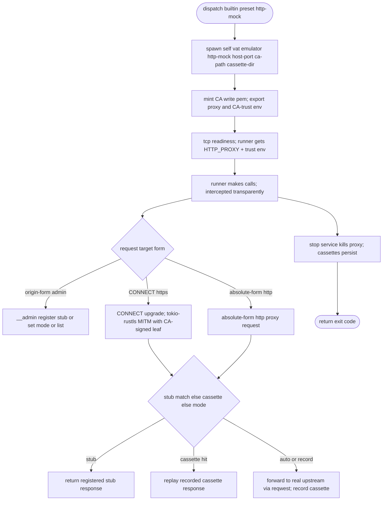

# Vat Built-in HTTP Mock + Record/Replay Proxy

## Logic
<!-- type: logic lang: mermaid -->

```mermaid
---
id: vat-built-in-http-mock-record-replay-proxy-logic
entry: start
nodes:
  start: { kind: start, label: "dispatch builtin preset http-mock" }
  spawn: { kind: process, label: "spawn self vat emulator http-mock host-port ca-path cassette-dir" }
  ca: { kind: process, label: "mint CA write pem; export proxy and CA-trust env" }
  ready: { kind: process, label: "tcp readiness; runner gets HTTP_PROXY + trust env" }
  accept: { kind: decision, label: "request target form" }
  admin: { kind: process, label: "/__admin/* register stub or set mode or list" }
  connect: { kind: process, label: "CONNECT upgrade; tokio-rustls MITM with CA-signed leaf" }
  forward: { kind: process, label: "absolute-form http proxy request" }
  core: { kind: decision, label: "stub match else cassette else mode" }
  stub: { kind: process, label: "return registered stub response" }
  replay: { kind: process, label: "replay recorded cassette response" }
  record: { kind: process, label: "forward to real upstream via reqwest; record cassette" }
  runner: { kind: process, label: "runner makes calls; intercepted transparently" }
  teardown: { kind: process, label: "stop service kills proxy; cassettes persist" }
  done: { kind: terminal, label: "return exit code" }
edges:
  - { from: start, to: spawn }
  - { from: spawn, to: ca }
  - { from: ca, to: ready }
  - { from: ready, to: runner }
  - { from: runner, to: accept }
  - { from: accept, to: admin, label: "origin-form admin" }
  - { from: accept, to: connect, label: "CONNECT https" }
  - { from: accept, to: forward, label: "absolute-form http" }
  - { from: connect, to: core }
  - { from: forward, to: core }
  - { from: core, to: stub, label: "stub" }
  - { from: core, to: replay, label: "cassette hit" }
  - { from: core, to: record, label: "auto or record" }
  - { from: runner, to: teardown }
  - { from: teardown, to: done }
---
flowchart TD
    start([dispatch builtin preset http-mock]) --> spawn[spawn self vat emulator http-mock host-port ca-path cassette-dir]
    spawn --> ca[mint CA write pem; export proxy and CA-trust env]
    ca --> ready[tcp readiness; runner gets HTTP_PROXY + trust env]
    ready --> runner[runner makes calls; intercepted transparently]
    runner --> accept{request target form}
    accept -- origin-form admin --> admin[__admin register stub or set mode or list]
    accept -- CONNECT https --> connect[CONNECT upgrade; tokio-rustls MITM with CA-signed leaf]
    accept -- absolute-form http --> forward[absolute-form http proxy request]
    connect --> core{stub match else cassette else mode}
    forward --> core
    core -- stub --> stub[return registered stub response]
    core -- cassette hit --> replay[replay recorded cassette response]
    core -- auto or record --> record[forward to real upstream via reqwest; record cassette]
    runner --> teardown[stop service kills proxy; cassettes persist]
    teardown --> done([return exit code])
```
