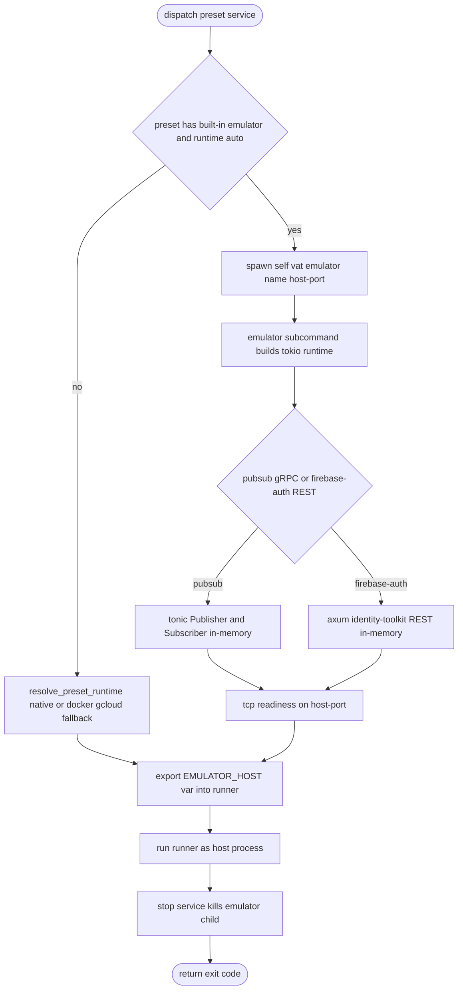

# Vat Built-in Rust Emulators (Pub/Sub + Firebase Auth)

## Logic
<!-- type: logic lang: mermaid -->

```mermaid
---
id: vat-built-in-rust-emulators-pub-sub-firebase-auth-logic
entry: start
nodes:
  start: { kind: start, label: "dispatch preset service" }
  builtin_q: { kind: decision, label: "preset has built-in emulator and runtime auto" }
  resolve_legacy: { kind: process, label: "resolve_preset_runtime native or docker (gcloud fallback)" }
  spawn: { kind: process, label: "spawn self vat emulator name host-port" }
  rt: { kind: process, label: "emulator subcommand builds tokio runtime" }
  kind_q: { kind: decision, label: "pubsub gRPC or firebase-auth REST" }
  pubsub_srv: { kind: process, label: "tonic Publisher and Subscriber in-memory" }
  auth_srv: { kind: process, label: "axum identity-toolkit REST in-memory" }
  ready: { kind: process, label: "tcp readiness on host-port" }
  export: { kind: process, label: "export EMULATOR_HOST var into runner" }
  runner: { kind: process, label: "run runner as host process" }
  teardown: { kind: process, label: "stop service kills emulator child" }
  done: { kind: terminal, label: "return exit code" }
edges:
  - { from: start, to: builtin_q }
  - { from: builtin_q, to: spawn, label: "yes" }
  - { from: builtin_q, to: resolve_legacy, label: "no" }
  - { from: resolve_legacy, to: export }
  - { from: spawn, to: rt }
  - { from: rt, to: kind_q }
  - { from: kind_q, to: pubsub_srv, label: "pubsub" }
  - { from: kind_q, to: auth_srv, label: "firebase-auth" }
  - { from: pubsub_srv, to: ready }
  - { from: auth_srv, to: ready }
  - { from: ready, to: export }
  - { from: export, to: runner }
  - { from: runner, to: teardown }
  - { from: teardown, to: done }
---
flowchart TD
    start([dispatch preset service]) --> builtin_q{preset has built-in emulator and runtime auto}
    builtin_q -- yes --> spawn[spawn self vat emulator name host-port]
    builtin_q -- no --> resolve_legacy[resolve_preset_runtime native or docker gcloud fallback]
    resolve_legacy --> export[export EMULATOR_HOST var into runner]
    spawn --> rt[emulator subcommand builds tokio runtime]
    rt --> kind_q{pubsub gRPC or firebase-auth REST}
    kind_q -- pubsub --> pubsub_srv[tonic Publisher and Subscriber in-memory]
    kind_q -- firebase-auth --> auth_srv[axum identity-toolkit REST in-memory]
    pubsub_srv --> ready[tcp readiness on host-port]
    auth_srv --> ready
    ready --> export
    export --> runner[run runner as host process]
    runner --> teardown[stop service kills emulator child]
    teardown --> done([return exit code])
```
