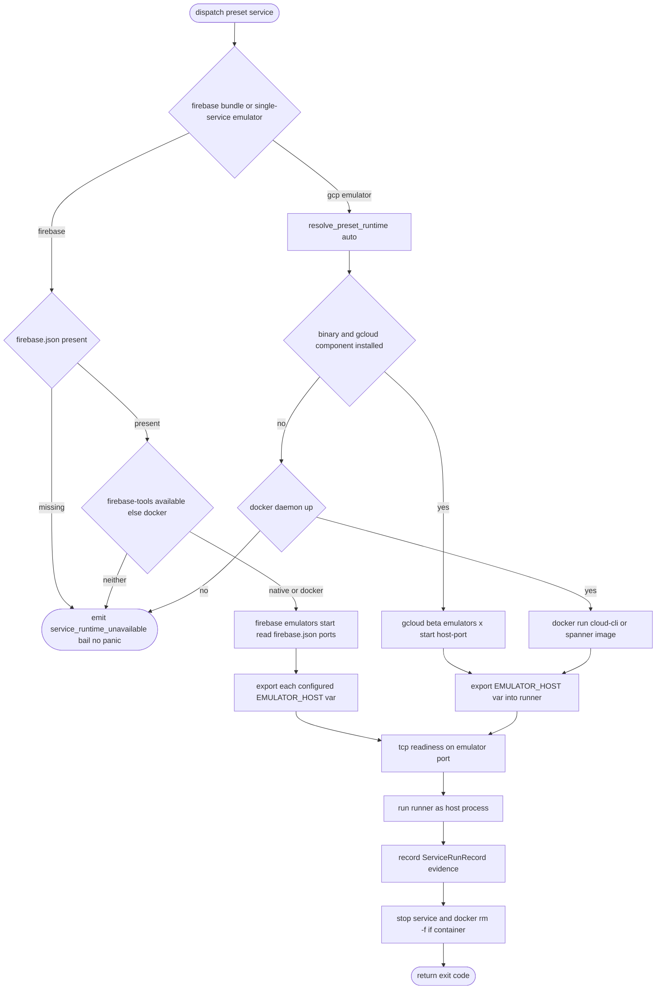

# Vat GCP and Firebase Emulator Service Presets

## Logic
<!-- type: logic lang: mermaid -->



## Schema
<!-- type: schema lang: yaml -->

```yaml
$schema: "https://json-schema.org/draft/2020-12/schema"
$id: "vat-emulator-evidence.schema.json"
title: "Vat emulator service evidence"
type: object
description: "Service-evidence additions for GCP / Firebase emulator presets."
properties:
  emulator_preset:
    type: string
    enum: [firestore, pubsub, datastore, bigtable, spanner, firebase]
  prepare_mode:
    type: string
    enum: [direct_start, docker_run, firebase_emulators]
    description: "How the emulator service was provided: native binary, docker image, or the firebase suite."
  exported_env:
    type: array
    items: { type: string }
    description: >
      Host env var names exported to the runner, e.g. FIRESTORE_EMULATOR_HOST,
      PUBSUB_EMULATOR_HOST, DATASTORE_EMULATOR_HOST, BIGTABLE_EMULATOR_HOST,
      SPANNER_EMULATOR_HOST, and for the firebase bundle additionally
      FIREBASE_AUTH_EMULATOR_HOST, FIREBASE_DATABASE_EMULATOR_HOST,
      FIREBASE_STORAGE_EMULATOR_HOST.
additionalProperties: true
```

## Config
<!-- type: config lang: yaml -->

```yaml
$schema: "https://json-schema.org/draft/2020-12/schema"
$id: "vat-config-emulator.schema.json"
title: "vat.toml (emulator preset additions)"
type: object
properties:
  services:
    type: array
    items:
      type: object
      required: [id]
      properties:
        preset:
          type: string
          enum: [postgres, redis, nats, rabbitmq, mysql, mongo, firestore, pubsub, datastore, bigtable, spanner, firebase]
          description: >
            firestore/pubsub/datastore/bigtable/spanner are GCP emulators (native
            gcloud + Java + the gcloud component, with a docker-image fallback);
            firebase is a bundle that requires a firebase.json in the workspace and
            runs the Firebase Emulator Suite.
        runtime:
          type: string
          enum: [auto, native, docker]
          default: auto
          description: "auto prefers the native emulator and falls back to the docker image when the native binary or gcloud component is missing."
        export:
          type: object
          additionalProperties: { type: string }
          description: "Override the default *_EMULATOR_HOST export target name(s)."
      additionalProperties: true
additionalProperties: true
```
