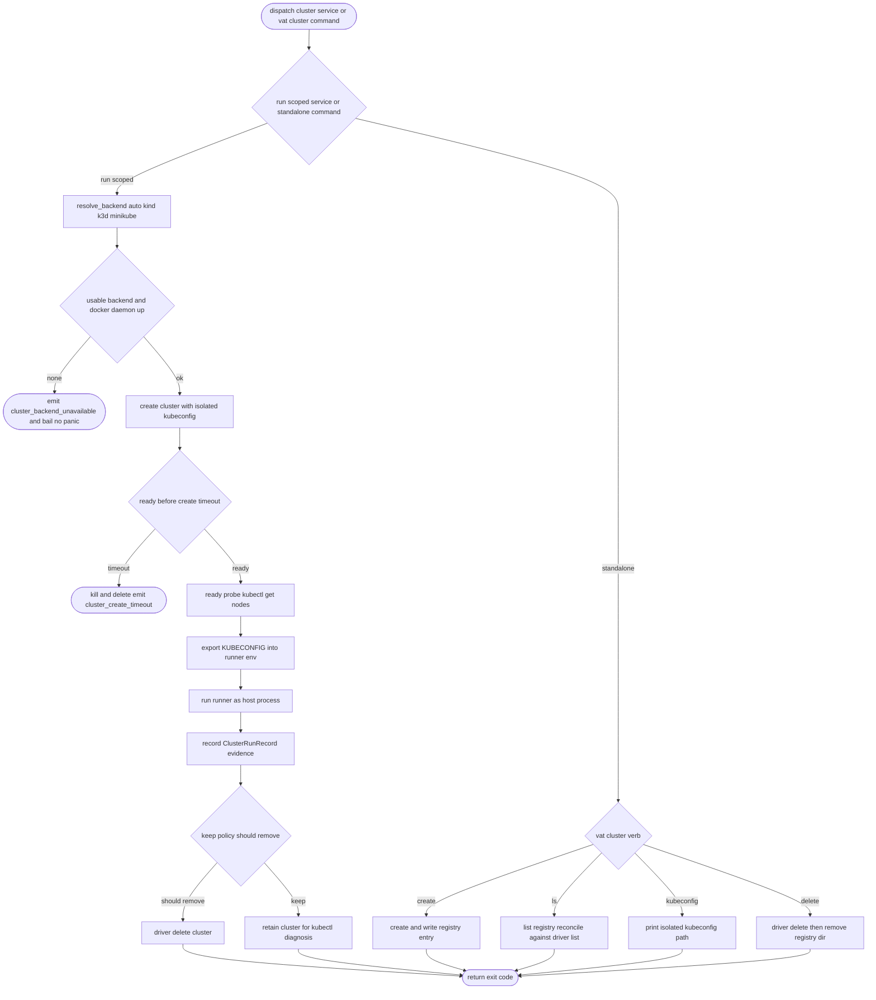

# Vat Kind-Like Local Kubernetes Clusters

## Logic
<!-- type: logic lang: mermaid -->


## Schema
<!-- type: schema lang: yaml -->

```yaml
$schema: "https://json-schema.org/draft/2020-12/schema"
$id: "vat-cluster-evidence.schema.json"
title: "Vat cluster evidence"
type: object
description: "Cluster additions to vat run evidence and the standalone cluster registry."
properties:
  service_cluster:
    description: "ClusterRunRecord attached to a service evidence item when the service is a local Kubernetes cluster. Null for non-cluster services."
    type: [object, "null"]
    required: [backend, name, kubeconfig, node_count]
    properties:
      backend: { type: string, enum: [kind, k3d, minikube] }
      name: { type: string }
      kubeconfig: { type: string }
      node_count: { type: integer }
      ready_ms: { type: [integer, "null"] }
    additionalProperties: false
  cluster_registry_record:
    description: "Standalone cluster registry entry under .vat/clusters/<name>/cluster.json."
    type: object
    required: [backend, name, kubeconfig, node_count, created_at]
    properties:
      backend: { type: string, enum: [kind, k3d, minikube] }
      name: { type: string }
      kubeconfig: { type: string }
      node_count: { type: integer }
      created_at: { type: string }
    additionalProperties: false
additionalProperties: false
```
## Config
<!-- type: config lang: yaml -->

```yaml
$schema: "https://json-schema.org/draft/2020-12/schema"
$id: "vat-config-cluster.schema.json"
title: "vat.toml (cluster service additions)"
type: object
required: [version, runners]
properties:
  version:
    type: integer
    const: 1
  services:
    type: array
    items:
      type: object
      required: [id]
      description: >
        A run-scoped dependency service backed by exactly one of: cmd (an
        explicit native command), preset (a built-in service whose runtime
        decides native-binary vs official Docker image), image (a Docker-only
        service), or cluster (an ephemeral local Kubernetes cluster). The runner
        that requires the service is always a host process — only the service
        may be a container or cluster — so the host GPU story is unaffected.
      properties:
        id: { type: string }
        requires:
          type: array
          items: { type: string }
        cmd:
          type: array
          items: { type: string }
          minItems: 1
        preset: { type: string, enum: [postgres, redis, nats, rabbitmq, mysql, mongo] }
        image: { type: string }
        container_port: { type: integer }
        image_env:
          type: object
          additionalProperties: { type: string }
        runtime: { type: string, enum: [auto, native, docker], default: auto }
        cluster:
          type: string
          enum: [auto, kind, k3d, minikube]
          description: >
            Declares this service as an ephemeral local Kubernetes cluster.
            Mutually exclusive with cmd/preset/image. auto resolves to the first
            installed of kind -> k3d -> minikube whose Docker daemon is reachable.
        k8s_version:
          type: string
          description: "Optional Kubernetes version for the cluster node image, e.g. 1.30."
        nodes:
          type: integer
          minimum: 1
          maximum: 9
          description: "Cluster node count. Defaults to a single node."
        version: { type: string }
        port:
          oneOf:
            - { type: string, const: auto }
            - { type: integer }
        seed:
          type: array
          items: { type: string }
        export:
          type: object
          additionalProperties: { type: string }
          description: >
            For a cluster service the token {kubeconfig} resolves to the isolated
            kubeconfig path; KUBECONFIG and VAT_SERVICE_<ID>_KUBECONFIG are always
            exported to the runner regardless of explicit export entries.
        ready_http: { type: string }
        timeout_s: { type: integer, default: 60 }
      additionalProperties: false
  runners:
    type: array
    items:
      type: object
      required: [id, cmd]
      properties:
        id: { type: string }
        requires:
          type: array
          items: { type: string }
        cmd:
          type: array
          items: { type: string }
          minItems: 1
        timeout_s: { type: integer }
        artifacts:
          type: array
          items: { type: string }
      additionalProperties: false
additionalProperties: false
```
## CLI
<!-- type: cli lang: yaml -->

```yaml
commands:
  - name: vat cluster create
    usage: "vat cluster create [--name <name>] [--backend auto|kind|k3d|minikube] [--k8s-version <v>] [--nodes <n>] [--json]"
    behavior:
      - "Resolves the backend (auto prefers the first installed of kind, k3d, minikube whose Docker daemon is reachable)."
      - "Creates a standalone cluster with an isolated kubeconfig under <repo>/.vat/clusters/<name>/."
      - "Auto-generates a unique name when --name is omitted; rejects a name that collides with the registry or the backend."
      - "Fails with a structured cluster_backend_unavailable error and a non-zero exit when no backend is usable."
  - name: vat cluster ls
    usage: "vat cluster ls [--json]"
    behavior:
      - "Lists vat-managed clusters from the registry."
      - "Reconciles against the backend cluster list and marks entries missing from the backend as stale."
  - name: vat cluster kubeconfig
    usage: "vat cluster kubeconfig <name> [--json]"
    behavior:
      - "Prints the isolated kubeconfig path for the named cluster (or its contents in --json form)."
  - name: vat cluster delete
    usage: "vat cluster delete <name> [--json]"
    behavior:
      - "Deletes the cluster via its backend driver, then removes the registry directory."
```
## Unit Test
<!-- type: unit-test lang: mermaid -->

```mermaid
---
id: vat-kind-like-local-kubernetes-clusters-unit-tests
---
requirementDiagram
    requirement cluster_service_exclusivity {
      id: UT1
      text: "A cluster service is mutually exclusive with cmd/preset/image; validation rejects any combination and rejects an empty backing."
      risk: high
      verifymethod: test
    }
    requirement cluster_backend_enum {
      id: UT2
      text: "ClusterBackend round-trips auto/kind/k3d/minikube via serde with the k3d/minikube tokens preserved."
      risk: medium
      verifymethod: test
    }
    requirement cluster_knob_rejection {
      id: UT3
      text: "A cluster service rejects container_port/image_env/seed and rejects nodes outside 1..9."
      risk: medium
      verifymethod: test
    }
    requirement cluster_name_sanitized {
      id: UT4
      text: "The run-scoped cluster name builder produces a collision-resistant, backend-safe name from vat id and service id."
      risk: medium
      verifymethod: test
    }
    requirement backend_unavailable_no_panic {
      id: UT5
      text: "resolve_backend with no cluster backend on PATH returns a structured cluster_backend_unavailable error and never panics."
      risk: high
      verifymethod: test
    }
    test config_cluster_validation_tests {
      type: functional
      verifies: cluster_service_exclusivity
    }
    test config_cluster_knob_tests {
      type: functional
      verifies: cluster_knob_rejection
    }
    test cluster_backend_serde_tests {
      type: functional
      verifies: cluster_backend_enum
    }
    test cluster_name_tests {
      type: functional
      verifies: cluster_name_sanitized
    }
    test resolve_backend_unavailable_tests {
      type: functional
      verifies: backend_unavailable_no_panic
    }
```
## E2E Test
<!-- type: e2e-test lang: yaml -->

```yaml
e2e_tests:
  - id: vat-cluster-backend-unavailable-smoke
    name: "cluster service reports structured backend-unavailable error"
    capability_id: agent-native-gpu-native-dev-containers
    claim_id: local-kubernetes-cluster-service-and-vat-cluster
    contract_id: local-agent-test-runner-protocol
    category: behavior
    command: "cargo test -p vat --test vat_cluster -- --nocapture"
    assertions:
      - "a cluster service with no backend on PATH emits a cluster_backend_unavailable JSONL error and a non-zero exit."
      - "vat never panics on the unavailable path."
  - id: vat-cluster-runscoped-smoke
    name: "run-scoped cluster service exports KUBECONFIG and tears down"
    capability_id: agent-native-gpu-native-dev-containers
    claim_id: local-kubernetes-cluster-service-and-vat-cluster
    contract_id: local-agent-test-runner-protocol
    category: behavior
    command: "cargo test -p vat --test vat_cluster -- --nocapture --include-ignored"
    assertions:
      - "with a real backend and Docker available, vat creates the cluster, the runner reaches the cluster via KUBECONFIG, and vat state shows services[].cluster.backend."
      - "the cluster is deleted at teardown under keep=never; the test skips gracefully when no backend/docker is present."
  - id: vat-cluster-standalone-smoke
    name: "standalone vat cluster lifecycle"
    capability_id: agent-native-gpu-native-dev-containers
    claim_id: local-kubernetes-cluster-service-and-vat-cluster
    contract_id: local-agent-test-runner-protocol
    category: behavior
    command: "cargo test -p vat --test vat_cluster -- --nocapture --include-ignored"
    assertions:
      - "vat cluster create then ls --json lists the cluster, kubeconfig prints a usable path, and delete removes it from the registry and the backend."
      - "the test skips gracefully when no backend/docker is present."
```
## Changes
<!-- type: changes lang: yaml -->

```yaml
changes:
  - path: projects/vat/tech-design/logic/kind-like-local-kubernetes-clusters.md
    action: create
    section: changes
    impl_mode: hand-written
    reason: "Define the kind-like local Kubernetes clusters TD."
  - path: projects/vat/tech-design/logic/kind-like-local-kubernetes-clusters.md
    action: validate
    section: logic
    impl_mode: hand-written
    reason: "Record the run-scoped and standalone cluster lifecycle logic."
  - path: projects/vat/tech-design/logic/kind-like-local-kubernetes-clusters.md
    action: validate
    section: schema
    impl_mode: hand-written
    reason: "Record the ClusterRunRecord evidence and standalone registry record."
  - path: projects/vat/tech-design/logic/kind-like-local-kubernetes-clusters.md
    action: validate
    section: config
    impl_mode: hand-written
    reason: "Record the cluster/k8s_version/nodes vat.toml service additions."
  - path: projects/vat/tech-design/logic/kind-like-local-kubernetes-clusters.md
    action: validate
    section: cli
    impl_mode: hand-written
    reason: "Record the vat cluster create/ls/delete/kubeconfig commands."
  - path: projects/vat/tech-design/logic/kind-like-local-kubernetes-clusters.md
    action: validate
    section: unit-test
    impl_mode: hand-written
    reason: "Record cluster config validation, backend resolution, and naming unit coverage."
  - path: projects/vat/tech-design/logic/kind-like-local-kubernetes-clusters.md
    action: validate
    section: e2e-test
    impl_mode: hand-written
    reason: "Record cluster unavailable, run-scoped, and standalone smoke coverage."
  - path: projects/vat/src/config.rs
    action: modify
    section: config
    impl_mode: hand-written
    refs:
      - "projects/vat/tech-design/logic/kind-like-local-kubernetes-clusters.md#config"
      - "projects/vat/tech-design/logic/kind-like-local-kubernetes-clusters.md#schema"
    summary: "Add ClusterBackend enum, the cluster/k8s_version/nodes ServiceConfig fields, and validate_cluster_service with four-way backing exclusivity."
  - path: projects/vat/src/cluster.rs
    action: add
    section: logic
    impl_mode: hand-written
    refs:
      - "projects/vat/tech-design/logic/kind-like-local-kubernetes-clusters.md#logic"
    summary: "Backend abstraction: resolve_backend auto selection plus kind/k3d/minikube drivers (create with isolated kubeconfig, ready probe, delete, list)."
  - path: projects/vat/src/commands/run.rs
    action: modify
    section: logic
    impl_mode: hand-written
    refs:
      - "projects/vat/tech-design/logic/kind-like-local-kubernetes-clusters.md#logic"
    summary: "prepare_cluster_service in the prepare phase, kubectl readiness, KUBECONFIG export, and keep-policy-aware cluster teardown in stop_services."
  - path: projects/vat/src/commands/cluster.rs
    action: add
    section: cli
    impl_mode: hand-written
    refs:
      - "projects/vat/tech-design/logic/kind-like-local-kubernetes-clusters.md#cli"
    summary: "Standalone vat cluster create/ls/delete/kubeconfig backed by the .vat/clusters registry."
  - path: projects/vat/src/cli.rs
    action: modify
    section: cli
    impl_mode: hand-written
    refs:
      - "projects/vat/tech-design/logic/kind-like-local-kubernetes-clusters.md#cli"
    summary: "Add the Cmd::Cluster subcommand and ClusterCmd tree and dispatch to commands::cluster."
  - path: projects/vat/src/commands/mod.rs
    action: modify
    section: cli
    impl_mode: hand-written
    refs:
      - "projects/vat/tech-design/logic/kind-like-local-kubernetes-clusters.md#cli"
    summary: "Register the new cluster command module."
  - path: projects/vat/src/state.rs
    action: modify
    section: schema
    impl_mode: hand-written
    refs:
      - "projects/vat/tech-design/logic/kind-like-local-kubernetes-clusters.md#schema"
    summary: "Add ClusterRunRecord and the optional cluster field on ServiceRunRecord surfaced via vat state."
  - path: projects/vat/src/paths.rs
    action: modify
    section: cli
    impl_mode: hand-written
    refs:
      - "projects/vat/tech-design/logic/kind-like-local-kubernetes-clusters.md#cli"
    summary: "Add clusters_dir/cluster_dir for the standalone cluster registry under .vat/clusters."
  - path: projects/vat/src/lib.rs
    action: modify
    section: logic
    impl_mode: hand-written
    refs:
      - "projects/vat/tech-design/logic/kind-like-local-kubernetes-clusters.md#logic"
    summary: "Expose the new cluster module."
  - path: projects/vat/src/commands/llm.rs
    action: modify
    section: cli
    impl_mode: hand-written
    refs:
      - "projects/vat/tech-design/logic/kind-like-local-kubernetes-clusters.md#cli"
    summary: "Document cluster service syntax, KUBECONFIG export, and vat cluster commands in the agent usage guide."
  - path: projects/vat/README.md
    action: modify
    section: cli
    impl_mode: hand-written
    refs:
      - "projects/vat/tech-design/logic/kind-like-local-kubernetes-clusters.md#cli"
    summary: "Document the cluster service and vat cluster commands."
  - path: projects/vat/tests
    action: modify
    section: unit-test
    impl_mode: hand-written
    refs:
      - "projects/vat/tech-design/logic/kind-like-local-kubernetes-clusters.md#unit-test"
    summary: "Add cluster config validation, backend serde, naming, and resolve-unavailable unit coverage."
  - path: projects/vat/tests
    action: modify
    section: e2e-test
    impl_mode: hand-written
    refs:
      - "projects/vat/tech-design/logic/kind-like-local-kubernetes-clusters.md#e2e-test"
    summary: "Add cluster unavailable, run-scoped KUBECONFIG, and standalone lifecycle smoke coverage (gated on a real backend)."
```

# Reviews

### Review 1
**Verdict:** approved

- [logic] Contract logic is complete and codegen-ready: a single Mermaid Plus flow binds run-scoped and standalone paths, with explicit error terminals (cluster_backend_unavailable, cluster_create_timeout) and a keep-policy teardown branch.
- [schema] ClusterRunRecord and the standalone registry record are fully specified with bounded enums and additionalProperties false, matching how state surfaces through ServiceRunRecord and vat state.
- [config] The cluster/k8s_version/nodes service additions are a clean fourth backing; exclusivity, the 1..9 nodes bound, and the {kubeconfig}/KUBECONFIG export contract are unambiguous.
- [cli] vat cluster create/ls/delete/kubeconfig forms and flags are concrete and consistent with the registry and backend-resolution design.
- [unit-test] UT1..UT5 give deterministic, Docker-free coverage of exclusivity, serde, knob rejection, naming, and no-panic resolution.
- [e2e-test] The smoke set pairs an always-run unavailable assertion with gated run-scoped and standalone lifecycles that skip without a backend; commands and assertions are runnable.
- [changes] The bounded change list maps every source file (config.rs, cluster.rs, run.rs, commands/cluster.rs, cli.rs, commands/mod.rs, state.rs, paths.rs, lib.rs, llm.rs, README, tests) to its driving section, with no unrelated scope.
