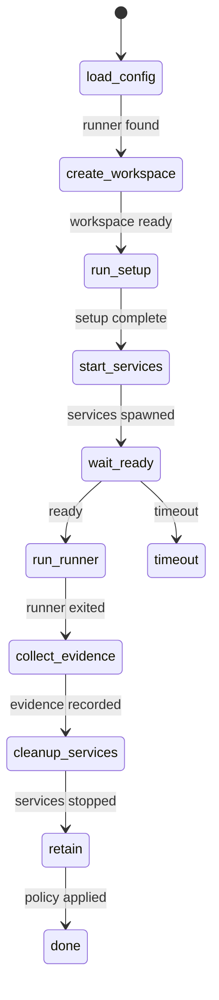
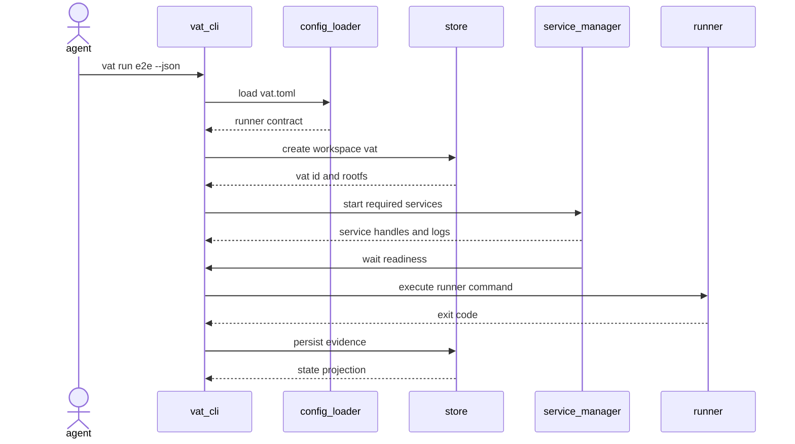
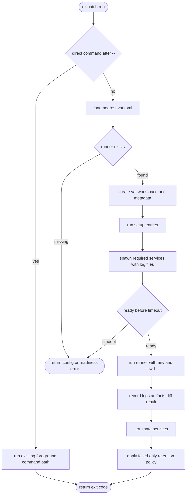
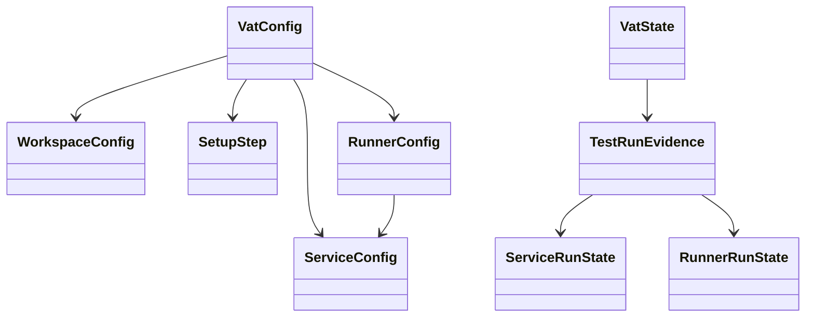
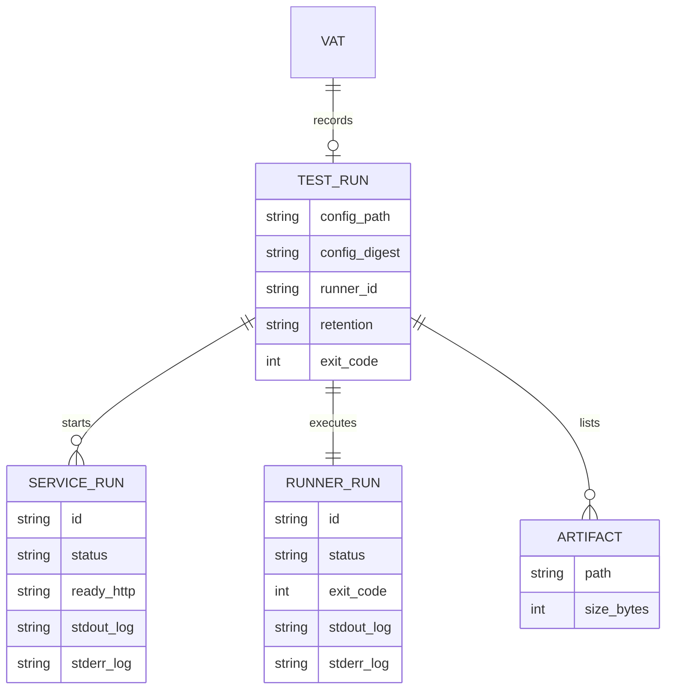
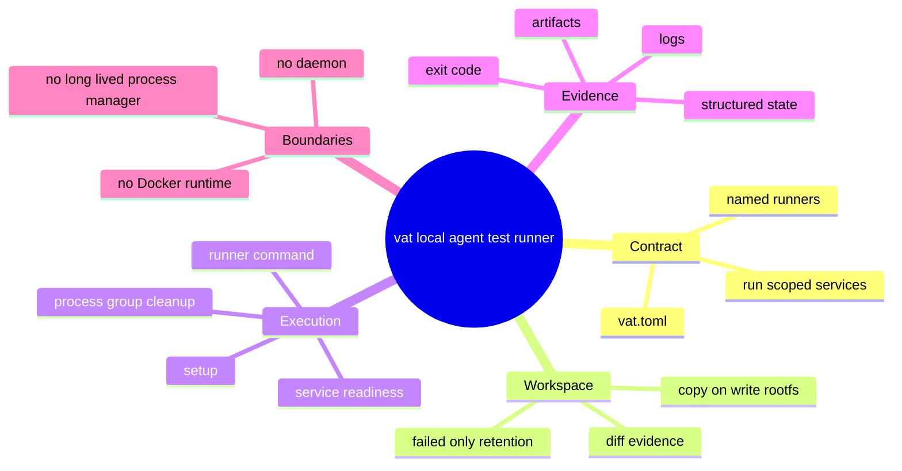

# Vat Local Agent Test Runner Protocol

## Scenarios
<!-- type: scenarios lang: yaml -->

```yaml
id: vat-local-agent-test-runner-protocol-scenarios
scenarios:
  - id: config_runner_success_cleans_up
    given:
      - "a project contains vat.toml with one runner that requires one local service"
      - "the service reaches its configured HTTP readiness endpoint"
    when:
      - "an agent runs `vat run e2e --json`"
    then:
      - "vat creates a copy-on-write workspace for the run"
      - "vat starts the required service only for the duration of the run"
      - "vat executes the selected runner command"
      - "vat emits structured JSON with runner, service, log, artifact, diff, and cleanup metadata"
      - "successful runs use the default failed-only retention policy and remove retained workspace state after emitting the result"
  - id: failed_runner_keeps_evidence
    given:
      - "a vat.toml runner exits non-zero"
    when:
      - "the agent runs the named runner"
    then:
      - "vat forwards the runner exit code"
      - "vat keeps the vat directory, logs, artifact list, and diff evidence"
      - "`vat state <id>`, `vat logs <id> runner`, and `vat diff <id>` remain useful for diagnosis"
  - id: service_readiness_timeout_terminates_run
    given:
      - "a runner requires a service with ready_http"
      - "the service never becomes ready before timeout_s"
    when:
      - "vat waits for service readiness"
    then:
      - "the run fails with a readiness timeout"
      - "vat terminates all service process groups"
      - "failure evidence is retained according to the failed-only policy"
  - id: direct_command_mode_stays_compatible
    given:
      - "an existing caller uses `vat run -- <cmd>`"
    when:
      - "the caller runs a direct command"
    then:
      - "vat does not require vat.toml"
      - "vat preserves current foreground stdio behavior"
      - "vat forwards the child command exit code"
```

## State Machine
<!-- type: state-machine lang: mermaid -->



## Interaction
<!-- type: interaction lang: mermaid -->



## Logic
<!-- type: logic lang: mermaid -->



## Dependency
<!-- type: dependency lang: mermaid -->



## Data Model
<!-- type: db-model lang: mermaid -->



## Schema
<!-- type: schema lang: yaml -->

```yaml
$schema: "https://json-schema.org/draft/2020-12/schema"
$id: "vat-test-run-evidence.schema.json"
title: "Vat test run evidence"
type: object
required: [config_path, runner_id, retention, services, runner, artifacts]
properties:
  config_path:
    type: string
  config_digest:
    type: string
  runner_id:
    type: string
  retention:
    type: string
    enum: [failed, always, never]
  services:
    type: array
    items:
      type: object
      required: [id, status, stdout_log, stderr_log]
      properties:
        id: { type: string }
        status: { type: string, enum: [created, running, ready, exited, failed, timeout] }
        exit_code: { type: [integer, "null"] }
        ready_http: { type: [string, "null"] }
        stdout_log: { type: string }
        stderr_log: { type: string }
      additionalProperties: false
  runner:
    type: object
    required: [id, status, command, stdout_log, stderr_log]
    properties:
      id: { type: string }
      status: { type: string, enum: [created, running, exited, failed] }
      command:
        type: array
        items: { type: string }
      exit_code: { type: [integer, "null"] }
      stdout_log: { type: string }
      stderr_log: { type: string }
    additionalProperties: false
  artifacts:
    type: array
    items:
      type: object
      required: [path]
      properties:
        path: { type: string }
        size_bytes: { type: [integer, "null"] }
      additionalProperties: false
additionalProperties: false
```

## REST API
<!-- type: rest-api lang: yaml -->

```yaml
openapi: 3.1.0
info:
  title: "No REST API change"
  version: "0.0.0"
paths: {}
components:
  schemas: {}
x-aw-contract:
  surface: none
  reason: "Vat remains a local CLI tool for this slice."
```

## RPC API
<!-- type: rpc-api lang: yaml -->

```yaml
openrpc: 1.3.2
info:
  title: "No JSON-RPC API change"
  version: "0.0.0"
methods: []
x-aw-contract:
  surface: none
  reason: "No RPC surface is introduced."
```

## Async API
<!-- type: async-api lang: yaml -->

```yaml
asyncapi: 2.6.0
info:
  title: "No async API change"
  version: "0.0.0"
channels: {}
x-aw-contract:
  surface: none
  reason: "No pub-sub or streaming protocol is introduced."
```

## CLI
<!-- type: cli lang: yaml -->

```yaml
commands:
  - name: vat run
    forms:
      - usage: "vat run -- <command>"
        behavior:
          - "Preserves existing direct foreground command mode."
          - "Does not require vat.toml."
      - usage: "vat run <runner-id> [--json]"
        behavior:
          - "Loads vat.toml from the current directory or an ancestor."
          - "Executes the named runner with its setup and required services."
          - "Returns the runner exit code."
  - name: vat logs
    usage: "vat logs <vat-id> [service-id|runner]"
    behavior:
      - "Prints captured stdout and stderr evidence for the selected source."
      - "Defaults to all captured logs for the vat run."
```

## Wireframe
<!-- type: wireframe lang: yaml -->

```yaml
layout:
  id: vat-local-agent-test-runner-wireframe
  surfaces: []
  note: "No UI surface is added."
```

## Component
<!-- type: component lang: yaml -->

```yaml
schemaVersion: "1.0.0"
readme: "No web component contract is changed."
modules: []
```

## Design Token
<!-- type: design-token lang: yaml -->

```yaml
$schema: "https://design-tokens.github.io/community-group/format/"
tokens: {}
metadata:
  reason: "No visual design token is introduced."
```

## Config
<!-- type: config lang: yaml -->

```yaml
$schema: "https://json-schema.org/draft/2020-12/schema"
$id: "vat-config.schema.json"
title: "vat.toml"
type: object
required: [version, runners]
properties:
  version:
    type: integer
    const: 1
  name:
    type: string
  workspace:
    type: object
    properties:
      base: { type: string, default: "." }
      workdir: { type: string, default: "." }
      keep: { type: string, enum: [failed, always, never], default: failed }
    additionalProperties: false
  env:
    type: object
    additionalProperties: { type: string }
  setup:
    type: array
    items:
      type: object
      required: [id, cmd]
      properties:
        id: { type: string }
        cmd:
          type: array
          items: { type: string }
          minItems: 1
        when: { type: string }
      additionalProperties: false
  services:
    type: array
    items:
      type: object
      required: [id, cmd]
      properties:
        id: { type: string }
        cmd:
          type: array
          items: { type: string }
          minItems: 1
        ready_http: { type: string }
        timeout_s: { type: integer, default: 60 }
      additionalProperties: false
  runners:
    type: array
    items:
      type: object
      required: [id, cmd]
      properties:
        id: { type: string }
        requires:
          type: array
          items: { type: string }
        cmd:
          type: array
          items: { type: string }
          minItems: 1
        timeout_s: { type: integer }
        artifacts:
          type: array
          items: { type: string }
      additionalProperties: false
additionalProperties: false
```

## Manifest
<!-- type: manifest lang: yaml -->

```yaml
manifests:
  - path: projects/vat/Cargo.toml
    changes:
      - "Add TOML parsing dependency for vat.toml."
      - "Use libc as a normal dependency for process cleanup on Unix hosts."
```

## Runtime Image
<!-- type: runtime-image lang: yaml -->

```yaml
images: []
build_contexts: []
x-aw-contract:
  surface: none
  reason: "Vat does not add Docker, OCI, or runtime image behavior."
```

## Deployment
<!-- type: deployment lang: yaml -->

```yaml
deployments: []
operations:
  - id: local-vat-cli
    action: "build and run the local vat binary"
    verification:
      - "cargo test -p vat"
      - "aw health vat --verify-traceability --verify-cb --verify-cold --verify-tests --verify-ec"
```

## Unit Test
<!-- type: unit-test lang: mermaid -->

```mermaid
---
id: vat-local-agent-test-runner-unit-tests
---
requirementDiagram
    requirement parse_config {
      id: UT1
      text: "Vat parses valid vat.toml and rejects duplicate runner or service ids."
      risk: high
      verifymethod: test
    }
    requirement resolve_paths {
      id: UT2
      text: "Relative workspace and artifact paths resolve from the vat.toml directory."
      risk: medium
      verifymethod: test
    }
    requirement keep_direct_run {
      id: UT3
      text: "Direct command mode still forwards child exit codes."
      risk: high
      verifymethod: test
    }
    test config_parse_tests {
      type: functional
      verifies: parse_config
    }
    test direct_run_regression {
      type: functional
      verifies: keep_direct_run
    }
```

## E2E Test
<!-- type: e2e-test lang: yaml -->

```yaml
e2e_tests:
  - id: vat-toml-runner-local-service-smoke
    name: "vat.toml runner local service smoke"
    capability_id: agent-native-gpu-native-dev-containers
    contract_id: local-agent-test-runner-protocol
    category: behavior
    command: "cargo test -p vat vat_toml_runner -- --nocapture"
    assertions:
      - "vat run <runner-id> starts a local readiness service, runs the runner, captures logs, records artifacts, and returns JSON evidence."
      - "failed runner evidence remains inspectable."
      - "direct vat run -- <cmd> compatibility is preserved."
```

## Changes
<!-- type: changes lang: yaml -->

```yaml
changes:
  - path: projects/vat/tech-design/logic/local-agent-test-runner-protocol.md
    action: create
    section: changes
    impl_mode: hand-written
    reason: "Define the local agent test runner protocol TD."
  - path: projects/vat/tech-design/logic/local-agent-test-runner-protocol.md
    action: validate
    section: scenarios
    impl_mode: hand-written
    reason: "Record success, failure retention, readiness timeout, and direct-run compatibility scenarios."
  - path: projects/vat/tech-design/logic/local-agent-test-runner-protocol.md
    action: validate
    section: mindmap
    impl_mode: hand-written
    reason: "Record protocol, workspace, execution, evidence, and boundary concepts."
  - path: projects/vat/tech-design/logic/local-agent-test-runner-protocol.md
    action: validate
    section: state-machine
    impl_mode: hand-written
    reason: "Record the ephemeral runner lifecycle."
  - path: projects/vat/tech-design/logic/local-agent-test-runner-protocol.md
    action: validate
    section: interaction
    impl_mode: hand-written
    reason: "Record the agent, CLI, config, store, service, and runner interaction."
  - path: projects/vat/tech-design/logic/local-agent-test-runner-protocol.md
    action: validate
    section: dependency
    impl_mode: hand-written
    reason: "Record the config and evidence type relationships."
  - path: projects/vat/tech-design/logic/local-agent-test-runner-protocol.md
    action: validate
    section: db-model
    impl_mode: hand-written
    reason: "Record the persisted vat, test run, service run, runner run, and artifact relationships."
  - path: projects/vat/tech-design/logic/local-agent-test-runner-protocol.md
    action: validate
    section: rest-api
    impl_mode: hand-written
    reason: "Record non-applicability because this slice adds no REST API."
  - path: projects/vat/tech-design/logic/local-agent-test-runner-protocol.md
    action: validate
    section: rpc-api
    impl_mode: hand-written
    reason: "Record non-applicability because this slice adds no RPC API."
  - path: projects/vat/tech-design/logic/local-agent-test-runner-protocol.md
    action: validate
    section: async-api
    impl_mode: hand-written
    reason: "Record non-applicability because this slice adds no async API."
  - path: projects/vat/tech-design/logic/local-agent-test-runner-protocol.md
    action: validate
    section: wireframe
    impl_mode: hand-written
    reason: "Record non-applicability because this slice adds no UI surface."
  - path: projects/vat/tech-design/logic/local-agent-test-runner-protocol.md
    action: validate
    section: component
    impl_mode: hand-written
    reason: "Record non-applicability because this slice adds no component contract."
  - path: projects/vat/tech-design/logic/local-agent-test-runner-protocol.md
    action: validate
    section: design-token
    impl_mode: hand-written
    reason: "Record non-applicability because this slice adds no design tokens."
  - path: projects/vat/tech-design/logic/local-agent-test-runner-protocol.md
    action: validate
    section: runtime-image
    impl_mode: hand-written
    reason: "Record non-applicability because vat does not add Docker or OCI runtime behavior."
  - path: projects/vat/tech-design/logic/local-agent-test-runner-protocol.md
    action: validate
    section: deployment
    impl_mode: hand-written
    reason: "Record local CLI verification as the deployment impact."
  - path: projects/vat/src/config.rs
    action: add
    section: config
    impl_mode: hand-written
    refs:
      - "projects/vat/tech-design/logic/local-agent-test-runner-protocol.md#config"
      - "projects/vat/tech-design/logic/local-agent-test-runner-protocol.md#schema"
    summary: "Load, validate, and resolve vat.toml runner contracts."
  - path: projects/vat/src/commands/run.rs
    action: modify
    section: logic
    impl_mode: hand-written
    refs:
      - "projects/vat/tech-design/logic/local-agent-test-runner-protocol.md#logic"
      - "projects/vat/tech-design/logic/local-agent-test-runner-protocol.md#cli"
    summary: "Dispatch vat run <runner-id> through setup, services, readiness, runner execution, evidence, and cleanup."
  - path: projects/vat/src/state.rs
    action: modify
    section: schema
    impl_mode: hand-written
    refs:
      - "projects/vat/tech-design/logic/local-agent-test-runner-protocol.md#schema"
    summary: "Persist and project runner evidence metadata."
  - path: projects/vat/src/commands/logs.rs
    action: add
    section: cli
    impl_mode: hand-written
    refs:
      - "projects/vat/tech-design/logic/local-agent-test-runner-protocol.md#cli"
    summary: "Expose captured per-run logs."
  - path: projects/vat/README.md
    action: modify
    section: scenarios
    impl_mode: hand-written
    refs:
      - "projects/vat/tech-design/logic/local-agent-test-runner-protocol.md#scenarios"
    summary: "Document vat as an ephemeral local agent test runner protocol."
  - path: projects/vat/tests
    action: modify
    section: unit-test
    impl_mode: hand-written
    refs:
      - "projects/vat/tech-design/logic/local-agent-test-runner-protocol.md#unit-test"
      - "projects/vat/tech-design/logic/local-agent-test-runner-protocol.md#e2e-test"
    summary: "Add parser and runner smoke coverage."
  - path: projects/vat/tests
    action: modify
    section: e2e-test
    impl_mode: hand-written
    refs:
      - "projects/vat/tech-design/logic/local-agent-test-runner-protocol.md#e2e-test"
    summary: "Add vat.toml local service runner smoke coverage."
  - path: projects/vat/Cargo.toml
    action: modify
    section: manifest
    impl_mode: hand-written
    refs:
      - "projects/vat/tech-design/logic/local-agent-test-runner-protocol.md#manifest"
    summary: "Add TOML parsing and process cleanup dependencies."
```

## Mindmap
<!-- type: mindmap lang: mermaid -->



# Reviews

### Review 1
**Verdict:** approved

- [scenarios] The TD captures the intended ephemeral agent test runner lifecycle, including success cleanup, failed evidence retention, service readiness timeout, and direct-run compatibility.
- [config] The `vat.toml` schema is intentionally small and project-local, with `workspace`, `env`, `setup`, `services`, and `runners` only.
- [logic] The orchestration flow keeps services run-scoped and explicitly avoids daemon or long-lived process management.
- [changes] The implementation scope is bounded to vat config loading, run orchestration, state evidence, logs, README, manifest, and tests.
