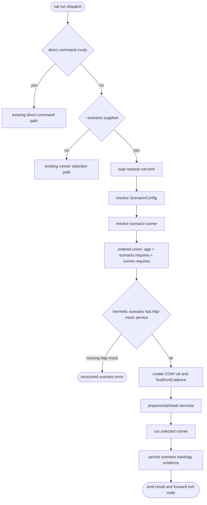

# Vat Production-Like Integration Scenarios

## Logic
<!-- type: logic lang: mermaid -->


## Config
<!-- type: config lang: yaml -->

```yaml
vat_toml:
  version: 1
  additions:
    - table: "[[scenarios]]"
      required_fields:
        id: "unique scenario id"
        app: "service id of the app under test"
        runner: "runner id to execute"
      optional_fields:
        requires: "Vec<String>, default []"
        network: "open | hermetic, default open"
      semantics:
        - "scenario.app is included in the required service set."
        - "scenario.requires is additional dependency services."
        - "runner.requires remains honored and is deduped into the same service set."
        - "network=hermetic requires a participating http-mock service."
validation:
  - "scenario id must not be empty and must be unique"
  - "scenario.app must reference an existing service"
  - "scenario.requires entries must reference existing services"
  - "scenario.runner must reference an existing runner"
  - "scenario.network must deserialize from open or hermetic"
backward_compatibility:
  - "VatConfig.scenarios defaults to empty."
  - "Existing vat.toml runner selection remains unchanged when --scenario is absent."
  - "No existing service or runner fields are renamed or removed."
example:
  toml: |
    [[scenarios]]
    id = "prod-like"
    app = "api"
    requires = ["pg", "auth", "tasks", "http"]
    runner = "e2e"
    network = "hermetic"
```
## Schema
<!-- type: schema lang: yaml -->

```yaml
rust_types:
  ScenarioConfig:
    derives: ["Debug", "Clone", "Serialize", "Deserialize"]
    location: "projects/vat/src/config.rs"
    fields:
      id: String
      app: String
      requires: "Vec<String> with serde default/skip empty"
      runner: String
      network: "ScenarioNetworkMode with serde default"
  ScenarioNetworkMode:
    derives: ["Debug", "Clone", "Copy", "Default", "PartialEq", "Eq", "Serialize", "Deserialize"]
    serde: "rename_all = kebab-case"
    variants:
      Open: "default"
      Hermetic: "requires http-mock proxy participation"
  ScenarioRunRecord:
    derives: ["Debug", "Clone", "Serialize", "Deserialize"]
    location: "projects/vat/src/state.rs"
    fields:
      id: String
      app: String
      runner: String
      network: String
      services: Vec<String>
      routes: Vec<RouteRecord>
      hermetic: bool
  RouteRecord:
    derives: ["Debug", "Clone", "Serialize", "Deserialize"]
    location: "projects/vat/src/state.rs"
    fields:
      host: String
      target: String
      source: String
state_changes:
  TestRunEvidence:
    field: "scenario: Option<ScenarioRunRecord>"
    serde: "default + skip_serializing_if Option::is_none"
compatibility:
  - "Old meta.json without scenario field deserializes."
  - "Scenario evidence is absent for non-scenario runner runs."
```
## CLI
<!-- type: cli lang: yaml -->

```yaml
run_options:
  new_flag:
    name: "--scenario <id>"
    applies_to: "vat run"
    conflicts:
      - "direct command after --"
      - "positional runner ids"
    dispatch_target: "Target::Scenario { scenario_id }"
behavior:
  select_event:
    type: "select"
    fields: ["scenario", "app", "runner", "services", "reason"]
  result_event:
    type: "result"
    fields: ["id", "scenario", "app", "runner", "ok", "exit_code", "state", "inspect"]
  exit_code: "same as selected runner; negative internal setup failure maps to 255"
structured_errors:
  - code: "scenario_required"
    when: "--scenario names an unknown scenario"
  - code: "scenario_hermetic_proxy_required"
    when: "scenario network is hermetic and the service set does not include a http-mock preset"
unchanged:
  - "vat run"
  - "vat run <runner-id>"
  - "vat run <runner-id> <runner-id>"
  - "vat run -- <cmd>"
```
## E2E Test
<!-- type: e2e-test lang: yaml -->

```yaml
e2e_tests:
  - id: scenario-run-starts-app-dependency-and-runner
    name: "Scenario run starts app dependency and runner"
    capability_id: agent-native-gpu-native-dev-containers
    claim_id: production-like-integration-scenarios
    contract_id: production-like-integration-scenarios
    category: behavior
    command: "cargo test -p vat scenario_run_starts_app_dependency_and_runner -- --nocapture"
    assertions:
      - "vat run --scenario prod-like succeeds"
      - "app readiness marker exists before runner marker"
      - "vat state includes test_run.scenario id/app/runner/services"
      - "result JSONL includes scenario and app"
  - id: scenario-failure-keeps-topology-and-logs
    name: "Scenario failure keeps topology and logs"
    capability_id: agent-native-gpu-native-dev-containers
    claim_id: production-like-integration-scenarios
    contract_id: production-like-integration-scenarios
    category: behavior
    command: "cargo test -p vat scenario_failure_keeps_topology_and_logs -- --nocapture"
    assertions:
      - "failing runner forwards its exit code"
      - "keep=failed retains the vat directory"
      - "vat logs exposes runner output"
      - "vat state exposes scenario topology"
  - id: scenario-hermetic-requires-http-mock-service
    name: "Scenario hermetic requires http mock service"
    capability_id: agent-native-gpu-native-dev-containers
    claim_id: production-like-integration-scenarios
    contract_id: production-like-integration-scenarios
    category: behavior
    command: "cargo test -p vat scenario_hermetic_requires_http_mock_service -- --nocapture"
    assertions:
      - "hermetic scenario without http-mock exits non-zero"
      - "stdout JSONL contains scenario_hermetic_proxy_required"
      - "runner command is not executed"
regression_commands:
  - "cargo test -p vat vat_toml_runner -- --nocapture"
  - "cargo test -p vat --test vat_concurrent_runners -- --nocapture"
```
## Changes
<!-- type: changes lang: yaml -->

```yaml
changes:
  - area: "config"
    impl_mode: "codegen"
    files: ["projects/vat/src/config.rs"]
    summary: "Add ScenarioConfig, ScenarioNetworkMode, scenario lookup, and scenario validation."
  - area: "cli"
    impl_mode: "codegen"
    files: ["projects/vat/src/cli.rs"]
    summary: "Add --scenario to vat run and dispatch Target::Scenario."
  - area: "runner-orchestration"
    impl_mode: "codegen"
    files: ["projects/vat/src/commands/run.rs"]
    summary: "Resolve scenario service union, enforce hermetic proxy participation, run one selected runner, and persist scenario evidence."
  - area: "state"
    impl_mode: "codegen"
    files: ["projects/vat/src/state.rs"]
    summary: "Add ScenarioRunRecord and RouteRecord under TestRunEvidence."
  - area: "tests"
    impl_mode: "codegen"
    files: ["projects/vat/tests/vat_toml_runner.rs", "projects/vat/tests/vat_concurrent_runners.rs"]
    summary: "Add scenario e2e tests and preserve runner/concurrency regressions."
non_changes:
  - "No VM backend."
  - "No Dockerized runner."
  - "No new emulator preset."
  - "No breaking change to existing vat.toml files."
```
