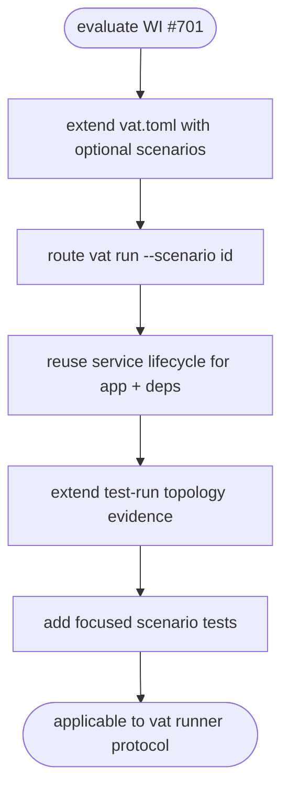

# Vat Production-Like Integration Scenarios

## Logic
<!-- type: logic lang: mermaid -->



## Config
<!-- type: config lang: yaml -->

```yaml
config_changes:
  - surface: "projects/vat/src/config.rs"
    change: "Add optional scenarios: Vec<ScenarioConfig> to VatConfig with serde default."
  - surface: "vat.toml"
    change: "Introduce compatible [[scenarios]] entries; existing files with only services/runners remain valid."
  - surface: "validation"
    change: "Validate unique scenario ids, known app service, known required services, known runner, and supported network mode."
scenario_shape:
  fields:
    id: "non-empty scenario id"
    app: "service id for the app under test"
    requires: "additional service ids for dependencies"
    runner: "runner id to execute after readiness"
    network: "open | hermetic; default open"
compatibility:
  existing_run_modes: "unchanged"
  scenario_optional: true
  service_schema_reuse: true
```

## Schema
<!-- type: schema lang: yaml -->

```yaml
new_types:
  ScenarioConfig:
    fields:
      id: String
      app: String
      requires: Vec<String>
      runner: String
      network: ScenarioNetworkMode
  ScenarioNetworkMode:
    variants:
      - open
      - hermetic
  ScenarioRunRecord:
    fields:
      id: String
      app: String
      runner: String
      network: String
      services: Vec<String>
      routes: Vec<RouteRecord>
      hermetic: bool
  RouteRecord:
    fields:
      host: String
      target: String
      source: String
state_integration:
  TestRunEvidence:
    add_optional_field: "scenario: Option<ScenarioRunRecord>"
  ServiceRunRecord:
    reuse_existing_fields: ["id", "status", "preset", "port", "exported_env", "ready_duration_ms", "stdout_log", "stderr_log"]
compatibility:
  serde_defaults: "new fields default absent for existing metadata"
```
