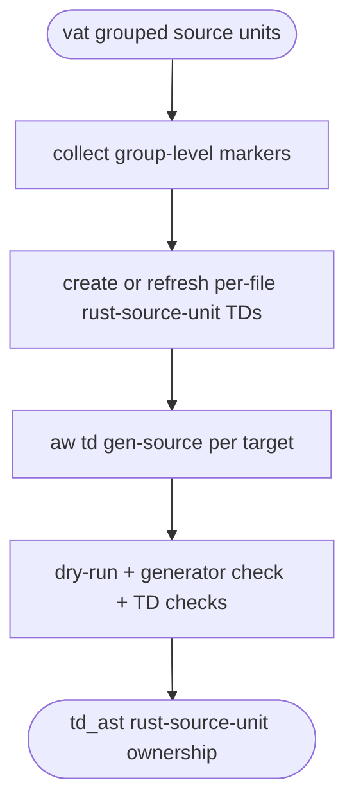

## Logic
<!-- type: logic lang: mermaid -->




## Changes
<!-- type: changes lang: yaml -->

```yaml
changes:
  - path: projects/vat/src/cli.rs
    action: modify
    section: logic
    impl_mode: hand-written
    description: "Implement the migration logic by promoting grouped vat source units to per-file rust-source-unit TDs."
  - path: projects/vat/build.rs
    action: modify
    section: rust-source-unit
    impl_mode: hand-written
    description: "Promote `projects/vat/build.rs` to per-file rust-source-unit TD ownership."
  - path: projects/vat/src/cli.rs
    action: modify
    section: rust-source-unit
    impl_mode: hand-written
    description: "Promote `projects/vat/src/cli.rs` to per-file rust-source-unit TD ownership."
  - path: projects/vat/src/cluster.rs
    action: modify
    section: rust-source-unit
    impl_mode: hand-written
    description: "Promote `projects/vat/src/cluster.rs` to per-file rust-source-unit TD ownership."
  - path: projects/vat/src/commands/cluster.rs
    action: modify
    section: rust-source-unit
    impl_mode: hand-written
    description: "Promote `projects/vat/src/commands/cluster.rs` to per-file rust-source-unit TD ownership."
  - path: projects/vat/src/commands/diff.rs
    action: modify
    section: rust-source-unit
    impl_mode: hand-written
    description: "Promote `projects/vat/src/commands/diff.rs` to per-file rust-source-unit TD ownership."
  - path: projects/vat/src/commands/emulator.rs
    action: modify
    section: rust-source-unit
    impl_mode: hand-written
    description: "Promote `projects/vat/src/commands/emulator.rs` to per-file rust-source-unit TD ownership."
  - path: projects/vat/src/commands/gpu.rs
    action: modify
    section: rust-source-unit
    impl_mode: hand-written
    description: "Promote `projects/vat/src/commands/gpu.rs` to per-file rust-source-unit TD ownership."
  - path: projects/vat/src/commands/llm.rs
    action: modify
    section: rust-source-unit
    impl_mode: hand-written
    description: "Promote `projects/vat/src/commands/llm.rs` to per-file rust-source-unit TD ownership."
  - path: projects/vat/src/commands/logs.rs
    action: modify
    section: rust-source-unit
    impl_mode: hand-written
    description: "Promote `projects/vat/src/commands/logs.rs` to per-file rust-source-unit TD ownership."
  - path: projects/vat/src/commands/ls.rs
    action: modify
    section: rust-source-unit
    impl_mode: hand-written
    description: "Promote `projects/vat/src/commands/ls.rs` to per-file rust-source-unit TD ownership."
  - path: projects/vat/src/commands/mod.rs
    action: modify
    section: rust-source-unit
    impl_mode: hand-written
    description: "Promote `projects/vat/src/commands/mod.rs` to per-file rust-source-unit TD ownership."
  - path: projects/vat/src/commands/rm.rs
    action: modify
    section: rust-source-unit
    impl_mode: hand-written
    description: "Promote `projects/vat/src/commands/rm.rs` to per-file rust-source-unit TD ownership."
  - path: projects/vat/src/commands/run.rs
    action: modify
    section: rust-source-unit
    impl_mode: hand-written
    description: "Promote `projects/vat/src/commands/run.rs` to per-file rust-source-unit TD ownership."
  - path: projects/vat/src/commands/snapshot.rs
    action: modify
    section: rust-source-unit
    impl_mode: hand-written
    description: "Promote `projects/vat/src/commands/snapshot.rs` to per-file rust-source-unit TD ownership."
  - path: projects/vat/src/commands/state.rs
    action: modify
    section: rust-source-unit
    impl_mode: hand-written
    description: "Promote `projects/vat/src/commands/state.rs` to per-file rust-source-unit TD ownership."
  - path: projects/vat/src/config.rs
    action: modify
    section: rust-source-unit
    impl_mode: hand-written
    description: "Promote `projects/vat/src/config.rs` to per-file rust-source-unit TD ownership."
  - path: projects/vat/src/emulator/auth.rs
    action: modify
    section: rust-source-unit
    impl_mode: hand-written
    description: "Promote `projects/vat/src/emulator/auth.rs` to per-file rust-source-unit TD ownership."
  - path: projects/vat/src/emulator/dispatch.rs
    action: modify
    section: rust-source-unit
    impl_mode: hand-written
    description: "Promote `projects/vat/src/emulator/dispatch.rs` to per-file rust-source-unit TD ownership."
  - path: projects/vat/src/emulator/httpmock/ca.rs
    action: modify
    section: rust-source-unit
    impl_mode: hand-written
    description: "Promote `projects/vat/src/emulator/httpmock/ca.rs` to per-file rust-source-unit TD ownership."
  - path: projects/vat/src/emulator/httpmock/cassette.rs
    action: modify
    section: rust-source-unit
    impl_mode: hand-written
    description: "Promote `projects/vat/src/emulator/httpmock/cassette.rs` to per-file rust-source-unit TD ownership."
  - path: projects/vat/src/emulator/httpmock/mod.rs
    action: modify
    section: rust-source-unit
    impl_mode: hand-written
    description: "Promote `projects/vat/src/emulator/httpmock/mod.rs` to per-file rust-source-unit TD ownership."
  - path: projects/vat/src/emulator/httpmock/stub.rs
    action: modify
    section: rust-source-unit
    impl_mode: hand-written
    description: "Promote `projects/vat/src/emulator/httpmock/stub.rs` to per-file rust-source-unit TD ownership."
  - path: projects/vat/src/emulator/mod.rs
    action: modify
    section: rust-source-unit
    impl_mode: hand-written
    description: "Promote `projects/vat/src/emulator/mod.rs` to per-file rust-source-unit TD ownership."
  - path: projects/vat/src/emulator/openapi.rs
    action: modify
    section: rust-source-unit
    impl_mode: hand-written
    description: "Promote `projects/vat/src/emulator/openapi.rs` to per-file rust-source-unit TD ownership."
  - path: projects/vat/src/emulator/pubsub.rs
    action: modify
    section: rust-source-unit
    impl_mode: hand-written
    description: "Promote `projects/vat/src/emulator/pubsub.rs` to per-file rust-source-unit TD ownership."
  - path: projects/vat/src/emulator/scheduler.rs
    action: modify
    section: rust-source-unit
    impl_mode: hand-written
    description: "Promote `projects/vat/src/emulator/scheduler.rs` to per-file rust-source-unit TD ownership."
  - path: projects/vat/src/emulator/storage.rs
    action: modify
    section: rust-source-unit
    impl_mode: hand-written
    description: "Promote `projects/vat/src/emulator/storage.rs` to per-file rust-source-unit TD ownership."
  - path: projects/vat/src/emulator/tasks.rs
    action: modify
    section: rust-source-unit
    impl_mode: hand-written
    description: "Promote `projects/vat/src/emulator/tasks.rs` to per-file rust-source-unit TD ownership."
  - path: projects/vat/src/emulator/workflows/expr.rs
    action: modify
    section: rust-source-unit
    impl_mode: hand-written
    description: "Promote `projects/vat/src/emulator/workflows/expr.rs` to per-file rust-source-unit TD ownership."
  - path: projects/vat/src/emulator/workflows/interp.rs
    action: modify
    section: rust-source-unit
    impl_mode: hand-written
    description: "Promote `projects/vat/src/emulator/workflows/interp.rs` to per-file rust-source-unit TD ownership."
  - path: projects/vat/src/emulator/workflows/mod.rs
    action: modify
    section: rust-source-unit
    impl_mode: hand-written
    description: "Promote `projects/vat/src/emulator/workflows/mod.rs` to per-file rust-source-unit TD ownership."
  - path: projects/vat/src/event.rs
    action: modify
    section: rust-source-unit
    impl_mode: hand-written
    description: "Promote `projects/vat/src/event.rs` to per-file rust-source-unit TD ownership."
  - path: projects/vat/src/gpu.rs
    action: modify
    section: rust-source-unit
    impl_mode: hand-written
    description: "Promote `projects/vat/src/gpu.rs` to per-file rust-source-unit TD ownership."
  - path: projects/vat/src/id.rs
    action: modify
    section: rust-source-unit
    impl_mode: hand-written
    description: "Promote `projects/vat/src/id.rs` to per-file rust-source-unit TD ownership."
  - path: projects/vat/src/lib.rs
    action: modify
    section: rust-source-unit
    impl_mode: hand-written
    description: "Promote `projects/vat/src/lib.rs` to per-file rust-source-unit TD ownership."
  - path: projects/vat/src/main.rs
    action: modify
    section: rust-source-unit
    impl_mode: hand-written
    description: "Promote `projects/vat/src/main.rs` to per-file rust-source-unit TD ownership."
  - path: projects/vat/src/overlay.rs
    action: modify
    section: rust-source-unit
    impl_mode: hand-written
    description: "Promote `projects/vat/src/overlay.rs` to per-file rust-source-unit TD ownership."
  - path: projects/vat/src/paths.rs
    action: modify
    section: rust-source-unit
    impl_mode: hand-written
    description: "Promote `projects/vat/src/paths.rs` to per-file rust-source-unit TD ownership."
  - path: projects/vat/src/sandbox/mod.rs
    action: modify
    section: rust-source-unit
    impl_mode: hand-written
    description: "Promote `projects/vat/src/sandbox/mod.rs` to per-file rust-source-unit TD ownership."
  - path: projects/vat/src/sandbox/process.rs
    action: modify
    section: rust-source-unit
    impl_mode: hand-written
    description: "Promote `projects/vat/src/sandbox/process.rs` to per-file rust-source-unit TD ownership."
  - path: projects/vat/src/sandbox/seatbelt.rs
    action: modify
    section: rust-source-unit
    impl_mode: hand-written
    description: "Promote `projects/vat/src/sandbox/seatbelt.rs` to per-file rust-source-unit TD ownership."
  - path: projects/vat/src/spec.rs
    action: modify
    section: rust-source-unit
    impl_mode: hand-written
    description: "Promote `projects/vat/src/spec.rs` to per-file rust-source-unit TD ownership."
  - path: projects/vat/src/state.rs
    action: modify
    section: rust-source-unit
    impl_mode: hand-written
    description: "Promote `projects/vat/src/state.rs` to per-file rust-source-unit TD ownership."
  - path: projects/vat/src/store.rs
    action: modify
    section: rust-source-unit
    impl_mode: hand-written
    description: "Promote `projects/vat/src/store.rs` to per-file rust-source-unit TD ownership."
  - path: projects/vat/tests/vat_cluster.rs
    action: modify
    section: rust-source-unit
    impl_mode: hand-written
    description: "Promote `projects/vat/tests/vat_cluster.rs` to per-file rust-source-unit TD ownership."
  - path: projects/vat/tests/vat_emulator_auth.rs
    action: modify
    section: rust-source-unit
    impl_mode: hand-written
    description: "Promote `projects/vat/tests/vat_emulator_auth.rs` to per-file rust-source-unit TD ownership."
  - path: projects/vat/tests/vat_emulator_httpmock.rs
    action: modify
    section: rust-source-unit
    impl_mode: hand-written
    description: "Promote `projects/vat/tests/vat_emulator_httpmock.rs` to per-file rust-source-unit TD ownership."
  - path: projects/vat/tests/vat_emulator_openapi.rs
    action: modify
    section: rust-source-unit
    impl_mode: hand-written
    description: "Promote `projects/vat/tests/vat_emulator_openapi.rs` to per-file rust-source-unit TD ownership."
  - path: projects/vat/tests/vat_emulator_pubsub.rs
    action: modify
    section: rust-source-unit
    impl_mode: hand-written
    description: "Promote `projects/vat/tests/vat_emulator_pubsub.rs` to per-file rust-source-unit TD ownership."
  - path: projects/vat/tests/vat_emulator_scheduler.rs
    action: modify
    section: rust-source-unit
    impl_mode: hand-written
    description: "Promote `projects/vat/tests/vat_emulator_scheduler.rs` to per-file rust-source-unit TD ownership."
  - path: projects/vat/tests/vat_emulator_storage.rs
    action: modify
    section: rust-source-unit
    impl_mode: hand-written
    description: "Promote `projects/vat/tests/vat_emulator_storage.rs` to per-file rust-source-unit TD ownership."
  - path: projects/vat/tests/vat_emulator_tasks.rs
    action: modify
    section: rust-source-unit
    impl_mode: hand-written
    description: "Promote `projects/vat/tests/vat_emulator_tasks.rs` to per-file rust-source-unit TD ownership."
  - path: projects/vat/tests/vat_emulator_workflows.rs
    action: modify
    section: rust-source-unit
    impl_mode: hand-written
    description: "Promote `projects/vat/tests/vat_emulator_workflows.rs` to per-file rust-source-unit TD ownership."
  - path: projects/vat/tests/vat_emulators.rs
    action: modify
    section: rust-source-unit
    impl_mode: hand-written
    description: "Promote `projects/vat/tests/vat_emulators.rs` to per-file rust-source-unit TD ownership."
  - path: projects/vat/tests/vat_toml_runner.rs
    action: modify
    section: rust-source-unit
    impl_mode: hand-written
    description: "Promote `projects/vat/tests/vat_toml_runner.rs` to per-file rust-source-unit TD ownership."
```
