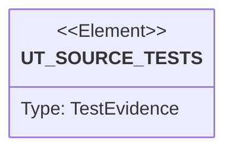

# Semantic TD: vat/commands

## Schema
<!-- type: schema lang: yaml -->

```yaml
semantic_domain:
  key: "vat/commands"
  source_group: "projects/vat/src/commands"
  coverage_kind: semantic
  evidence:
    source_units:
      - path: "projects/vat/src/commands/llm.rs"
        language: "rust"
        ownership_state: "codegen"
        generator_primitives: ["config_surface", "service_method"]
        symbols:
          - name: "GUIDE"
            kind: "constant"
            public: false
          - name: "exec"
            kind: "function"
            public: true
        source_evidence_node:
          layer: "backend"
          ecosystem: "rust"
          role: "source"
          section_type: "schema"
          domain: "projects/vat/src/commands"
      - path: "projects/vat/src/commands/rm.rs"
        language: "rust"
        ownership_state: "codegen"
        generator_primitives: ["service_method"]
        symbols:
          - name: "exec"
            kind: "function"
            public: true
        source_evidence_node:
          layer: "backend"
          ecosystem: "rust"
          role: "source"
          section_type: "schema"
          domain: "projects/vat/src/commands"
      - path: "projects/vat/src/commands/ls.rs"
        language: "rust"
        ownership_state: "codegen"
        generator_primitives: ["service_method"]
        symbols:
          - name: "exec"
            kind: "function"
            public: true
          - name: "status_label"
            kind: "function"
            public: false
        source_evidence_node:
          layer: "backend"
          ecosystem: "rust"
          role: "source"
          section_type: "schema"
          domain: "projects/vat/src/commands"
      - path: "projects/vat/src/commands/run.rs"
        language: "rust"
        ownership_state: "codegen"
        generator_primitives: ["data_model", "enum_model", "service_method"]
        symbols:
          - name: "Args"
            kind: "struct"
            public: true
          - name: "Target"
            kind: "enum"
            public: true
          - name: "exec"
            kind: "function"
            public: true
          - name: "RunnerArgs"
            kind: "struct"
            public: false
          - name: "DirectArgs"
            kind: "struct"
            public: false
          - name: "exec_direct"
            kind: "function"
            public: false
          - name: "exec_runner"
            kind: "function"
            public: false
          - name: "run_configured"
            kind: "function"
            public: false
          - name: "prepare_cluster_service"
            kind: "function"
            public: false
          - name: "should_delete_clusters"
            kind: "function"
            public: false
          - name: "run_setup_step"
            kind: "function"
            public: false
          - name: "ServiceHandle"
            kind: "struct"
            public: false
          - name: "start_service"
            kind: "function"
            public: false
          - name: "wait_for_services"
            kind: "function"
            public: false
          - name: "run_runner_process"
            kind: "function"
            public: false
          - name: "record_runner_failure"
            kind: "function"
            public: false
          - name: "persist_services"
            kind: "function"
            public: false
          - name: "stop_services"
            kind: "function"
            public: false
          - name: "command_with_logs"
            kind: "function"
            public: false
          - name: "set_process_group"
            kind: "function"
            public: false
          - name: "set_process_group"
            kind: "function"
            public: false
          - name: "wait_child"
            kind: "function"
            public: false
          - name: "kill_child"
            kind: "function"
            public: false
          - name: "kill_child"
            kind: "function"
            public: false
          - name: "http_ready"
            kind: "function"
            public: false
          - name: "collect_artifacts"
            kind: "function"
            public: false
          - name: "artifact_record"
            kind: "function"
            public: false
          - name: "print_summary"
            kind: "function"
            public: false
        source_evidence_node:
          layer: "backend"
          ecosystem: "rust"
          role: "source"
          section_type: "schema"
          domain: "projects/vat/src/commands"
      - path: "projects/vat/src/commands/mod.rs"
        language: "rust"
        ownership_state: "codegen"
        generator_primitives: ["service_method"]
        symbols:
          - name: "cluster"
            kind: "module"
            public: true
          - name: "diff"
            kind: "module"
            public: true
          - name: "gpu"
            kind: "module"
            public: true
          - name: "llm"
            kind: "module"
            public: true
          - name: "logs"
            kind: "module"
            public: true
          - name: "ls"
            kind: "module"
            public: true
          - name: "rm"
            kind: "module"
            public: true
          - name: "run"
            kind: "module"
            public: true
          - name: "snapshot"
            kind: "module"
            public: true
          - name: "state"
            kind: "module"
            public: true
          - name: "print_json"
            kind: "function"
            public: true
        source_evidence_node:
          layer: "backend"
          ecosystem: "rust"
          role: "source"
          section_type: "schema"
          domain: "projects/vat/src/commands"
      - path: "projects/vat/src/commands/state.rs"
        language: "rust"
        ownership_state: "codegen"
        generator_primitives: ["service_method"]
        symbols:
          - name: "exec"
            kind: "function"
            public: true
        source_evidence_node:
          layer: "backend"
          ecosystem: "rust"
          role: "source"
          section_type: "schema"
          domain: "projects/vat/src/commands"
      - path: "projects/vat/src/commands/snapshot.rs"
        language: "rust"
        ownership_state: "codegen"
        generator_primitives: ["service_method"]
        symbols:
          - name: "branch"
            kind: "function"
            public: false
          - name: "snapshot"
            kind: "function"
            public: true
          - name: "fork"
            kind: "function"
            public: true
        source_evidence_node:
          layer: "backend"
          ecosystem: "rust"
          role: "source"
          section_type: "schema"
          domain: "projects/vat/src/commands"
      - path: "projects/vat/src/commands/gpu.rs"
        language: "rust"
        ownership_state: "codegen"
        generator_primitives: ["service_method"]
        symbols:
          - name: "exec"
            kind: "function"
            public: true
        source_evidence_node:
          layer: "backend"
          ecosystem: "rust"
          role: "source"
          section_type: "schema"
          domain: "projects/vat/src/commands"
      - path: "projects/vat/src/commands/diff.rs"
        language: "rust"
        ownership_state: "codegen"
        generator_primitives: ["service_method"]
        symbols:
          - name: "exec"
            kind: "function"
            public: true
        source_evidence_node:
          layer: "backend"
          ecosystem: "rust"
          role: "source"
          section_type: "schema"
          domain: "projects/vat/src/commands"
      - path: "projects/vat/src/commands/logs.rs"
        language: "rust"
        ownership_state: "codegen"
        generator_primitives: ["service_method"]
        symbols:
          - name: "exec"
            kind: "function"
            public: true
          - name: "print_pair"
            kind: "function"
            public: false
          - name: "print_file"
            kind: "function"
            public: false
        source_evidence_node:
          layer: "backend"
          ecosystem: "rust"
          role: "source"
          section_type: "schema"
          domain: "projects/vat/src/commands"
      - path: "projects/vat/src/commands/cluster.rs"
        language: "rust"
        ownership_state: "codegen"
        generator_primitives: ["data_model", "service_method"]
        symbols:
          - name: "ClusterRecord"
            kind: "struct"
            public: true
          - name: "create"
            kind: "function"
            public: true
          - name: "ls"
            kind: "function"
            public: true
          - name: "kubeconfig"
            kind: "function"
            public: true
          - name: "delete"
            kind: "function"
            public: true
          - name: "default_cluster_name"
            kind: "function"
            public: false
          - name: "read_registry"
            kind: "function"
            public: false
          - name: "load_record"
            kind: "function"
            public: false
        source_evidence_node:
          layer: "backend"
          ecosystem: "rust"
          role: "source"
          section_type: "schema"
          domain: "projects/vat/src/commands"
```

## Unit Test
<!-- type: unit-test lang: mermaid -->



## Changes
<!-- type: changes lang: yaml -->

```yaml
coverage_kind: semantic
changes:
  - action: annotate
    section: unit-test
    impl_mode: hand-written
    description: "Traceability metadata edge for the semantic unit-test section."
  - path: "projects/vat/src/commands/llm.rs"
    action: modify
    section: schema
    description: |
      Generate this vat Rust source unit from the aggregate TD AST source group.
    impl_mode: codegen
    replaces:
      - "<whole-file>"
    rust_source: |
      //! `vat llm` — compact agent-facing usage contract.
      
      use std::process::ExitCode;
      
      use anyhow::Result;
      
      /// Stable guide text intended for LLM/tool agents.
      /// @spec projects/vat/tech-design/logic/llm-agent-usage-guide.md#cli
      const GUIDE: &str = r#"# vat LLM Guide
      
      vat is a local, ephemeral agent test runner. Use it to prepare a real local
      workspace, run one command or one named vat.toml runner, and inspect structured
      evidence afterward.
      
      ## First Choice
      
      - If the project has `vat.toml`, prefer plain `vat run`.
      - Use `vat run <runner-id>` only when you need a non-default runner.
      - If you only need one ad-hoc command, use `vat run -- <command>`.
      - `vat run` prints sparse JSONL checkpoints; the final line has
        `"type":"result"`.
      - After a retained run, inspect `vat state <id>`, `vat diff <id>`, and
        `vat logs <id> [runner|service-id]`.
      - Use `vat --help` for flag syntax and `vat <command> --help` for command flags.
      
      ## vat.toml Contract
      
      ```toml
      version = 1
      default_runner = "e2e"
      
      [workspace]
      base = "."
      workdir = "."
      keep = "failed" # failed | always | never
      
      [[services]]
      id = "pg"
      preset = "postgres"
      seed = ["schema.sql", "fixtures.sql"]
      export = { DATABASE_URL = "DATABASE_URL" }
      
      [[runners]]
      id = "e2e"
      requires = ["pg"]
      cmd = ["pnpm", "run", "test:e2e"]
      artifacts = ["test-results/**", "playwright-report/**"]
      ```
      
      ## Command Patterns
      
      - `vat run`: select the default runner, prepare or clone service images, start
        required services, wait for readiness, run the runner, capture evidence, stop
        services, and return the runner exit code.
      - `vat run e2e`: explicitly run the `e2e` runner.
      - `vat run -- cargo test -p app`: run one direct command without requiring
        vat.toml; the child exit code is forwarded.
      - `vat logs <id> runner`: print retained runner stdout/stderr.
      - `vat logs <id> <service-id>`: print retained service stdout/stderr.
      - `vat state <id>`: read the agent-legible JSON state.
      - `vat diff <id> --json`: read filesystem changes vs. the vat base.
      
      ## Retention
      
      Default `keep = "failed"` means successful configured runs clean up after
      emitting JSON, while failed runs keep workspace state and logs for inspection.
      
      ## Boundaries
      
      - vat is not Docker, OCI, Compose, a Linux runtime, a VM, a daemon, or a
        long-lived process manager.
      - Services in `vat.toml` are run-scoped dependencies of one runner invocation.
      - vat does not schedule production work or manage restart policy.
      "#;
      
      /// @spec projects/vat/tech-design/logic/llm-agent-usage-guide.md#cli
      pub fn exec() -> Result<ExitCode> {
          print!("{GUIDE}");
          Ok(ExitCode::SUCCESS)
      }
  - path: "projects/vat/src/commands/rm.rs"
    action: modify
    section: schema
    description: |
      Generate this vat Rust source unit from the aggregate TD AST source group.
    impl_mode: codegen
    replaces:
      - "<whole-file>"
    rust_source: |
      //! `vat rm <id>` — delete a vat and its workspace.
      
      use std::process::ExitCode;
      
      use anyhow::Result;
      
      use crate::event::{Event, EventKind};
      use crate::store;
      
      /// @spec projects/vat/tech-design/semantic/source/projects-vat-src-commands-rm-rs.md#source
      pub fn exec(id: String) -> Result<ExitCode> {
          // Best-effort: log the removal before the directory disappears, so a
          // shared events sink (future) still sees it.
          if let Ok(vat) = store::load(&id) {
              let _ = vat.log(Event::new(EventKind::Removed, format!("removing {id}")));
          }
          store::remove(&id)?;
          println!("removed {id}");
          Ok(ExitCode::SUCCESS)
      }
  - path: "projects/vat/src/commands/ls.rs"
    action: modify
    section: schema
    description: |
      Generate this vat Rust source unit from the aggregate TD AST source group.
    impl_mode: codegen
    replaces:
      - "<whole-file>"
    rust_source: |
      //! `vat ls` — list all vats with a one-line status each.
      //!
      //! Human mode prints a compact table; `--json` emits an array of projected
      //! [`VatState`] documents for an agent to consume in one read.
      
      use std::process::ExitCode;
      
      use anyhow::Result;
      
      use crate::state::Status;
      use crate::store;
      
      /// @spec projects/vat/tech-design/semantic/source/projects-vat-src-commands-ls-rs.md#source
      pub fn exec(json: bool) -> Result<ExitCode> {
          let mut vats = store::list()?;
          // Newest first.
          vats.sort_by(|a, b| b.meta.created_at.cmp(&a.meta.created_at));
      
          if json {
              let states: Vec<_> = vats
                  .iter()
                  .map(|v| v.project())
                  .collect::<Result<Vec<_>>>()?;
              crate::commands::print_json(&states, false)?;
              return Ok(ExitCode::SUCCESS);
          }
      
          if vats.is_empty() {
              println!("no vats (try: vat run -- <command>)");
              return Ok(ExitCode::SUCCESS);
          }
      
          println!(
              "{:<14} {:<12} {:>7} {:<20} NAME",
              "ID", "STATUS", "CHANGES", "CREATED"
          );
          for v in &vats {
              let changes = v
                  .changes()
                  .map(|c| c.oneline())
                  .unwrap_or_else(|_| "?".into());
              let created = v.meta.created_at.format("%Y-%m-%d %H:%M:%S");
              println!(
                  "{:<14} {:<12} {:>7} {:<20} {}",
                  v.meta.id,
                  status_label(&v.meta.status),
                  changes,
                  created,
                  v.meta.name.as_deref().unwrap_or("")
              );
          }
          Ok(ExitCode::SUCCESS)
      }
      
      fn status_label(s: &Status) -> String {
          match s {
              Status::Created => "created".into(),
              Status::Running => "running".into(),
              Status::Exited { code } => format!("exited:{code}"),
              Status::Snapshot => "snapshot".into(),
          }
      }
  - path: "projects/vat/src/commands/run.rs"
    action: modify
    section: schema
    description: |
      Generate this vat Rust source unit from the aggregate TD AST source group.
    impl_mode: codegen
    replaces:
      - "<whole-file>"
    rust_source: |
      //! `vat run` — direct command mode plus vat.toml runner mode.
      //!
      //! Direct mode (`vat run -- <cmd>`) preserves the original foreground behavior.
      //! Runner mode (`vat run [runner-id]`) treats `vat.toml` as the project-local
      //! agent test protocol: prepare a COW workspace, run setup, start run-scoped
      //! services, wait for readiness, execute the runner, capture evidence, and
      //! clean up services.
      
      use std::fs::{File, OpenOptions};
      use std::io::{Read, Write};
      use std::net::{TcpStream, ToSocketAddrs};
      use std::path::{Path, PathBuf};
      use std::process::{Child, Command, ExitCode, Stdio};
      use std::time::{Duration, Instant};
      
      use anyhow::{bail, Context, Result};
      use chrono::Utc;
      use walkdir::WalkDir;
      
      use crate::config::{self, RetentionPolicy, RunnerConfig, ServiceConfig, VatConfig};
      use crate::event::{Event, EventKind};
      use crate::gpu;
      use crate::sandbox;
      use crate::spec::{Base, EnvSpec, GpuRequest, Isolation};
      use crate::state::{
          ArtifactRecord, ConfigRef, ProcessStatus, RunRecord, RunnerRunRecord, ServiceRunRecord, Status,
          TestRunEvidence,
      };
      use crate::{id, store};
      
      /// Inputs for `vat run`, already parsed by the CLI layer.
      /// @spec projects/vat/tech-design/semantic/source/projects-vat-src-commands-run-rs.md#source
      /// @spec projects/vat/tech-design/logic/local-agent-test-runner-protocol.md#cli
      pub struct Args {
          pub target: Target,
          /// Clone from this host directory (default: current directory).
          pub base: Option<PathBuf>,
          /// Fork from an existing vat instead of a host directory.
          pub from: Option<String>,
          pub name: Option<String>,
          pub isolation: Isolation,
          pub gpu: GpuRequest,
          /// Direct mode prints full VatState JSON instead of a human summary.
          pub json: bool,
      }
      
      /// @spec projects/vat/tech-design/logic/local-agent-test-runner-protocol.md#cli
      pub enum Target {
          Direct {
              program: String,
              program_args: Vec<String>,
          },
          Runner {
              runner_id: String,
          },
      }
      
      /// @spec projects/vat/tech-design/semantic/source/projects-vat-src-commands-run-rs.md#source
      /// @spec projects/vat/tech-design/logic/local-agent-test-runner-protocol.md#logic
      pub fn exec(args: Args) -> Result<ExitCode> {
          let Args {
              target,
              base,
              from,
              name,
              isolation,
              gpu,
              json,
          } = args;
          match target {
              Target::Direct {
                  program,
                  program_args,
              } => exec_direct(DirectArgs {
                  program,
                  program_args,
                  base,
                  from,
                  name,
                  isolation,
                  gpu,
                  json,
              }),
              Target::Runner { runner_id } => exec_runner(RunnerArgs {
                  base,
                  from,
                  name,
                  isolation,
                  gpu,
                  json,
                  runner_id,
              }),
          }
      }
      
      struct RunnerArgs {
          base: Option<PathBuf>,
          from: Option<String>,
          name: Option<String>,
          isolation: Isolation,
          gpu: GpuRequest,
          json: bool,
          runner_id: String,
      }
      
      struct DirectArgs {
          program: String,
          program_args: Vec<String>,
          base: Option<PathBuf>,
          from: Option<String>,
          name: Option<String>,
          isolation: Isolation,
          gpu: GpuRequest,
          json: bool,
      }
      
      fn exec_direct(args: DirectArgs) -> Result<ExitCode> {
          let gpu_info = gpu::detect();
          if args.gpu == GpuRequest::Required && !gpu_info.accessible {
              bail!(
                  "spec requires a GPU but none is accessible on this host ({})",
                  gpu_info.note
              );
          }
      
          let (source, spec_base, lineage): (PathBuf, Base, Vec<String>) = match &args.from {
              Some(parent_id) => {
                  let parent = store::load(parent_id)
                      .with_context(|| format!("--from refers to unknown vat {parent_id}"))?;
                  let mut lineage = parent.meta.lineage.clone();
                  lineage.push(parent.meta.id.clone());
                  (parent.rootfs(), Base::Vat(parent.meta.id.clone()), lineage)
              }
              None => {
                  let dir = match &args.base {
                      Some(p) => p.clone(),
                      None => std::env::current_dir().context("get current directory")?,
                  };
                  let canon = std::fs::canonicalize(&dir)
                      .with_context(|| format!("resolve base dir {}", dir.display()))?;
                  (canon.clone(), Base::Dir(canon), Vec::new())
              }
          };
      
          let spec = EnvSpec {
              base: Some(spec_base),
              isolation: args.isolation,
              gpu: args.gpu,
              ..EnvSpec::default()
          };
      
          let new_id = id::fresh();
          let mut vat = store::create(
              &new_id,
              args.name.clone(),
              spec.clone(),
              Some(&source),
              lineage,
          )
          .context("create vat")?;
      
          let command: Vec<String> = std::iter::once(args.program.clone())
              .chain(args.program_args.iter().cloned())
              .collect();
          vat.meta.status = Status::Running;
          vat.meta.last_run = Some(RunRecord {
              command: command.clone(),
              started_at: Utc::now(),
              finished_at: None,
              exit_code: None,
              duration_ms: None,
          });
          vat.save()?;
          let backend = sandbox::pick(&spec);
          vat.log(
              Event::new(EventKind::RunStarted, format!("run: {}", command.join(" ")))
                  .with_data(serde_json::json!({ "backend": backend.name() })),
          )?;
      
          let rootfs = vat.rootfs();
          let (prog, argv) = backend.resolve(&rootfs, &args.program, &args.program_args);
          let cwd = rootfs.join(&spec.workdir);
          let started = Instant::now();
          let mut cmd = Command::new(&prog);
          cmd.args(&argv).current_dir(&cwd);
          for (key, value) in &spec.env {
              cmd.env(key, value);
          }
          let status = cmd
              .status()
              .with_context(|| format!("spawn `{prog}` inside vat rootfs"))?;
          let duration_ms = started.elapsed().as_millis() as u64;
          let code = status.code().unwrap_or(-1);
      
          vat.meta.status = Status::Exited { code };
          if let Some(run) = vat.meta.last_run.as_mut() {
              run.finished_at = Some(Utc::now());
              run.exit_code = Some(code);
              run.duration_ms = Some(duration_ms);
          }
          vat.save()?;
          let changes = vat.changes().unwrap_or_default();
          vat.log(
              Event::new(
                  EventKind::RunFinished,
                  format!("exit {code} in {duration_ms}ms · {}", changes.oneline()),
              )
              .with_data(serde_json::json!({
                  "exit_code": code,
                  "duration_ms": duration_ms,
                  "changes": { "added": changes.added.len(), "modified": changes.modified.len(), "deleted": changes.deleted.len() },
              })),
          )?;
      
          if args.json {
              crate::commands::print_json(&vat.project()?, false)?;
          } else {
              print_summary(&vat, code, duration_ms, &changes, backend.name(), &gpu_info);
          }
      
          Ok(ExitCode::from(code.clamp(0, 255) as u8))
      }
      
      fn exec_runner(args: RunnerArgs) -> Result<ExitCode> {
          let cwd = std::env::current_dir().context("get current directory")?;
          let cfg = config::load_nearest(&cwd)?;
          if args.base.is_some() || args.from.is_some() {
              bail!(
                  "vat run [runner-id] uses vat.toml workspace.base; --base/--from are direct mode only"
              );
          }
          let runner = cfg.runner(&args.runner_id)?.clone();
          let gpu_info = gpu::detect();
          if args.gpu == GpuRequest::Required && !gpu_info.accessible {
              bail!(
                  "spec requires a GPU but none is accessible on this host ({})",
                  gpu_info.note
              );
          }
      
          let source = std::fs::canonicalize(cfg.base_dir())
              .with_context(|| format!("resolve workspace base {}", cfg.base_dir().display()))?;
          let spec = EnvSpec {
              base: Some(Base::Dir(source.clone())),
              workdir: cfg.workspace.workdir.clone(),
              env: cfg.env.clone(),
              isolation: args.isolation,
              gpu: args.gpu,
              ..EnvSpec::default()
          };
      
          let new_id = id::fresh();
          let name = args
              .name
              .or_else(|| cfg.name.clone())
              .or(Some(runner.id.clone()));
          let mut vat = store::create(&new_id, name, spec.clone(), Some(&source), Vec::new())
              .context("create vat")?;
          let logs_dir = vat.dir.join(crate::paths::file::LOGS);
          std::fs::create_dir_all(&logs_dir).with_context(|| format!("create {}", logs_dir.display()))?;
      
          vat.meta.status = Status::Running;
          vat.meta.test_run = Some(TestRunEvidence {
              config: ConfigRef {
                  path: cfg.path.to_string_lossy().into_owned(),
                  digest: cfg.digest.clone(),
              },
              runner_id: runner.id.clone(),
              retention: cfg.workspace.keep,
              services: Vec::new(),
              runner: None,
              artifacts: Vec::new(),
          });
          vat.save()?;
          vat.log(Event::new(
              EventKind::RunStarted,
              format!("runner: {}", runner.id),
          ))?;
      
          let result = run_configured(&mut vat, &cfg, &runner, &logs_dir);
          let code = match result {
              Ok(code) => code,
              Err(err) => {
                  record_runner_failure(&mut vat, &runner, &logs_dir, &err.to_string())?;
                  -1
              }
          };
      
          vat.meta.status = Status::Exited { code };
          vat.save()?;
          let state = vat.project()?;
          let should_remove = match cfg.workspace.keep {
              RetentionPolicy::Always => false,
              RetentionPolicy::Never => true,
              RetentionPolicy::Failed => code == 0,
          };
      
          if args.json {
              crate::commands::print_json(&state, false)?;
          } else {
              println!(
                  "{} · runner {} exited {} · retention {:?}",
                  state.id, runner.id, code, cfg.workspace.keep
              );
              println!("→ vat state {}", state.id);
          }
      
          if should_remove {
              let _ = store::remove(&state.id);
          }
      
          Ok(ExitCode::from(code.clamp(0, 255) as u8))
      }
      
      fn run_configured(
          vat: &mut store::Vat,
          cfg: &VatConfig,
          runner: &RunnerConfig,
          logs_dir: &Path,
      ) -> Result<i32> {
          let rootfs = vat.rootfs();
          let cwd = rootfs.join(&vat.meta.spec.workdir);
          std::fs::create_dir_all(&cwd).with_context(|| format!("create {}", cwd.display()))?;
      
          for step in &cfg.setup {
              if !config::should_run_setup(&rootfs, step) {
                  continue;
              }
              run_setup_step(vat, step, &cwd, logs_dir)?;
          }
      
          let mut services = Vec::new();
          for service_id in &runner.requires {
              let service = cfg.service(service_id)?;
              services.push(start_service(vat, service, &cwd, logs_dir)?);
          }
      
          let readiness = wait_for_services(vat, &mut services);
          if let Err(err) = readiness {
              stop_services(&mut services);
              persist_services(vat, &services)?;
              return Err(err);
          }
          persist_services(vat, &services)?;
      
          let runner_record = run_runner_process(vat, runner, &cwd, logs_dir)?;
          let code = runner_record.exit_code.unwrap_or(-1);
          if let Some(test_run) = vat.meta.test_run.as_mut() {
              test_run.runner = Some(runner_record);
              test_run.artifacts = collect_artifacts(&rootfs, &runner.artifacts)?;
          }
          vat.save()?;
          stop_services(&mut services);
          persist_services(vat, &services)?;
          vat.log(Event::new(
              EventKind::RunFinished,
              format!("runner {} exited {code}", runner.id),
          ))?;
          Ok(code)
      }
      
      fn run_setup_step(
          vat: &store::Vat,
          step: &crate::config::SetupStep,
          cwd: &Path,
          logs_dir: &Path,
      ) -> Result<()> {
          let stdout = logs_dir.join(format!("setup-{}.stdout.log", step.id));
          let stderr = logs_dir.join(format!("setup-{}.stderr.log", step.id));
          let status = command_with_logs(&step.cmd, cwd, &vat.meta.spec.env, &stdout, &stderr)?
              .wait()
              .with_context(|| format!("wait setup `{}`", step.id))?;
          if !status.success() {
              bail!("setup `{}` failed with {:?}", step.id, status.code());
          }
          vat.log(Event::new(EventKind::Setup, format!("setup {}", step.id)))?;
          Ok(())
      }
      
      struct ServiceHandle {
          record: ServiceRunRecord,
          child: Child,
          timeout_s: u64,
      }
      
      fn start_service(
          vat: &mut store::Vat,
          service: &ServiceConfig,
          cwd: &Path,
          logs_dir: &Path,
      ) -> Result<ServiceHandle> {
          let stdout = logs_dir.join(format!("{}.stdout.log", service.id));
          let stderr = logs_dir.join(format!("{}.stderr.log", service.id));
          let child = command_with_logs(&service.cmd, cwd, &vat.meta.spec.env, &stdout, &stderr)
              .with_context(|| format!("spawn service `{}`", service.id))?;
          let record = ServiceRunRecord {
              id: service.id.clone(),
              command: service.cmd.clone(),
              status: ProcessStatus::Running,
              pid: Some(child.id()),
              exit_code: None,
              ready_http: service.ready_http.clone(),
              stdout_log: stdout.to_string_lossy().into_owned(),
              stderr_log: stderr.to_string_lossy().into_owned(),
          };
          vat.log(Event::new(
              EventKind::RunStarted,
              format!("service {}", service.id),
          ))?;
          Ok(ServiceHandle {
              record,
              child,
              timeout_s: service.timeout_s,
          })
      }
      
      fn wait_for_services(vat: &mut store::Vat, services: &mut [ServiceHandle]) -> Result<()> {
          for service in services {
              let Some(url) = service.record.ready_http.clone() else {
                  service.record.status = ProcessStatus::Ready;
                  continue;
              };
              let deadline = Instant::now() + Duration::from_secs(service.timeout_s);
              loop {
                  if http_ready(&url).unwrap_or(false) {
                      service.record.status = ProcessStatus::Ready;
                      break;
                  }
                  if let Some(status) = service.child.try_wait()? {
                      service.record.status = ProcessStatus::Failed;
                      service.record.exit_code = status.code();
                      bail!("service `{}` exited before readiness", service.record.id);
                  }
                  if Instant::now() >= deadline {
                      service.record.status = ProcessStatus::Timeout;
                      bail!("service `{}` readiness timed out", service.record.id);
                  }
                  std::thread::sleep(Duration::from_millis(100));
              }
              vat.log(Event::new(
                  EventKind::RunStarted,
                  format!("service {} ready", service.record.id),
              ))?;
          }
          Ok(())
      }
      
      fn run_runner_process(
          vat: &store::Vat,
          runner: &RunnerConfig,
          cwd: &Path,
          logs_dir: &Path,
      ) -> Result<RunnerRunRecord> {
          let stdout = logs_dir.join("runner.stdout.log");
          let stderr = logs_dir.join("runner.stderr.log");
          let started = Instant::now();
          let mut child = command_with_logs(&runner.cmd, cwd, &vat.meta.spec.env, &stdout, &stderr)
              .with_context(|| format!("spawn runner `{}`", runner.id))?;
          let status = wait_child(&mut child, runner.timeout_s)?;
          let duration_ms = started.elapsed().as_millis() as u64;
          let exit_code = status;
          Ok(RunnerRunRecord {
              id: runner.id.clone(),
              command: runner.cmd.clone(),
              status: ProcessStatus::Exited,
              exit_code: Some(exit_code),
              duration_ms: Some(duration_ms),
              stdout_log: stdout.to_string_lossy().into_owned(),
              stderr_log: stderr.to_string_lossy().into_owned(),
          })
      }
      
      fn record_runner_failure(
          vat: &mut store::Vat,
          runner: &RunnerConfig,
          logs_dir: &Path,
          message: &str,
      ) -> Result<()> {
          let stderr = logs_dir.join("runner.stderr.log");
          let mut file = OpenOptions::new().create(true).append(true).open(&stderr)?;
          writeln!(file, "{message}")?;
          if let Some(test_run) = vat.meta.test_run.as_mut() {
              test_run.runner = Some(RunnerRunRecord {
                  id: runner.id.clone(),
                  command: runner.cmd.clone(),
                  status: ProcessStatus::Failed,
                  exit_code: Some(-1),
                  duration_ms: None,
                  stdout_log: logs_dir
                      .join("runner.stdout.log")
                      .to_string_lossy()
                      .into_owned(),
                  stderr_log: stderr.to_string_lossy().into_owned(),
              });
          }
          vat.save()?;
          Ok(())
      }
      
      fn persist_services(vat: &mut store::Vat, services: &[ServiceHandle]) -> Result<()> {
          if let Some(test_run) = vat.meta.test_run.as_mut() {
              test_run.services = services.iter().map(|s| s.record.clone()).collect();
          }
          vat.save()
      }
      
      fn stop_services(services: &mut [ServiceHandle]) {
          for service in services {
              if service.child.try_wait().ok().flatten().is_some() {
                  continue;
              }
              kill_child(&mut service.child);
              let _ = service.child.wait();
              if service.record.status == ProcessStatus::Running
                  || service.record.status == ProcessStatus::Ready
              {
                  service.record.status = ProcessStatus::Exited;
              }
          }
      }
      
      fn command_with_logs(
          cmd: &[String],
          cwd: &Path,
          env: &std::collections::BTreeMap<String, String>,
          stdout: &Path,
          stderr: &Path,
      ) -> Result<Child> {
          if cmd.is_empty() {
              bail!("empty command");
          }
          if let Some(parent) = stdout.parent() {
              std::fs::create_dir_all(parent)?;
          }
          let out = File::create(stdout).with_context(|| format!("create {}", stdout.display()))?;
          let err = File::create(stderr).with_context(|| format!("create {}", stderr.display()))?;
          let mut command = Command::new(&cmd[0]);
          command
              .args(&cmd[1..])
              .current_dir(cwd)
              .stdout(Stdio::from(out))
              .stderr(Stdio::from(err));
          for (key, value) in env {
              command.env(key, value);
          }
          set_process_group(&mut command);
          command
              .spawn()
              .with_context(|| format!("spawn `{}`", cmd[0]))
      }
      
      #[cfg(unix)]
      fn set_process_group(command: &mut Command) {
          use std::os::unix::process::CommandExt;
          command.process_group(0);
      }
      
      #[cfg(not(unix))]
      fn set_process_group(_command: &mut Command) {}
      
      fn wait_child(child: &mut Child, timeout_s: Option<u64>) -> Result<i32> {
          let deadline = timeout_s.map(|s| Instant::now() + Duration::from_secs(s));
          loop {
              if let Some(status) = child.try_wait()? {
                  return Ok(status.code().unwrap_or(-1));
              }
              if let Some(deadline) = deadline {
                  if Instant::now() >= deadline {
                      kill_child(child);
                      let _ = child.wait();
                      return Ok(-1);
                  }
              }
              std::thread::sleep(Duration::from_millis(100));
          }
      }
      
      #[cfg(unix)]
      fn kill_child(child: &mut Child) {
          let pgid = -(child.id() as i32);
          unsafe {
              libc::kill(pgid, libc::SIGTERM);
          }
          std::thread::sleep(Duration::from_millis(200));
          if child.try_wait().ok().flatten().is_none() {
              unsafe {
                  libc::kill(pgid, libc::SIGKILL);
              }
          }
      }
      
      #[cfg(not(unix))]
      fn kill_child(child: &mut Child) {
          let _ = child.kill();
      }
      
      fn http_ready(raw_url: &str) -> Result<bool> {
          let url = url::Url::parse(raw_url).with_context(|| format!("parse ready_http {raw_url}"))?;
          let host = url.host_str().context("ready_http missing host")?;
          let port = url
              .port_or_known_default()
              .context("ready_http missing port")?;
          let addr = (host, port)
              .to_socket_addrs()?
              .next()
              .context("ready_http did not resolve")?;
          let mut stream = TcpStream::connect_timeout(&addr, Duration::from_millis(300))?;
          stream.set_read_timeout(Some(Duration::from_millis(300)))?;
          let path = if url.path().is_empty() {
              "/"
          } else {
              url.path()
          };
          write!(
              stream,
              "GET {path} HTTP/1.1\r\nHost: {host}\r\nConnection: close\r\n\r\n"
          )?;
          let mut buf = [0u8; 64];
          let n = stream.read(&mut buf)?;
          let head = String::from_utf8_lossy(&buf[..n]);
          Ok(head.starts_with("HTTP/1.0 2")
              || head.starts_with("HTTP/1.1 2")
              || head.starts_with("HTTP/1.0 3")
              || head.starts_with("HTTP/1.1 3"))
      }
      
      fn collect_artifacts(rootfs: &Path, patterns: &[String]) -> Result<Vec<ArtifactRecord>> {
          let mut out = Vec::new();
          for pattern in patterns {
              if let Some(prefix) = pattern.strip_suffix("/**") {
                  let dir = rootfs.join(prefix);
                  if !dir.exists() {
                      continue;
                  }
                  for entry in WalkDir::new(&dir).into_iter().filter_map(Result::ok) {
                      if !entry.file_type().is_file() {
                          continue;
                      }
                      out.push(artifact_record(rootfs, entry.path())?);
                  }
              } else {
                  let path = rootfs.join(pattern);
                  if path.is_file() {
                      out.push(artifact_record(rootfs, &path)?);
                  }
              }
          }
          Ok(out)
      }
      
      fn artifact_record(rootfs: &Path, path: &Path) -> Result<ArtifactRecord> {
          let rel = path
              .strip_prefix(rootfs)
              .context("artifact outside rootfs")?
              .to_string_lossy()
              .into_owned();
          Ok(ArtifactRecord {
              path: rel,
              size_bytes: path.metadata().ok().map(|m| m.len()),
          })
      }
      
      #[allow(clippy::too_many_arguments)]
      fn print_summary(
          vat: &store::Vat,
          code: i32,
          duration_ms: u64,
          changes: &crate::state::ChangeSet,
          backend: &str,
          gpu: &gpu::GpuInfo,
      ) {
          let id = &vat.meta.id;
          println!(
              "{id} · exited {code} in {duration_ms}ms · {backend} · changes {}",
              changes.oneline()
          );
          let chip = gpu.chip.as_deref().unwrap_or("unknown");
          let mark = if gpu.accessible { "✓" } else { "✗" };
          println!("gpu {mark} {chip} [{}]", gpu.backends.join(", "));
          println!("→ vat state {id}    # full JSON for an agent");
      }
  - path: "projects/vat/src/commands/mod.rs"
    action: modify
    section: schema
    description: |
      Generate this vat Rust source unit from the aggregate TD AST source group.
    impl_mode: codegen
    replaces:
      - "<whole-file>"
    rust_source: |
      //! Command implementations, one file per verb.
      //!
      //! The CLI layer ([`crate::cli`]) parses arguments and dispatches here; each
      //! module owns the logic for one verb and returns an [`std::process::ExitCode`]
      //! so the binary can propagate a meaningful status (notably: `vat run`
      //! forwards the child's exit code).
      
      pub mod diff;
      pub mod gpu;
      pub mod llm;
      pub mod logs;
      pub mod ls;
      pub mod rm;
      pub mod run;
      pub mod snapshot;
      pub mod state;
      
      use anyhow::Result;
      
      /// Print a value as JSON to stdout — pretty by default, single-line when
      /// `compact`. Used wherever a verb has a machine-readable mode.
      /// @spec projects/vat/tech-design/semantic/source/projects-vat-src-commands-mod-rs.md#source
      pub fn print_json<T: serde::Serialize>(value: &T, compact: bool) -> Result<()> {
          let s = if compact {
              serde_json::to_string(value)?
          } else {
              serde_json::to_string_pretty(value)?
          };
          println!("{s}");
          Ok(())
      }
  - path: "projects/vat/src/commands/state.rs"
    action: modify
    section: schema
    description: |
      Generate this vat Rust source unit from the aggregate TD AST source group.
    impl_mode: codegen
    replaces:
      - "<whole-file>"
    rust_source: |
      //! `vat state <id>` — print the full agent-legible [`VatState`] as JSON.
      //!
      //! This is the command an agent calls to understand a vat. Output is pretty
      //! JSON by default (readable in a transcript) or single-line with `--compact`.
      
      use std::process::ExitCode;
      
      use anyhow::Result;
      
      use crate::store;
      
      /// @spec projects/vat/tech-design/semantic/source/projects-vat-src-commands-state-rs.md#source
      pub fn exec(id: String, compact: bool) -> Result<ExitCode> {
          let vat = store::load(&id)?;
          let state = vat.project()?;
          crate::commands::print_json(&state, compact)?;
          Ok(ExitCode::SUCCESS)
      }
  - path: "projects/vat/src/commands/snapshot.rs"
    action: modify
    section: schema
    description: |
      Generate this vat Rust source unit from the aggregate TD AST source group.
    impl_mode: codegen
    replaces:
      - "<whole-file>"
    rust_source: |
      //! `vat snapshot <id>` and `vat fork <id>` — branch a running environment.
      //!
      //! Both copy-on-write clone an existing vat's rootfs into a new vat, carrying
      //! lineage so the fork tree is legible:
      //!
      //! - **snapshot** produces a frozen label (`Status::Snapshot`) — a restore
      //!   point you don't run in.
      //! - **fork** produces a fresh, runnable working copy — for trying a second
      //!   approach from the same starting point.
      //!
      //! This is the "git for a live environment" half of vat: cheap branching means
      //! an agent can explore, fail, and roll back without rebuilding.
      
      use std::process::ExitCode;
      
      use anyhow::{Context, Result};
      
      use crate::event::{Event, EventKind};
      use crate::spec::{Base, EnvSpec};
      use crate::state::Status;
      use crate::{id, store};
      
      /// Clone `parent_id` into a new vat. `freeze` marks it as a snapshot.
      fn branch(parent_id: &str, name: Option<String>, freeze: bool) -> Result<store::Vat> {
          let parent = store::load(parent_id).with_context(|| format!("unknown vat {parent_id}"))?;
      
          let mut lineage = parent.meta.lineage.clone();
          lineage.push(parent.meta.id.clone());
      
          // Inherit the parent's spec but repoint base at the parent vat.
          let spec = EnvSpec {
              base: Some(Base::Vat(parent.meta.id.clone())),
              ..parent.meta.spec.clone()
          };
      
          let new_id = id::fresh();
          let mut child = store::create(&new_id, name, spec, Some(&parent.rootfs()), lineage)
              .context("create forked vat")?;
      
          let (kind, msg) = if freeze {
              child.meta.status = Status::Snapshot;
              (EventKind::Snapshot, format!("snapshot of {parent_id}"))
          } else {
              (EventKind::Fork, format!("fork of {parent_id}"))
          };
          child.save()?;
          child.log(Event::new(kind, msg))?;
          Ok(child)
      }
      
      /// @spec projects/vat/tech-design/semantic/source/projects-vat-src-commands-snapshot-rs.md#source
      pub fn snapshot(id: String, name: Option<String>) -> Result<ExitCode> {
          let child = branch(&id, name, true)?;
          println!("snapshot {} (frozen, from {id})", child.meta.id);
          Ok(ExitCode::SUCCESS)
      }
      
      /// @spec projects/vat/tech-design/semantic/source/projects-vat-src-commands-snapshot-rs.md#source
      pub fn fork(id: String, name: Option<String>) -> Result<ExitCode> {
          let child = branch(&id, name, false)?;
          println!(
              "fork {} (runnable, from {id})\n→ vat run --from {} -- <command>",
              child.meta.id, child.meta.id
          );
          Ok(ExitCode::SUCCESS)
      }
  - path: "projects/vat/src/commands/gpu.rs"
    action: modify
    section: schema
    description: |
      Generate this vat Rust source unit from the aggregate TD AST source group.
    impl_mode: codegen
    replaces:
      - "<whole-file>"
    rust_source: |
      //! `vat gpu` — report the GPU every vat on this host can reach.
      //!
      //! The fastest way for an agent (or a curious human) to confirm the headline
      //! claim: on Apple Silicon this prints an accessible Metal device, where the
      //! same probe inside a Docker container reports nothing.
      
      use std::process::ExitCode;
      
      use anyhow::Result;
      
      use crate::gpu;
      
      /// @spec projects/vat/tech-design/semantic/source/projects-vat-src-commands-gpu-rs.md#source
      pub fn exec(json: bool) -> Result<ExitCode> {
          let info = gpu::detect();
          if json {
              crate::commands::print_json(&info, false)?;
              return Ok(ExitCode::SUCCESS);
          }
          let chip = info.chip.as_deref().unwrap_or("unknown");
          let mark = if info.accessible {
              "✓ accessible"
          } else {
              "✗ not accessible"
          };
          println!("vendor   {}", info.vendor);
          println!("chip     {chip}");
          println!("backends {}", info.backends.join(", "));
          println!("status   {mark}");
          println!("note     {}", info.note);
          Ok(ExitCode::SUCCESS)
      }
  - path: "projects/vat/src/commands/diff.rs"
    action: modify
    section: schema
    description: |
      Generate this vat Rust source unit from the aggregate TD AST source group.
    impl_mode: codegen
    replaces:
      - "<whole-file>"
    rust_source: |
      //! `vat diff <id>` — full filesystem changes vs. the vat's base.
      //!
      //! Where `vat state` shows a bounded sample, `diff` shows every changed path.
      //! `--json` emits the complete [`ChangeSet`].
      
      use std::process::ExitCode;
      
      use anyhow::Result;
      
      use crate::store;
      
      /// @spec projects/vat/tech-design/semantic/source/projects-vat-src-commands-diff-rs.md#source
      pub fn exec(id: String, json: bool) -> Result<ExitCode> {
          let vat = store::load(&id)?;
          let changes = vat.changes()?;
      
          if json {
              crate::commands::print_json(&changes, false)?;
              return Ok(ExitCode::SUCCESS);
          }
      
          if changes.is_empty() {
              println!("{id}: no changes vs base");
              return Ok(ExitCode::SUCCESS);
          }
          for p in &changes.added {
              println!("A  {p}");
          }
          for p in &changes.modified {
              println!("M  {p}");
          }
          for p in &changes.deleted {
              println!("D  {p}");
          }
          println!("{}", changes.oneline());
          Ok(ExitCode::SUCCESS)
      }
  - path: "projects/vat/src/commands/logs.rs"
    action: modify
    section: schema
    description: |
      Generate this vat Rust source unit from the aggregate TD AST source group.
    impl_mode: codegen
    replaces:
      - "<whole-file>"
    rust_source: |
      //! `vat logs` — print captured logs from a vat.toml runner invocation.
      
      use std::process::ExitCode;
      
      use anyhow::{bail, Context, Result};
      
      use crate::store;
      
      /// @spec projects/vat/tech-design/logic/local-agent-test-runner-protocol.md#cli
      pub fn exec(id: String, source: Option<String>) -> Result<ExitCode> {
          let vat = store::load(&id)?;
          let Some(test_run) = vat.meta.test_run else {
              bail!("vat {id} has no vat.toml runner evidence");
          };
      
          match source.as_deref() {
              Some("runner") => {
                  if let Some(runner) = test_run.runner {
                      print_pair(&runner.stdout_log, &runner.stderr_log)?;
                  }
              }
              Some(service_id) => {
                  let service = test_run
                      .services
                      .iter()
                      .find(|s| s.id == service_id)
                      .with_context(|| format!("no log source `{service_id}` in vat {id}"))?;
                  print_pair(&service.stdout_log, &service.stderr_log)?;
              }
              None => {
                  for service in &test_run.services {
                      println!("== service:{} stdout ==", service.id);
                      print_file(&service.stdout_log)?;
                      println!("== service:{} stderr ==", service.id);
                      print_file(&service.stderr_log)?;
                  }
                  if let Some(runner) = test_run.runner {
                      println!("== runner stdout ==");
                      print_file(&runner.stdout_log)?;
                      println!("== runner stderr ==");
                      print_file(&runner.stderr_log)?;
                  }
              }
          }
      
          Ok(ExitCode::SUCCESS)
      }
      
      fn print_pair(stdout: &str, stderr: &str) -> Result<()> {
          print_file(stdout)?;
          print_file(stderr)
      }
      
      fn print_file(path: &str) -> Result<()> {
          match std::fs::read_to_string(path) {
              Ok(content) => {
                  print!("{content}");
                  Ok(())
              }
              Err(err) if err.kind() == std::io::ErrorKind::NotFound => Ok(()),
              Err(err) => Err(err).with_context(|| format!("read log {path}")),
          }
      }
```
