# Semantic TD: vat/tests

## Schema
<!-- type: schema lang: yaml -->

```yaml
semantic_domain:
  key: "vat/tests"
  source_group: "projects/vat/tests"
  coverage_kind: semantic
  evidence:
    source_units:
      - path: "projects/vat/tests/vat_toml_runner.rs"
        language: "rust"
        ownership_state: "codegen"
        generator_primitives: ["service_method", "test_case"]
        symbols:
          - name: "vat_bin"
            kind: "function"
            public: false
          - name: "python3_available"
            kind: "function"
            public: false
          - name: "free_port"
            kind: "function"
            public: false
          - name: "vat_toml_runner_starts_service_and_returns_json_evidence"
            kind: "function"
            public: false
          - name: "failed_vat_toml_runner_keeps_logs_for_inspection"
            kind: "function"
            public: false
          - name: "direct_run_mode_still_forwards_exit_code"
            kind: "function"
            public: false
        source_evidence_node:
          layer: "backend"
          ecosystem: "rust"
          role: "test"
          section_type: "unit-test"
          domain: "projects/vat/tests"
      - path: "projects/vat/tests/behavior_vat_copy_on_write_lifecycle.rs"
        language: "rust"
        ownership_state: "codegen"
        generator_primitives: ["service_method", "test_case"]
        symbols:
          - name: "vat_copy_on_write_lifecycle"
            kind: "function"
            public: false
        source_evidence_node:
          layer: "backend"
          ecosystem: "rust"
          role: "test"
          section_type: "unit-test"
          domain: "projects/vat/tests"
      - path: "projects/vat/tests/behavior_vat_agent_state_and_diff_surface.rs"
        language: "rust"
        ownership_state: "codegen"
        generator_primitives: ["service_method", "test_case"]
        symbols:
          - name: "vat_agent_state_and_diff_surface"
            kind: "function"
            public: false
        source_evidence_node:
          layer: "backend"
          ecosystem: "rust"
          role: "test"
          section_type: "unit-test"
          domain: "projects/vat/tests"
      - path: "projects/vat/tests/behavior_vat_resource_isolation_boundary.rs"
        language: "rust"
        ownership_state: "codegen"
        generator_primitives: ["service_method", "test_case"]
        symbols:
          - name: "vat_resource_isolation_boundary"
            kind: "function"
            public: false
        source_evidence_node:
          layer: "backend"
          ecosystem: "rust"
          role: "test"
          section_type: "unit-test"
          domain: "projects/vat/tests"
      - path: "projects/vat/tests/behavior_vat_toml_runner_local_service_smoke.rs"
        language: "rust"
        ownership_state: "codegen"
        generator_primitives: ["service_method", "test_case"]
        symbols:
          - name: "vat_toml_runner_local_service_smoke"
            kind: "function"
            public: false
        source_evidence_node:
          layer: "backend"
          ecosystem: "rust"
          role: "test"
          section_type: "unit-test"
          domain: "projects/vat/tests"
      - path: "projects/vat/tests/behavior_vat_host_process_gpu_visibility.rs"
        language: "rust"
        ownership_state: "codegen"
        generator_primitives: ["service_method", "test_case"]
        symbols:
          - name: "vat_host_process_gpu_visibility"
            kind: "function"
            public: false
        source_evidence_node:
          layer: "backend"
          ecosystem: "rust"
          role: "test"
          section_type: "unit-test"
          domain: "projects/vat/tests"
      - path: "projects/vat/tests/vat_cluster.rs"
        language: "rust"
        ownership_state: "codegen"
        generator_primitives: ["service_method", "test_case"]
        symbols:
          - name: "vat_bin"
            kind: "function"
            public: false
          - name: "any_cluster_backend"
            kind: "function"
            public: false
          - name: "delete_cluster"
            kind: "function"
            public: false
          - name: "cluster_backend_unavailable_reports_jsonl_error"
            kind: "function"
            public: false
          - name: "llm_guide_mentions_cluster"
            kind: "function"
            public: false
          - name: "vat_cluster_create_exports_kubeconfig"
            kind: "function"
            public: false
          - name: "vat_cluster_standalone_lifecycle"
            kind: "function"
            public: false
        source_evidence_node:
          layer: "backend"
          ecosystem: "rust"
          role: "test"
          section_type: "unit-test"
          domain: "projects/vat/tests"
      - path: "projects/vat/tests/vat_emulators.rs"
        language: "rust"
        ownership_state: "codegen"
        generator_primitives: ["service_method", "test_case"]
        symbols:
          - name: "vat_bin"
            kind: "function"
            public: false
          - name: "on_path"
            kind: "function"
            public: false
          - name: "gcloud_component_installed"
            kind: "function"
            public: false
          - name: "firestore_native_available"
            kind: "function"
            public: false
          - name: "gcloud_emulator_unavailable_reports_jsonl_error"
            kind: "function"
            public: false
          - name: "firebase_without_firebase_json_is_rejected"
            kind: "function"
            public: false
          - name: "firestore_emulator_exports_host"
            kind: "function"
            public: false
          - name: "firebase_bundle_exports_hosts"
            kind: "function"
            public: false
        source_evidence_node:
          layer: "backend"
          ecosystem: "rust"
          role: "test"
          section_type: "unit-test"
          domain: "projects/vat/tests"
      - path: "projects/vat/tests/vat_emulator_auth.rs"
        language: "rust"
        ownership_state: "codegen"
        generator_primitives: ["service_method", "test_case"]
        symbols:
          - name: "vat_bin"
            kind: "function"
            public: false
          - name: "post"
            kind: "function"
            public: false
          - name: "firebase_auth_emulator_signup_signin_lookup"
            kind: "function"
            public: false
        source_evidence_node:
          layer: "backend"
          ecosystem: "rust"
          role: "test"
          section_type: "unit-test"
          domain: "projects/vat/tests"
      - path: "projects/vat/tests/vat_emulator_pubsub.rs"
        language: "rust"
        ownership_state: "codegen"
        generator_primitives: ["service_method", "test_case"]
        symbols:
          - name: "vat_bin"
            kind: "function"
            public: false
          - name: "pubsub_emulator_publish_pull_ack_and_stream"
            kind: "function"
            public: false
        source_evidence_node:
          layer: "backend"
          ecosystem: "rust"
          role: "test"
          section_type: "unit-test"
          domain: "projects/vat/tests"
```

## Unit Test

```mermaid
---
id: unit-test
coverage_kind: semantic
strategy: preserve observed source behavior while semantic coverage is promoted toward generator primitives
evidence:
  source_tests:
    - path: "projects/vat/tests/vat_emulator_storage.rs"
    - path: "projects/vat/tests/vat_emulator_auth.rs"
    - path: "projects/vat/tests/vat_emulator_grpc_mitm_routing.rs"
    - path: "projects/vat/tests/vat_emulator_tasks_grpc.rs"
    - path: "projects/vat/tests/vat_toml_runner.rs"
    - path: "projects/vat/tests/behavior_vat_copy_on_write_lifecycle.rs"
    - path: "projects/vat/tests/behavior_vat_agent_state_and_diff_surface.rs"
    - path: "projects/vat/tests/vat_emulator_tasks.rs"
    - path: "projects/vat/tests/vat_emulator_httpmock_routing.rs"
    - path: "projects/vat/tests/vat_cluster.rs"
    - path: "projects/vat/tests/vat_emulator_pubsub.rs"
    - path: "projects/vat/tests/vat_emulator_scheduler_grpc.rs"
    - path: "projects/vat/tests/vat_cli_convention.rs"
    - path: "projects/vat/tests/behavior_vat_resource_isolation_boundary.rs"
    - path: "projects/vat/tests/behavior_vat_toml_runner_local_service_smoke.rs"
    - path: "projects/vat/tests/vat_emulator_workflows.rs"
    - path: "projects/vat/tests/vat_emulator_scheduler.rs"
    - path: "projects/vat/tests/behavior_vat_llm_agent_usage_guide.rs"
    - path: "projects/vat/tests/behavior_vat_host_process_gpu_visibility.rs"
    - path: "projects/vat/tests/vat_emulator_httpmock.rs"
    - path: "projects/vat/tests/vat_emulators.rs"
    - path: "projects/vat/tests/vat_runner_sandbox.rs"
    - path: "projects/vat/tests/vat_emulator_openapi.rs"
    - path: "projects/vat/tests/vat_concurrent_runners.rs"
    - path: "projects/vat/tests/vat_sandbox_egress.rs"
---
requirementDiagram

element UT_SOURCE_TESTS {
  type: "TestEvidence"
}
```

<!-- type: unit-test lang: mermaid -->



## Changes
<!-- type: changes lang: yaml -->

```yaml
coverage_kind: semantic
changes:
  - path: "projects/vat/tests/vat_toml_runner.rs"
    action: modify
    section: schema
    description: |
      Generate this vat Rust source unit from the aggregate TD AST source group.
    impl_mode: codegen
    replaces:
      - "<whole-file>"
    rust_source: |
      use std::net::TcpListener;
      use std::process::Command;
      
      use serde_json::Value;
      
      fn vat_bin() -> &'static str {
          env!("CARGO_BIN_EXE_vat")
      }
      
      fn python3_available() -> bool {
          Command::new("python3")
              .arg("--version")
              .status()
              .map(|s| s.success())
              .unwrap_or(false)
      }
      
      fn free_port() -> Option<u16> {
          let listener = TcpListener::bind("127.0.0.1:0").ok()?;
          Some(listener.local_addr().ok()?.port())
      }
      
      fn jsonl(stdout: &[u8]) -> Vec<Value> {
          String::from_utf8_lossy(stdout)
              .lines()
              .filter(|line| !line.trim().is_empty())
              .map(|line| serde_json::from_str(line).unwrap())
              .collect()
      }
      
      fn result_event(events: &[Value]) -> &Value {
          events
              .iter()
              .find(|event| event["type"] == "result")
              .expect("missing result event")
      }
      
      #[test]
      fn vat_toml_runner_starts_service_and_returns_json_evidence() {
          if !python3_available() {
              return;
          }
      
          let project = tempfile::tempdir().unwrap();
          let vat_home = tempfile::tempdir().unwrap();
          let Some(port) = free_port() else {
              return;
          };
          std::fs::write(
              project.path().join("vat.toml"),
              format!(
                  r#"
      version = 1
      name = "smoke"
      default_runner = "e2e"
      
      [workspace]
      base = "."
      workdir = "."
      keep = "always"
      
      [env]
      VAT_TEST_MODE = "runner"
      
      [[services]]
      id = "web"
      cmd = ["python3", "-m", "http.server", "{port}", "--bind", "127.0.0.1"]
      ready_http = "http://127.0.0.1:{port}/"
      timeout_s = 10
      
      [[runners]]
      id = "e2e"
      requires = ["web"]
      cmd = ["sh", "-c", "echo ok > runner-artifact.txt"]
      artifacts = ["runner-artifact.txt"]
      "#
              ),
          )
          .unwrap();
      
          let output = Command::new(vat_bin())
              .current_dir(project.path())
              .env("VAT_HOME", vat_home.path())
              .arg("run")
              .output()
              .unwrap();
      
          assert!(
              output.status.success(),
              "stdout:\n{}\nstderr:\n{}",
              String::from_utf8_lossy(&output.stdout),
              String::from_utf8_lossy(&output.stderr)
          );
          let events = jsonl(&output.stdout);
          assert_eq!(events[0]["type"], "select");
          assert_eq!(events[0]["runner"], "e2e");
          assert_eq!(events[0]["reason"], "default_runner");
          assert!(events.iter().any(|event| event["type"] == "ready"));
          let result = result_event(&events);
          assert_eq!(result["ok"], true);
          assert_eq!(result["state"], "kept");
          let id = result["id"].as_str().unwrap();
      
          let state_output = Command::new(vat_bin())
              .env("VAT_HOME", vat_home.path())
              .args(["state", id, "--compact"])
              .output()
              .unwrap();
          assert!(state_output.status.success());
          let json: Value = serde_json::from_slice(&state_output.stdout).unwrap();
          assert_eq!(json["test_run"]["runner_id"], "e2e");
          assert_eq!(json["test_run"]["runner"]["exit_code"], 0);
          assert_eq!(json["test_run"]["services"][0]["status"], "exited");
          assert_eq!(
              json["test_run"]["artifacts"][0]["path"],
              "runner-artifact.txt"
          );
          assert!(
              vat_home.path().join("vats").join(id).exists(),
              "always-retained run should stay inspectable"
          );
      }
      
      #[test]
      fn failed_vat_toml_runner_keeps_logs_for_inspection() {
          let project = tempfile::tempdir().unwrap();
          let vat_home = tempfile::tempdir().unwrap();
          std::fs::write(
              project.path().join("vat.toml"),
              r#"
      version = 1
      
      [workspace]
      keep = "failed"
      
      [[runners]]
      id = "fail"
      cmd = ["sh", "-c", "echo before-fail; exit 7"]
      "#,
          )
          .unwrap();
      
          let output = Command::new(vat_bin())
              .current_dir(project.path())
              .env("VAT_HOME", vat_home.path())
              .args(["run", "fail"])
              .output()
              .unwrap();
      
          assert_eq!(output.status.code(), Some(7));
          let events = jsonl(&output.stdout);
          let result = result_event(&events);
          assert_eq!(result["ok"], false);
          assert_eq!(result["exit_code"], 7);
          assert_eq!(result["state"], "kept");
          let id = result["id"].as_str().unwrap();
          assert!(vat_home.path().join("vats").join(id).exists());
      
          let logs = Command::new(vat_bin())
              .env("VAT_HOME", vat_home.path())
              .args(["logs", id, "runner"])
              .output()
              .unwrap();
          assert!(logs.status.success());
          assert!(String::from_utf8_lossy(&logs.stdout).contains("before-fail"));
      }
      
      #[test]
      fn ambiguous_vat_run_requires_default_runner() {
          let project = tempfile::tempdir().unwrap();
          let vat_home = tempfile::tempdir().unwrap();
          std::fs::write(
              project.path().join("vat.toml"),
              r#"
      version = 1
      
      [[runners]]
      id = "unit"
      cmd = ["sh", "-c", "true"]
      
      [[runners]]
      id = "e2e"
      cmd = ["sh", "-c", "true"]
      "#,
          )
          .unwrap();
      
          let output = Command::new(vat_bin())
              .current_dir(project.path())
              .env("VAT_HOME", vat_home.path())
              .arg("run")
              .output()
              .unwrap();
      
          assert!(!output.status.success());
          let events = jsonl(&output.stdout);
          assert_eq!(events[0]["type"], "error");
          assert_eq!(events[0]["code"], "runner_required");
          assert_eq!(events[0]["runners"][0], "unit");
          assert_eq!(events[0]["runners"][1], "e2e");
      }
      
      #[test]
      fn missing_preset_binary_reports_jsonl_error() {
          let project = tempfile::tempdir().unwrap();
          let vat_home = tempfile::tempdir().unwrap();
          std::fs::write(
              project.path().join("vat.toml"),
              r#"
      version = 1
      
      [[services]]
      id = "redis"
      preset = "redis"
      
      [[runners]]
      id = "test"
      requires = ["redis"]
      cmd = ["sh", "-c", "true"]
      "#,
          )
          .unwrap();
      
          let output = Command::new(vat_bin())
              .current_dir(project.path())
              .env("VAT_HOME", vat_home.path())
              .env("PATH", project.path())
              .arg("run")
              .output()
              .unwrap();
      
          assert!(!output.status.success());
          let events = jsonl(&output.stdout);
          assert!(events.iter().any(|event| {
              event["type"] == "error"
                  && event["code"] == "missing_service_binary"
                  && event["service"] == "redis"
          }));
      }
      
      #[test]
      fn direct_run_mode_still_forwards_exit_code() {
          let project = tempfile::tempdir().unwrap();
          let vat_home = tempfile::tempdir().unwrap();
          let output = Command::new(vat_bin())
              .current_dir(project.path())
              .env("VAT_HOME", vat_home.path())
              .args(["run", "--", "sh", "-c", "exit 3"])
              .output()
              .unwrap();
          assert_eq!(output.status.code(), Some(3));
      }
      
      #[test]
      fn llm_guide_mentions_core_agent_contract() {
          let output = Command::new(vat_bin()).arg("llm").output().unwrap();
          assert!(output.status.success());
          let stdout = String::from_utf8_lossy(&output.stdout);
      
          for expected in [
              "vat run",
              "vat run <runner-id>",
              "vat run -- <command>",
              "vat state <id>",
              "vat diff <id>",
              "vat logs <id>",
              "vat.toml",
              "not Docker",
              "not Docker, OCI, Compose, a Linux runtime, a VM, a daemon",
          ] {
              assert!(
                  stdout.contains(expected),
                  "missing {expected:?} in:\n{stdout}"
              );
          }
      }
  - path: "projects/vat/tests/behavior_vat_copy_on_write_lifecycle.rs"
    action: modify
    section: schema
    description: |
      Existing behavior coverage is owned by the generated TD/EC test artifacts.
    impl_mode: hand-written
  - path: "projects/vat/tests/behavior_vat_agent_state_and_diff_surface.rs"
    action: modify
    section: schema
    description: |
      Existing behavior coverage is owned by the generated TD/EC test artifacts.
    impl_mode: hand-written
  - path: "projects/vat/tests/behavior_vat_resource_isolation_boundary.rs"
    action: modify
    section: schema
    description: |
      Existing behavior coverage is owned by the generated TD/EC test artifacts.
    impl_mode: hand-written
  - path: "projects/vat/tests/behavior_vat_toml_runner_local_service_smoke.rs"
    action: modify
    section: schema
    description: |
      Existing behavior coverage is owned by the generated TD/EC test artifacts.
    impl_mode: hand-written
  - path: "projects/vat/tests/behavior_vat_host_process_gpu_visibility.rs"
    action: modify
    section: schema
    description: |
      Existing behavior coverage is owned by the generated TD/EC test artifacts.
    impl_mode: hand-written
  - action: annotate
    section: unit-test
    impl_mode: hand-written
    description: "Traceability metadata edge for runner protocol integration tests."
```
